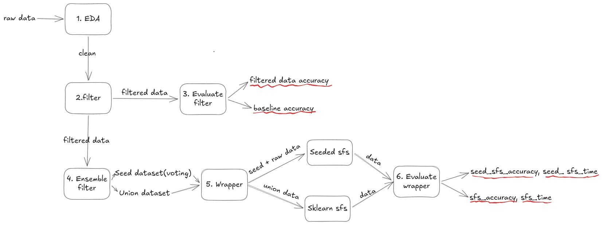

# Pipeline Chọn Đặc Trưng (Filter + Wrapper)

_Read this in [English](README.md)_

Repository này cung cấp pipeline chọn đặc trưng end-to-end, chạy bằng script, cho nhiều bộ dữ liệu ung thư, bao gồm:

- Các phương pháp Filter (variance, correlation, chi-squared, mutual information, ANOVA)
- Các phương pháp Wrapper (Sklearn SFS, Seeded SFS)
- Hai biến thể dữ liệu: Raw và Union

**Lưu ý:** _Seeded SFS_ là hướng lai (hybrid), kết hợp Filter + Wrapper.

## Mục Lục

- [Các Giai Đoạn Pipeline End-to-End](#các-giai-đoạn-pipeline-end-to-end)
- [Cấu Trúc Thư Mục](#cấu-trúc-thư-mục)
- [Cài Đặt](#cài-đặt)
- [Cách Chạy (End-to-End)](#cách-chạy-end-to-end)
  - [1) Chạy các notebook giai đoạn (EDA -> Ensemble)](#1-chạy-các-notebook-giai-đoạn-eda---ensemble)
  - [2) Chạy wrapper scripts (raw + union)](#2-chạy-wrapper-scripts-raw--union)
  - [3) Chạy notebook đánh giá](#3-chạy-notebook-đánh-giá)
- [Quy Tắc Biến Thể (Raw vs Union)](#quy-tắc-biến-thể-raw-vs-union)
- [Các Điểm Vào Nguồn Chính](#các-điểm-vào-nguồn-chính)
- [Các Lưu Ý Thường Gặp](#các-lưu-ý-thường-gặp)
- [Mục Lục Tài Liệu](#mục-lục-tài-liệu)

---

## Các Giai Đoạn Pipeline End-to-End



Mỗi dataset đi qua các bước sau:

1. EDA
2. Preprocess (có thể khác nhau tùy dataset)
3. Filter Selection
4. Modeling (so sánh ở tầng filter)
5. Ensemble Filter (voting + tập đặc trưng union)
6. Wrapper: Sklearn SFS (raw/union)
7. Wrapper: Seeded SFS (raw/union)
8. Accuracy Evaluation (raw/union)
9. Time Evaluation (raw/union)

Bố cục dữ liệu đã xử lý theo chuẩn:

- `data/processed/<dataset>/01_clean`
- `data/processed/<dataset>/02_filter`
- `data/processed/<dataset>/03_ensemble`
- `data/processed/<dataset>/04_wrapper`

## Cấu Trúc Thư Mục

Bố cục cấp cao (lược gọn các đường dẫn quan trọng):

```text
.
├── data/
│   ├── raw/
│   └── processed/
│       └── <dataset>/
│           ├── 01_clean/
│           ├── 02_filter/
│           ├── 03_ensemble/
│           └── 04_wrapper/
├── docs/
├── notebook/
│   └── <dataset>/
│       ├── 01_eda.ipynb
│       ├── ...
│       ├── 06_sklearn_sfs-raw.py
│       ├── 06_sklearn_sfs-union.py
│       ├── 07_sfs-raw.py
│       └── 07_sfs-union.py
├── results/
│   └── <dataset>/
│       ├── filter/
│       ├── wrapper/
│       │   └── <variant>/<algorithm>/run_YYYYMMDD_HHMMSS[_tag]/
│       │       ├── history/
│       │       ├── features/
│       │       ├── metrics/
│       │       └── artifacts/
│       └── evaluation/
├── src/
│   ├── config.py
│   ├── utils/
│   ├── wrapper/
│   ├── modeling/
│   └── filter/
├── README.md
├── README.vi.md
├── requirements.txt
└── run_sfs.sh
```

---

## Cài Đặt

Chạy từ thư mục gốc repo:

```bash
pip install -r requirements.txt
```

Kiểm tra nhanh dependency:

```bash
python -c "import sklearn, imblearn, seaborn, xgboost"
```

`requirements.txt` được dùng để bao phủ dependency runtime cho luồng end-to-end.

---

## Cách Chạy (End-to-End)

## 1) Chạy các notebook giai đoạn (EDA -> Ensemble)

Với mỗi dataset trong `notebook/<dataset>/`, chạy notebook theo đúng thứ tự giai đoạn.

Ví dụ thư mục dataset:

- `notebook/colon1/`

Các file thường gặp:

- `01_eda.ipynb`
- `02_preprocess.ipynb`
- `03_filter_selection.ipynb`
- `04_modeling.ipynb`
- `05_esemble_filter.ipynb`

Tên file chưa đồng nhất hoàn toàn giữa các dataset (ví dụ `8_accuracu...`, `08_accuracy...`, và `7_.../8_...` trong `Lung_cancer`).

## 2) Chạy wrapper scripts (raw + union)

Chạy từ repo root (ví dụ: `colon1`):

```bash
python notebook/colon1/06_sklearn_sfs-raw.py
python notebook/colon1/07_sfs-raw.py
python notebook/colon1/06_sklearn_sfs-union.py
python notebook/colon1/07_sfs-union.py
```

Bạn cũng có thể dùng script hỗ trợ:

```bash
bash run_sfs.sh --list
bash run_sfs.sh colon1 raw sklearn
bash run_sfs.sh colon1 raw seeded
bash run_sfs.sh colon1 union sklearn
bash run_sfs.sh colon1 union seeded
```

Chạy batch sklearn wrapper cho tất cả dataset:

```bash
bash run_all_sklearn_sfs.sh
```

## 3) Chạy notebook đánh giá

Với mỗi dataset, chạy:

- Notebook so sánh Accuracy (`8_...evaluate...ipynb` hoặc `08_...`)
- Notebook so sánh Time (`9_time_evaluate...ipynb` hoặc `8_time...` trong `Lung_cancer`)

Cả hai biến thể raw và union đều có sẵn.

---

## Quy Tắc Biến Thể (Raw vs Union)

- Tách biệt nghiêm ngặt artifact raw và union bằng `dataset_variant` (`raw`, `union`).
- Tên output cần có tag biến thể để tránh ghi đè.
- Mẫu đặt tên trong notebook so sánh Accuracy:

```python
experiment_prefix=f"wrapper_sfs_comparison_sk_{sk_data_variant}_seeded_{data_variant}"
chart_title=f"Sklearn sfs({sk_data_variant}) vs Seeded sfs({data_variant}) Performance"
```

---

## Các Điểm Vào Nguồn Chính

- Quy ước path và cấu trúc thư mục: `src/config.py` (`ProjectPath`)
- Quy ước output wrapper: `src/utils/experiment_paths.py`, `src/wrapper/base.py`
- Logic đánh giá: `src/modeling/evaluation.py`
- Tạo union features: `src/utils/utils.py` (`create_union_features`)

---

## Các Lưu Ý Thường Gặp

- Tên notebook không đồng nhất giữa các dataset; giữ đúng convention tại từng thư mục.
- Nhiều notebook được chỉnh trực tiếp dạng JSON; tránh thay đổi metadata/id không cần thiết.
- Wrapper scripts phụ thuộc `sys.path` injection, nên chạy từ repo root.

---

## Mục Lục Tài Liệu

Bạn có thể xem cách từng **pipeline** hoạt động tại [Pipeline Documentation](./docs/pipelines/README.md)
Bạn có thể xem **kết quả** tại [Results Report](./docs/results.md)
