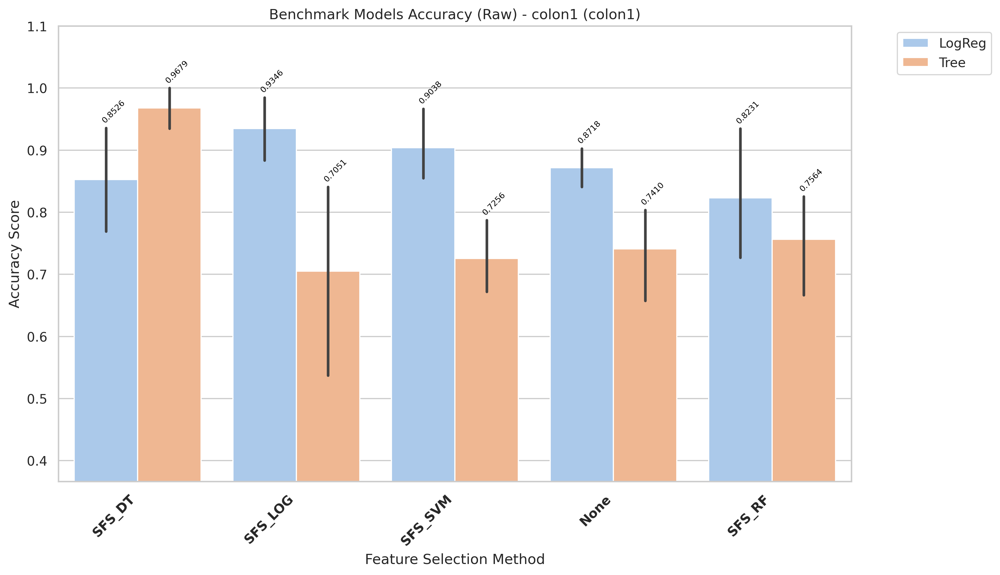
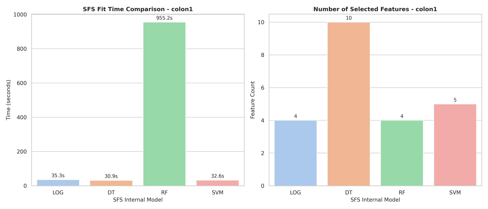

# Colon1 Model Changes Expiriments

## Report

- Fully report is in: `results/colon1/evaluation/reports/benchmark_accuracy_raw_colon1.txt`

CROSS-VALIDATION SUMMARY (ranked)
| rank| Method| Model| mean_accuracy| std_accuracy| median_accuracy| min_accuracy| max_accuracy| n_folds| cv_stability|
| -| -| -| -| -| -| -| -| -| -|
| 1| SFS_DT| Tree| 0.9679| 0.0439| 1.0000| 0.9167| 1.0000| 5| 0.9561|
| 2| SFS_LOG| LogReg| 0.9346| 0.0694| 0.9231| 0.8333| 1.0000| 5| 0.9306|
| 3| SFS_SVM| LogReg| 0.9038| 0.0672| 0.9167| 0.8333| 1.0000| 5| 0.9328|
| 4| None| LogReg| 0.8718| 0.0413| 0.8462| 0.8333| 0.9167| 5| 0.9587|
| 5| SFS_DT| LogReg| 0.8526| 0.1083| 0.8462| 0.7500| 1.0000| 5| 0.8917|
| 6| SFS_RF| LogReg| 0.8231| 0.1314| 0.7500| 0.6923| 1.0000| 5| 0.8686|
| 7| SFS_RF| Tree| 0.7564| 0.1050| 0.7692| 0.5833| 0.8462| 5| 0.8950|
| 8| None| Tree| 0.7410| 0.0936| 0.7692| 0.5833| 0.8333| 5| 0.9064|
| 9| SFS_SVM| Tree| 0.7256| 0.0734| 0.6923| 0.6667| 0.8333| 5| 0.9266|
| 10| SFS_LOG| Tree| 0.7051| 0.1860| 0.7500| 0.4167| 0.9231| 5| 0.8140|

- Time:

| Model | Selected_Features | Internal_SFS_Score | Time (s)           |
| ----- | ----------------- | ------------------ | ------------------ |
| LOG   | 4                 | 0.9346153846153846 | 35.32592434000253  |
| DT    | 10                | 0.9833333333333334 | 30.885568714002147 |
| RF    | 4                 | 0.9346153846153846 | 955.2452157080045  |
| SVM   | 5                 | 0.9346153846153846 | 32.643529725995904 |

## Chart

