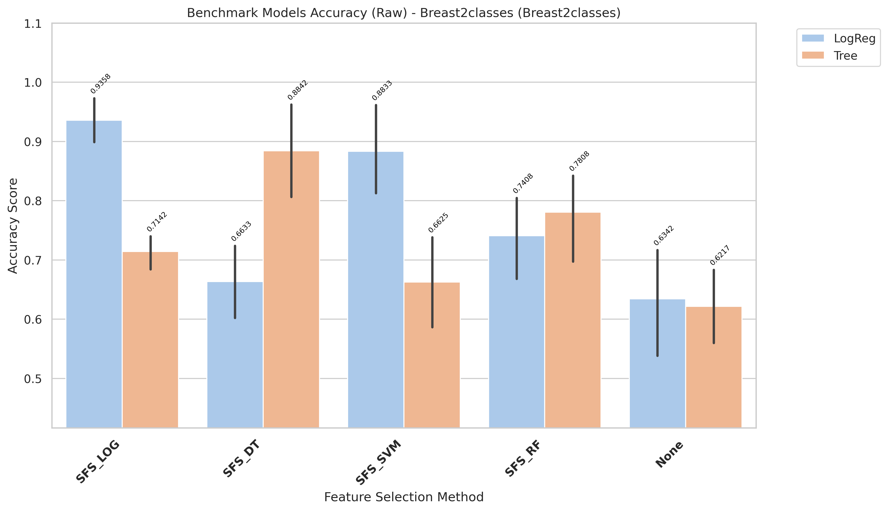
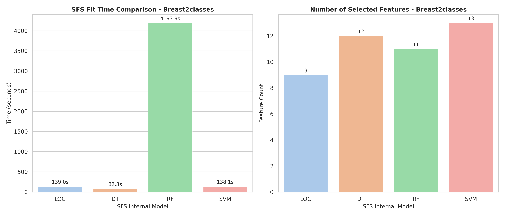

# Breast2classes Model Changes Expiriments

[goto index](./README.md)

## Report

runing in raw variant

- Fully report is in: `results/Breast2classes/evaluation/reports/benchmark_accuracy_raw_Breast2classes.txt`

- Report:

CROSS-VALIDATION SUMMARY (ranked)
| rank| Method| Model| mean_accuracy| std_accuracy| median_accuracy| min_accuracy| max_accuracy| n_folds| cv_stability|
| - |- |- |- |- |- |- |- |- |- |
| 1| SFS_LOG| LogReg| 0.9358| 0.0443| 0.9333| 0.8750| 1.0000| 5| 0.9557|
| 2| SFS_DT| Tree| 0.8842| 0.1046| 0.9333| 0.7500| 1.0000| 5| 0.8954|
| 3| SFS_SVM| LogReg| 0.8833| 0.0984| 0.8750| 0.7333| 1.0000| 5| 0.9016|
| 4| SFS_RF| Tree| 0.8067| 0.0733| 0.8125| 0.6875| 0.8667| 5| 0.9267|
| 5| SFS_RF| LogReg| 0.7408| 0.0881| 0.8000| 0.6250| 0.8125| 5| 0.9119|
| 6| SFS_LOG| Tree| 0.7158| 0.1016| 0.7500| 0.5625| 0.8000| 5| 0.8984|
| 7| SFS_SVM| Tree| 0.6758| 0.0774| 0.6667| 0.6000| 0.8000| 5| 0.9226|
| 8| SFS_DT| LogReg| 0.6633| 0.0784| 0.6875| 0.5625| 0.7333| 5| 0.9216|
| 9| None| LogReg| 0.6342| 0.1247| 0.6250| 0.4667| 0.8125| 5| 0.8753|
| 10| None| Tree| 0.6217| 0.0811| 0.6667| 0.5333| 0.6875| 5| 0.9189|

- Time:

| Model | Selected_Features | Internal_SFS_Score | Time (s)           |
| ----- | ----------------- | ------------------ | ------------------ |
| LOG   | 9                 | 0.9358333333333334 | 139.02734391699778 |
| DT    | 12                | 0.9375             | 82.33449082099833  |
| RF    | 11                | 0.925              | 4193.940119870007  |
| SVM   | 13                | 0.9225             | 138.06964267898002 |

## Chart

