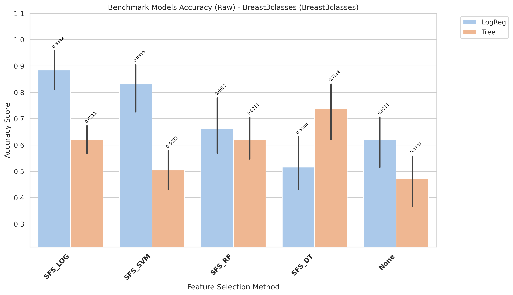
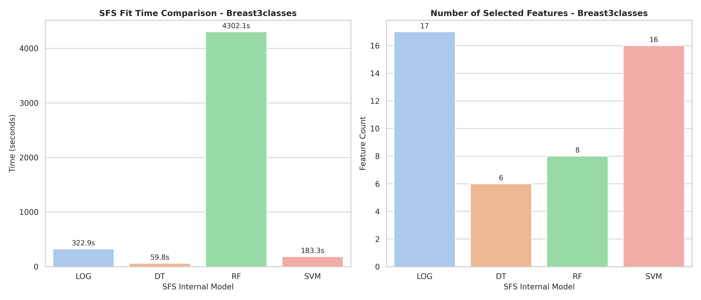

# Breast3classes Model Changes Expiriments

[goto index](./README.md)

## Report

runing in raw variant

- Fully report is in: `results/Breast3classes/evaluation/reports/benchmark_accuracy_raw_Breast3classes.txt`

- Report:

CROSS-VALIDATION SUMMARY (ranked)
| rank| Method| Model| mean_accuracy| std_accuracy| median_accuracy| min_accuracy| max_accuracy| n_folds| cv_stability|
| -| -| -| -| -| - |- |-| -|-|
|1| SFS_LOG| LogReg| 0.8842| 0.0942| 0.8947| 0.7895| 1.0000| 5| 0.9058|
|2| SFS_SVM| LogReg| 0.8316| 0.1200| 0.8421| 0.6316| 0.9474| 5| 0.8800|
|3| SFS_DT| Tree| 0.7789| 0.1079| 0.7368| 0.6842| 0.8947| 5| 0.8921|
|4| SFS_RF| LogReg| 0.6632| 0.1268| 0.6316| 0.5263| 0.8421| 5| 0.8732|
|5| SFS_RF| Tree| 0.6421| 0.1412| 0.5789| 0.5263| 0.8421| 5| 0.8588|
|6| None| LogReg| 0.6211| 0.1200| 0.5789| 0.4737| 0.7895| 5| 0.8800|
|7| SFS_LOG| Tree| 0.6000| 0.0798| 0.5789| 0.5263| 0.6842| 5| 0.9202|
|8| SFS_DT| LogReg| 0.5158| 0.1362| 0.4737| 0.3684| 0.7368| 5| 0.8638|
|9| SFS_SVM| Tree| 0.4947| 0.0798| 0.4737| 0.4211| 0.5789| 5| 0.9202|
|10| None| Tree| 0.4737| 0.1289| 0.4737| 0.2632| 0.5789| 5| 0.8711|

- Time:

| Model | Selected_Features | Internal_SFS_Score | Time (s)           |
| ----- | ----------------- | ------------------ | ------------------ |
| LOG   | 17                | 0.8842105263157893 | 322.9308911900007  |
| DT    | 6                 | 0.8526315789473685 | 59.82356163900113  |
| RF    | 8                 | 0.8105263157894737 | 4302.145751121003  |
| SVM   | 16                | 0.9157894736842104 | 183.25937249598792 |

## Chart

