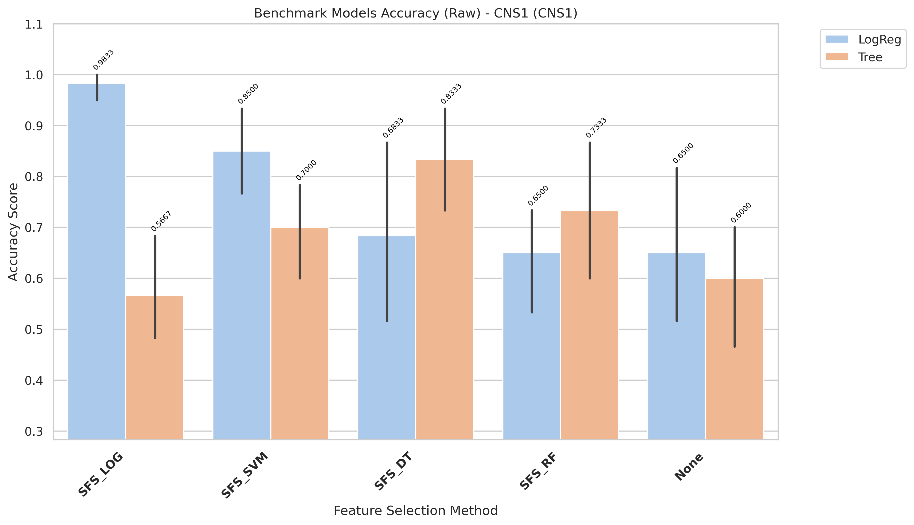
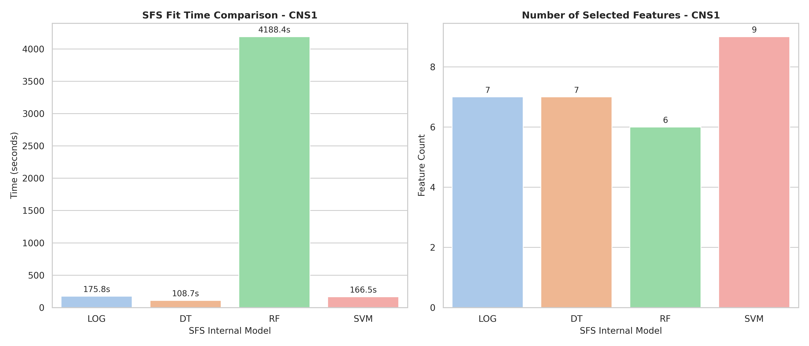

# CNS1 Model Changes Expiriments

[goto index](./README.md)

## Report

runing in raw variant

- Fully report is in: `results/CNS1/evaluation/reports/benchmark_accuracy_raw_CNS1.txt`

- Report:

CROSS-VALIDATION SUMMARY (ranked)
| rank| Method| Model| mean_accuracy| std_accuracy| median_accuracy| min_accuracy| max_accuracy| n_folds| cv_stability|
| -| -| -| -| -| - |- |-| -|-|
|1| SFS_LOG| LogReg| 0.9833| 0.0373| 1.0000| 0.9167| 1.0000| 5| 0.9627|
|2| SFS_SVM| LogReg| 0.8500| 0.1087| 0.8333| 0.7500| 1.0000| 5| 0.8913|
|3| SFS_DT| Tree| 0.8333| 0.1179| 0.8333| 0.6667| 1.0000| 5| 0.8821|
|4| SFS_RF| Tree| 0.7333| 0.1708| 0.6667| 0.5833| 0.9167| 5| 0.8292|
|5| SFS_SVM| Tree| 0.7000| 0.1264| 0.7500| 0.5000| 0.8333| 5| 0.8736|
|6| SFS_DT| LogReg| 0.6833| 0.2157| 0.6667| 0.4167| 1.0000| 5| 0.7843|
|7| SFS_RF| LogReg| 0.6500| 0.1369| 0.6667| 0.4167| 0.7500| 5| 0.8631|
|7| None| LogReg| 0.6500| 0.1900| 0.5833| 0.4167| 0.9167| 5| 0.8100|
|8| None| Tree| 0.6000| 0.1603| 0.6667| 0.3333| 0.7500| 5| 0.8397|
|9| SFS_LOG| Tree| 0.5667| 0.1236| 0.5833| 0.4167| 0.7500| 5| 0.8764|

- Time:

| Model | Selected_Features | Internal_SFS_Score | Time (s)           |
| ----- | ----------------- | ------------------ | ------------------ |
| LOG   | 7                 | 0.9833333333333334 | 175.75089231900347 |
| DT    | 7                 | 0.9166666666666669 | 88.99724162799976  |
| RF    | 6                 | 0.8833333333333334 | 4188.399078866001  |
| SVM   | 9                 | 1.0                | 166.45881449599983 |

## Chart

