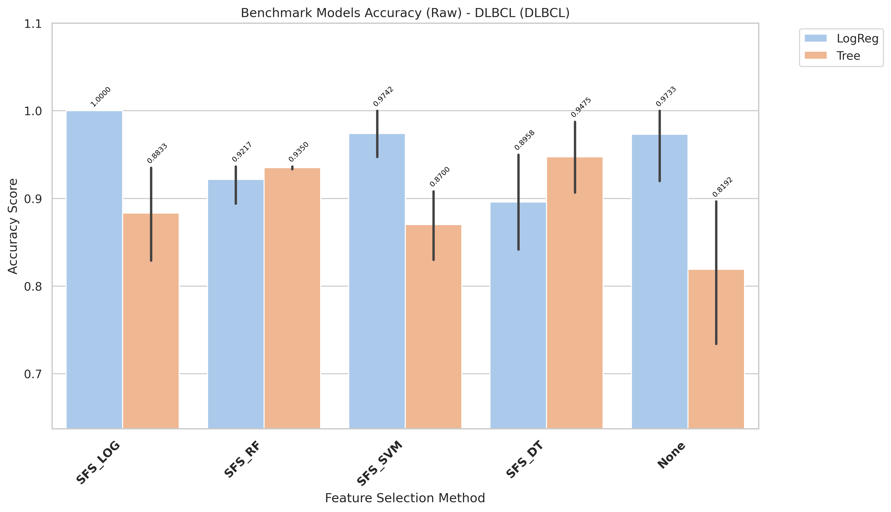
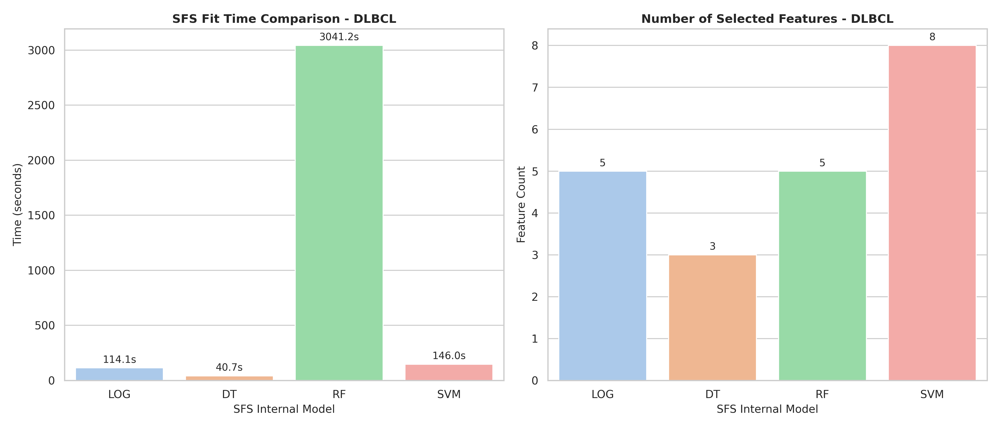

# DLBCL Model Changes Expiriments

[goto index](./README.md)

## Report

runing in raw variant

- Fully report is in: `results/DLBCL/evaluation/reports/benchmark_accuracy_raw_DLBCL.txt`

- Report:

CROSS-VALIDATION SUMMARY (ranked)
| rank| Method| Model| mean_accuracy| std_accuracy| median_accuracy| min_accuracy| max_accuracy| n_folds| cv_stability|
| -| -| -| -| -| - |- |-| -|-|
|1| SFS_LOG| LogReg| 1.0000| 0.0000| 1.0000| 1.0000| 1.0000| 5| 1.0000|
|2| SFS_SVM| LogReg| 0.9742| 0.0354| 1.0000| 0.9333| 1.0000| 5| 0.9646|
|3| None| LogReg| 0.9733| 0.0596| 1.0000| 0.8667| 1.0000| 5| 0.9404|
|4| SFS_DT| Tree| 0.9475| 0.0556| 0.9375| 0.8667| 1.0000| 5| 0.9444|
|5| SFS_RF| Tree| 0.9350| 0.0023| 0.9333| 0.9333| 0.9375| 5| 0.9977|
|6| SFS_RF| LogReg| 0.9217| 0.0308| 0.9333| 0.8667| 0.9375| 5| 0.9692|
|7| SFS_DT| LogReg| 0.8958| 0.0759| 0.8750| 0.8000| 1.0000| 5| 0.9241|
|8| SFS_LOG| Tree| 0.8833| 0.0705| 0.9333| 0.8000| 0.9375| 5| 0.9295|
|9| SFS_SVM| Tree| 0.8700| 0.0474| 0.8750| 0.8000| 0.9333| 5| 0.9526|
|10| None| Tree| 0.8192| 0.1038| 0.8667| 0.6875| 0.9333| 5| 0.8962|

- Time:

| Model | Selected_Features | Internal_SFS_Score | Time (s)           |
| ----- | ----------------- | ------------------ | ------------------ |
| LOG   | 5                 | 1.0                | 114.10690793799586 |
| DT    | 3                 | 0.9741666666666668 | 40.711032154998975 |
| RF    | 5                 | 0.9875             | 3041.227850402007  |
| SVM   | 8                 | 1.0                | 146.03929167898605 |

## Chart

