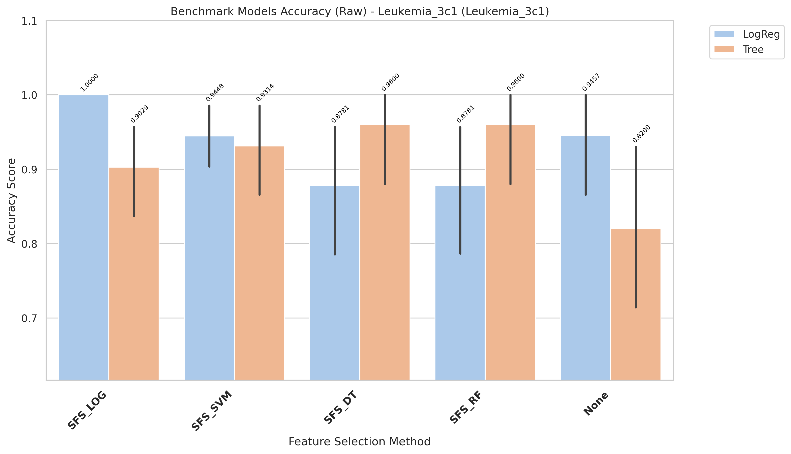
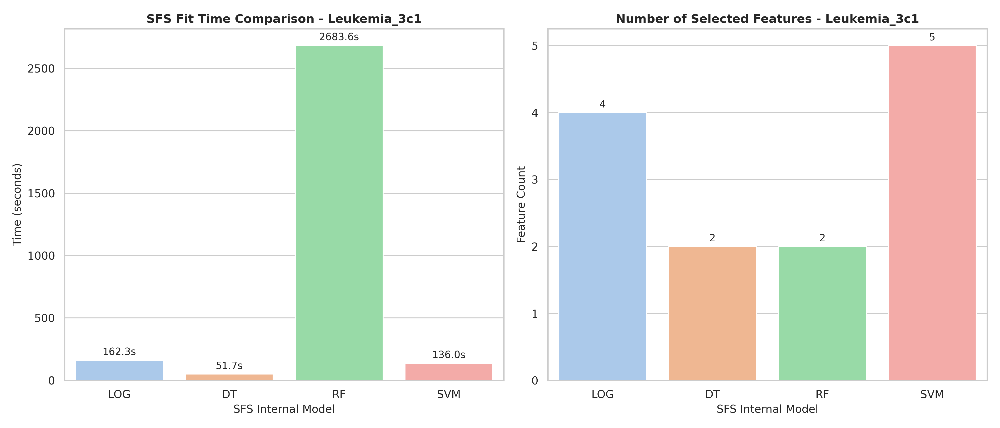

# Leukemia_3c1 Model Changes Expiriments

[goto index](./README.md)

## Report

runing in raw variant

- Fully report is in: `results/Leukemia_3c1/evaluation/reports/benchmark_accuracy_raw_Leukemia_3c1.txt`

- Report:

CROSS-VALIDATION SUMMARY (ranked)
| rank| Method| Model| mean_accuracy| std_accuracy| median_accuracy| min_accuracy| max_accuracy| n_folds| cv_stability|
| -| -| -| -| -| - |- |-| -|-|
|1| SFS_LOG| LogReg| 1.0000| 0.0000| 1.0000| 1.0000| 1.0000| 5| 1.0000|
|2| SFS_DT| Tree| 0.9600| 0.0894| 1.0000| 0.8000| 1.0000| 5| 0.9106|
|2| SFS_RF| Tree| 0.9600| 0.0894| 1.0000| 0.8000| 1.0000| 5| 0.9106|
|3| None| LogReg| 0.9457| 0.0871| 1.0000| 0.8000| 1.0000| 5| 0.9129|
|4| SFS_SVM| LogReg| 0.9448| 0.0564| 0.9286| 0.8667| 1.0000| 5| 0.9436|
|5| SFS_SVM| Tree| 0.9314| 0.0817| 0.9286| 0.8000| 1.0000| 5| 0.9183|
|6| SFS_LOG| Tree| 0.9029| 0.0765| 0.9286| 0.8000| 1.0000| 5| 0.9235|
|7| SFS_DT| LogReg| 0.8781| 0.1084| 0.9286| 0.7333| 1.0000| 5| 0.8916|
|7| SFS_RF| LogReg| 0.8781| 0.1084| 0.9286| 0.7333| 1.0000| 5| 0.8916|
|8| None| Tree| 0.8200| 0.1424| 0.7857| 0.6667| 1.0000| 5| 0.8576|

- Time:

| Model | Selected_Features | Internal_SFS_Score | Time (s)           |
| ----- | ----------------- | ------------------ | ------------------ |
| LOG   | 4                 | 1.0                | 162.25904828700004 |
| DT    | 2                 | 0.96               | 51.71043778100284  |
| RF    | 2                 | 0.9733333333333334 | 2683.557399684003  |
| SVM   | 5                 | 1.0                | 135.96339862099558 |

## Chart

