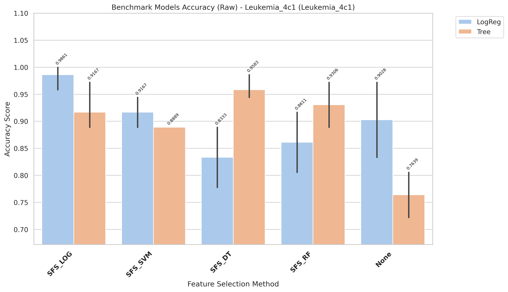
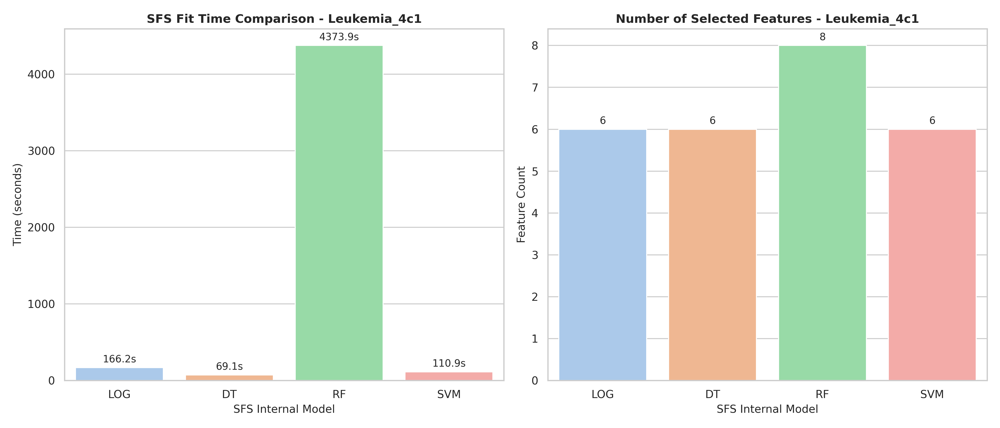

# Leukemia_4c1 Model Changes Expiriments

[goto index](./README.md)

## Report

runing in raw variant

- Fully report is in: `results/Leukemia_4c1/evaluation/reports/benchmark_accuracy_raw_Leukemia_4c1.txt`

- Report:

CROSS-VALIDATION SUMMARY (ranked)
| rank| Method| Model| mean_accuracy| std_accuracy| median_accuracy| min_accuracy| max_accuracy| n_folds| cv_stability|
| -| -| -| -| -| - |- |-| -|-|
|1| SFS_LOG| LogReg| 0.9861| 0.0278| 1.0000| 0.9444| 1.0000| 4| 0.9722|
|2| SFS_DT| Tree| 0.9583| 0.0278| 0.9444| 0.9444| 1.0000| 4| 0.9722|
|3| SFS_RF| Tree| 0.9306| 0.0532| 0.9167| 0.8889| 1.0000| 4| 0.9468|
|4| SFS_LOG| Tree| 0.9167| 0.0556| 0.8889| 0.8889| 1.0000| 4| 0.9444|
|4| SFS_SVM| LogReg| 0.9167| 0.0321| 0.9167| 0.8889| 0.9444| 4| 0.9679|
|5| None| LogReg| 0.9028| 0.0833| 0.8889| 0.8333| 1.0000| 4| 0.9167|
|6| SFS_SVM| Tree| 0.8889| 0.0000| 0.8889| 0.8889| 0.8889| 4| 1.0000|
|7| SFS_RF| LogReg| 0.8611| 0.0717| 0.8611| 0.7778| 0.9444| 4| 0.9283|
|8| SFS_DT| LogReg| 0.8333| 0.0642| 0.8333| 0.7778| 0.8889| 4| 0.9358|
|9| None| Tree| 0.7639| 0.0532| 0.7500| 0.7222| 0.8333| 4| 0.9468|

- Time:

| Model | Selected_Features | Internal_SFS_Score | Time (s)           |
| ----- | ----------------- | ------------------ | ------------------ |
| LOG   | 6                 | 0.9861111111111112 | 166.19543427600001 |
| DT    | 6                 | 0.9861111111111112 | 69.1228901919967   |
| RF    | 8                 | 0.9861111111111112 | 4373.89968735      |
| SVM   | 6                 | 1.0                | 110.9051679080003  |

## Chart

