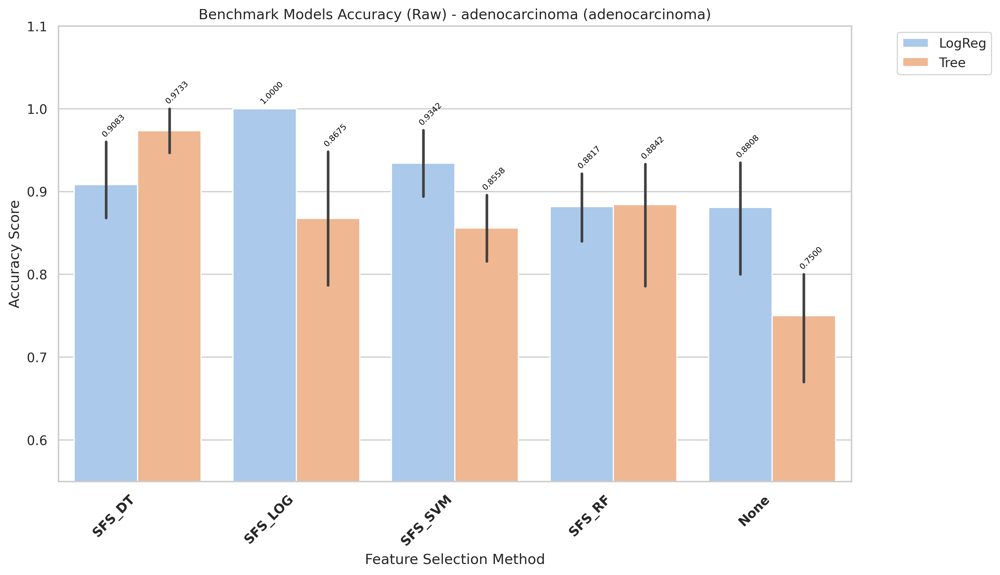
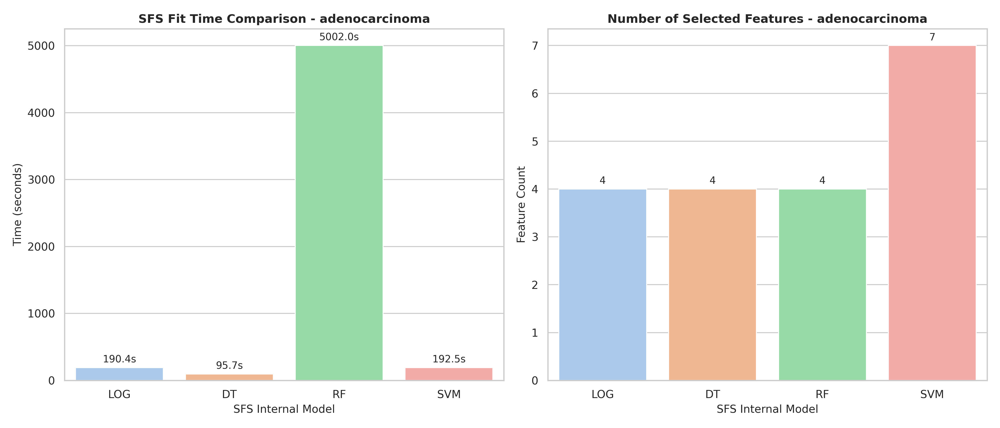

# adenocarcinoma Model Changes Expiriments

raw benchmark

## Report

- Fully report is in: `results/evaluation/reports/benchmark_accuracy_raw_adenocarcinoma.txt`

CROSS-VALIDATION SUMMARY (ranked)
| rank| Method| Model| mean_accuracy| std_accuracy| median_accuracy| min_accuracy| max_accuracy| n_folds| cv_stability|
| -| -| -| -| -| -| -| -| -|-|
|1| SFS_LOG| LogReg| 1.0000| 0.0000| 1.0000| 1.0000| 1.0000| 5| 1.0000|
|2| SFS_DT| Tree| 0.9733| 0.0365| 1.0000| 0.9333| 1.0000| 5| 0.9635|
|3| SFS_SVM| LogReg| 0.9342| 0.0472| 0.9333| 0.8667| 1.0000| 5| 0.9528|
|4| SFS_DT| LogReg| 0.9083| 0.0583| 0.8750| 0.8667| 1.0000| 5| 0.9417|
|5| SFS_RF| Tree| 0.8842| 0.1099| 0.9333| 0.6875| 0.9333| 5| 0.8901|
|6| SFS_RF| LogReg| 0.8817| 0.0554| 0.8750| 0.8000| 0.9333| 5| 0.9446|
|7| None| LogReg| 0.8808| 0.0876| 0.9333| 0.7333| 0.9375| 5| 0.9124|
|8| SFS_LOG| Tree| 0.8675| 0.1061| 0.8667| 0.7333| 1.0000| 5| 0.8939|
|9| SFS_SVM| Tree| 0.8558| 0.0530| 0.8667| 0.8000| 0.9333| 5| 0.9470|
|10| None| Tree| 0.7500| 0.0866| 0.8000| 0.6000| 0.8000| 5| 0.9134|

- Time:

| Model | Selected_Features | Internal_SFS_Score | Time (s)          |
| ----- | ----------------- | ------------------ | ----------------- |
| LOG   | 4                 | 1.0                | 190.4245332389837 |
| DT    | 4                 | 0.9866666666666668 | 88.89867609299836 |
| RF    | 4                 | 0.9608333333333334 | 5001.986041911994 |
| SVM   | 7                 | 1.0                | 192.5215414380073 |

## Chart

