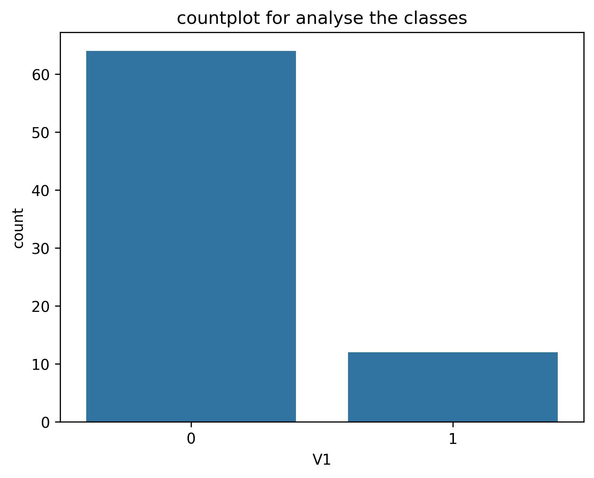
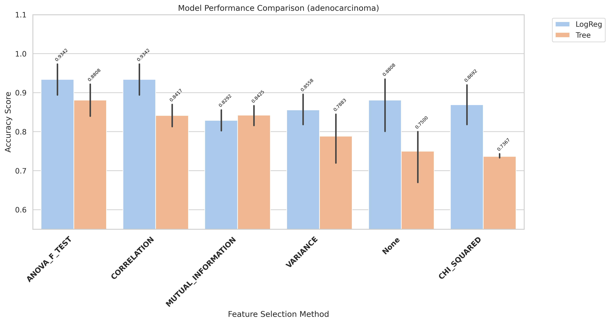
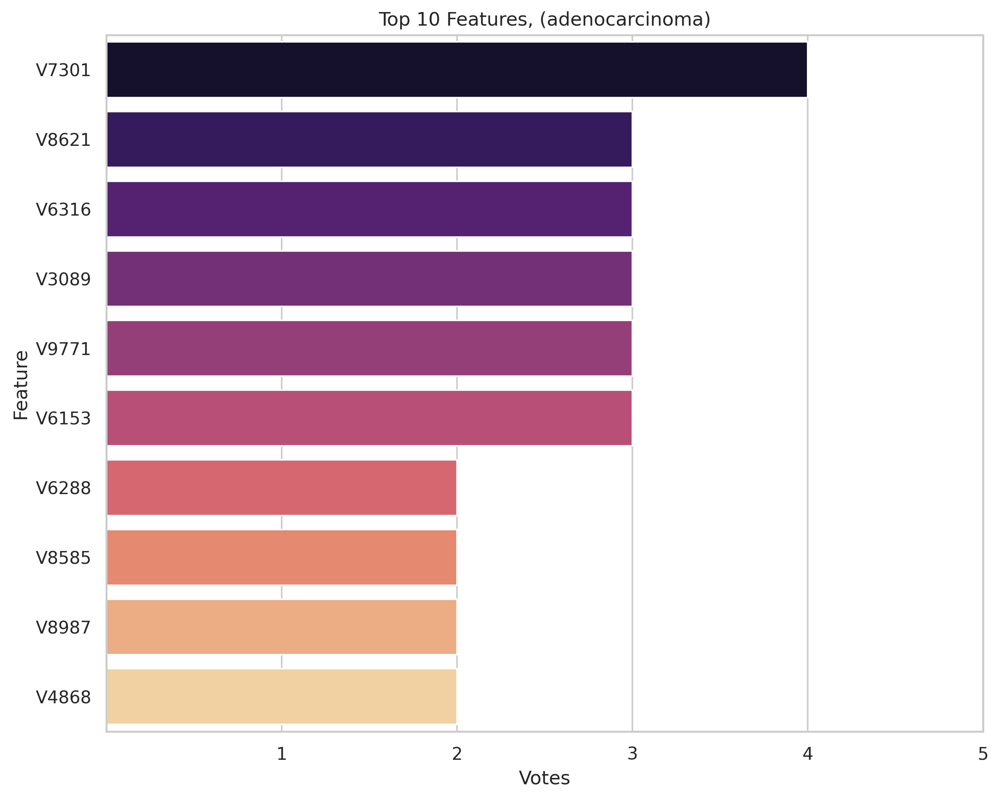
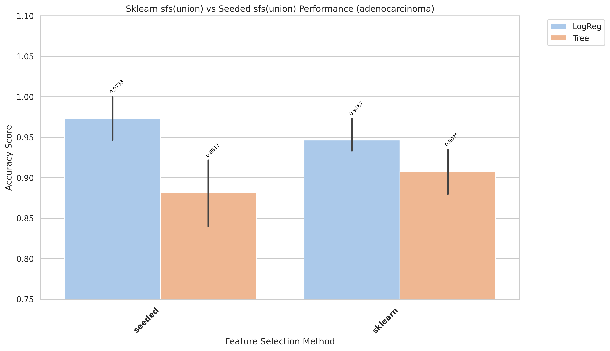
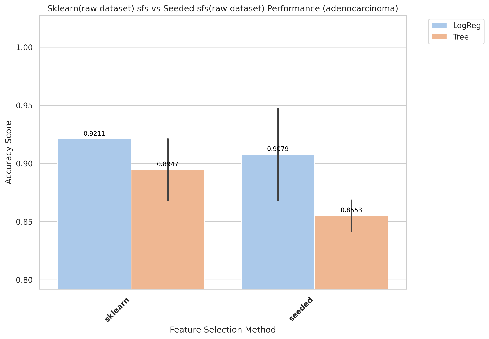
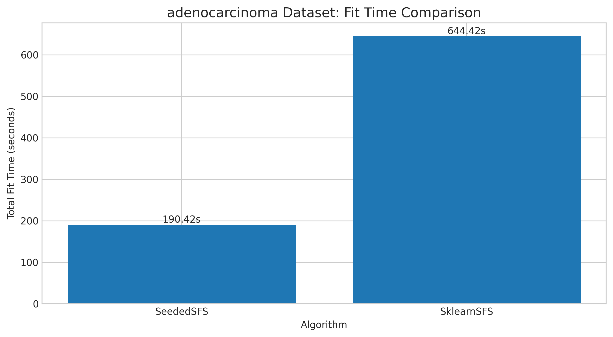
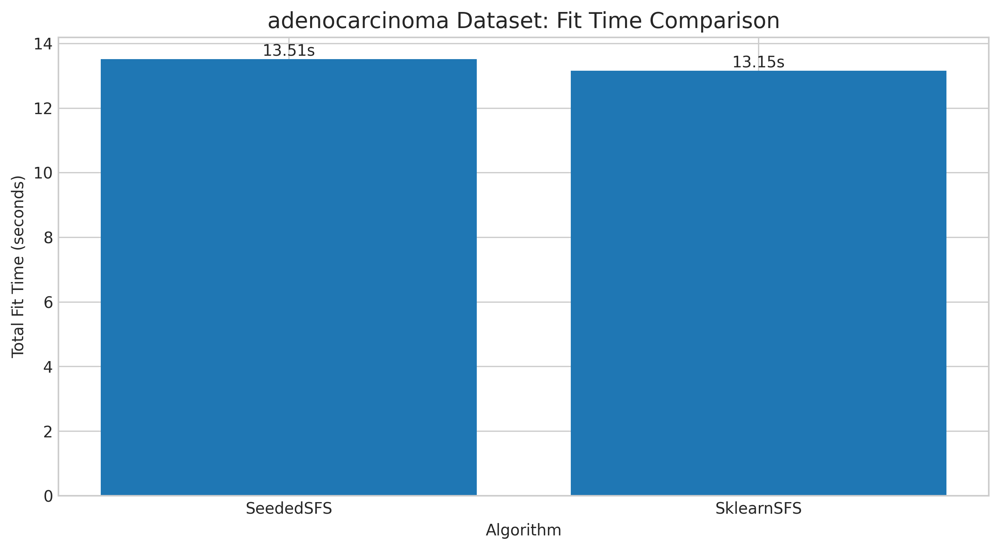

# adenocarcinoma Results and Evaluation

[Back to index](results.md)

## 1) EDA (Exploratory Data Analysis)

- Notebook entry point(s):
- `notebook/adenocarcinoma/01_eda.ipynb`

[Insert Chart: EDA Summary]

## 2) Data Preprocessing

- Notebook entry point(s):
- `notebook/adenocarcinoma/02_preprocess.ipynb`
- Output location convention: `data/processed/adenocarcinoma/01_clean/`

## 3) Filter Selection

- Notebook entry point(s):
- `notebook/adenocarcinoma/03_filter_selection.ipynb`
- Report artifact: `results/adenocarcinoma/filter/reports/evaluation_adenocarcinoma.txt`

[Insert Chart: Filter Selection Comparison]

## 4) Modeling (Filter-stage comparison)

- Notebook entry point(s):
- `notebook/adenocarcinoma/04_modeling.ipynb`
- Modeling outputs are tracked under `results/adenocarcinoma/filter/` when available.

## 5) Ensemble Filter (Voting + union feature set)

- Notebook entry point(s):
- `notebook/adenocarcinoma/05_esemble_filter.ipynb`
- Seed pool file: `data/processed/adenocarcinoma/03_ensemble/top50_features_voting.csv`
- Seed pool size: 10
- Top voting features: `V7301(4)`, `V8621(3)`, `V6316(3)`, `V3089(3)`, `V9771(3)`

[Insert Chart: Ensemble Voting / Union Features]

## 6) Wrapper: Sklearn SFS (Raw vs Union execution)

- Script entry point(s):
- `notebook/adenocarcinoma/06_sklearn_sfs-raw.py`
- `notebook/adenocarcinoma/06_sklearn_sfs-union.py`

| Variant | Sklearn Selected | Sklearn Global Best | Sklearn Fit Time (ms) |
|---|---:|---:|---:|
| Raw | 3 | 0.9733 | 644,417 |
| Union | 2 | 0.9474 | 13,152 |

## 7) Wrapper: Seeded SFS (Raw vs Union execution)

- Script entry point(s):
- `notebook/adenocarcinoma/07_sfs-raw.py`
- `notebook/adenocarcinoma/07_sfs-union.py`

| Variant | Seeded Selected | Seeded Global Best | Seeded Fit Time (ms) |
|---|---:|---:|---:|
| Raw | 3 | 0.9608 | 258,032 |
| Union | 6 | 0.9608 | 13,509 |

## 8) Accuracy Evaluation (Comparing Raw vs Union)

- Notebook entry point(s):
- `notebook/adenocarcinoma/8_accuracu_evaluate.ipynb`
- `notebook/adenocarcinoma/8_accuracu_evaluate_union.ipynb`

[Insert Chart: Accuracy Comparison Raw vs Union]

- **Observation:** Union sklearn is best in final evaluation despite lower wrapper score than raw sklearn.
- **Explanation:** Wrapper objective and downstream evaluation objective are correlated but not identical.
- **Takeaway:** Use final evaluation ranking as the model selection criterion.

- Raw best configuration: `sklearn + LogReg`, mean accuracy 0.9211, std 0.0000 (2-fold)
- Union best configuration: `sklearn + LogReg`, mean accuracy **0.9467**, std 0.0298

## 9) Time Evaluation (Comparing fit times for Raw vs Union)

- Notebook entry point(s):
- `notebook/adenocarcinoma/9_time_evaluate.ipynb`
- `notebook/adenocarcinoma/9_time_evaluate_union.ipynb`

[Insert Chart: Time Comparison Raw vs Union]

- **Observation:** Union runs are generally faster than raw runs across wrapper methods.
- **Explanation:** Union reduces candidate-space size, reducing total model-fit operations.
- **Takeaway:** Use union for rapid iteration; use raw when chasing peak wrapper score.
