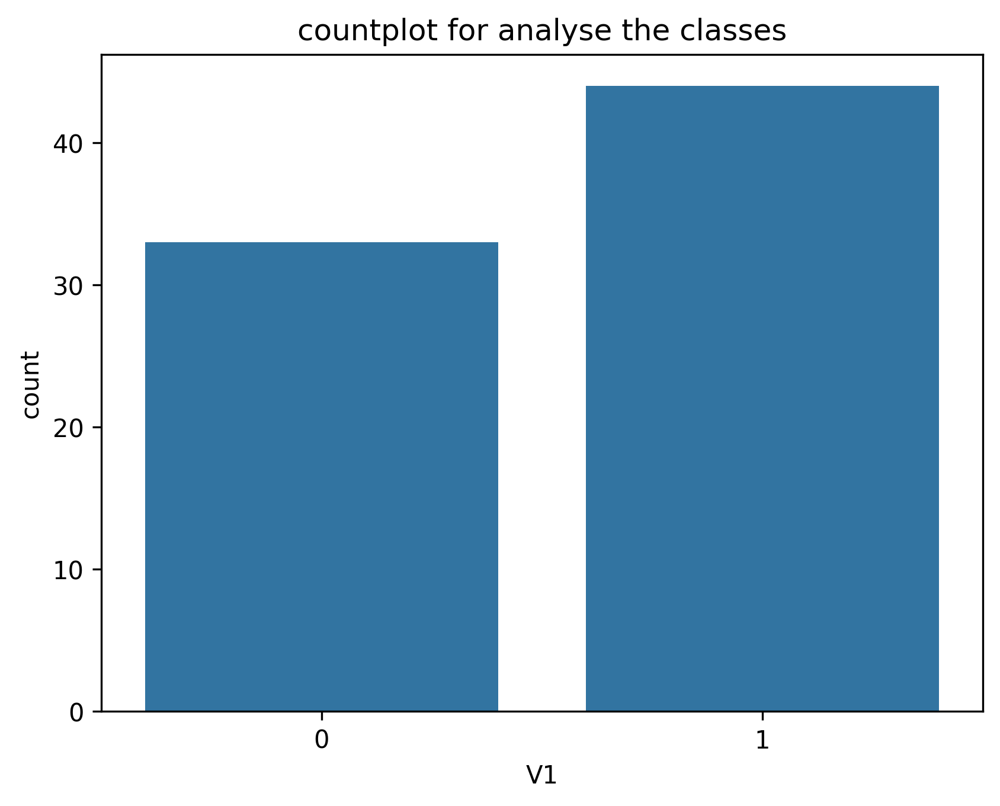
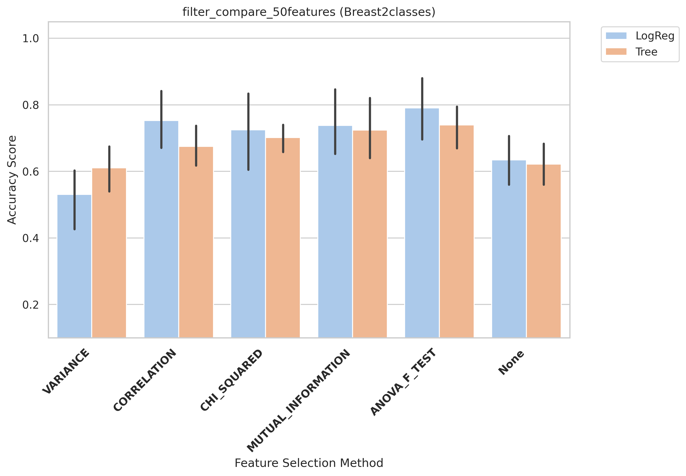
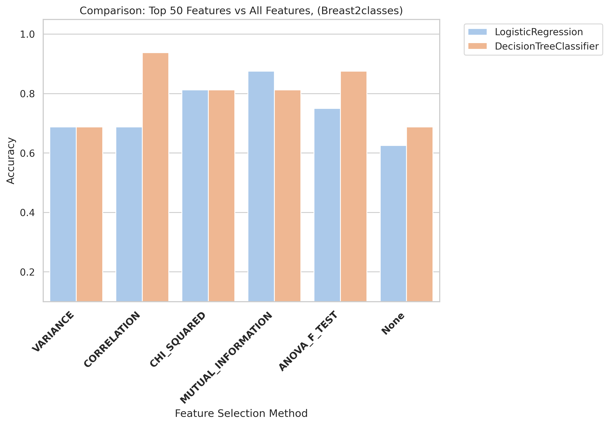
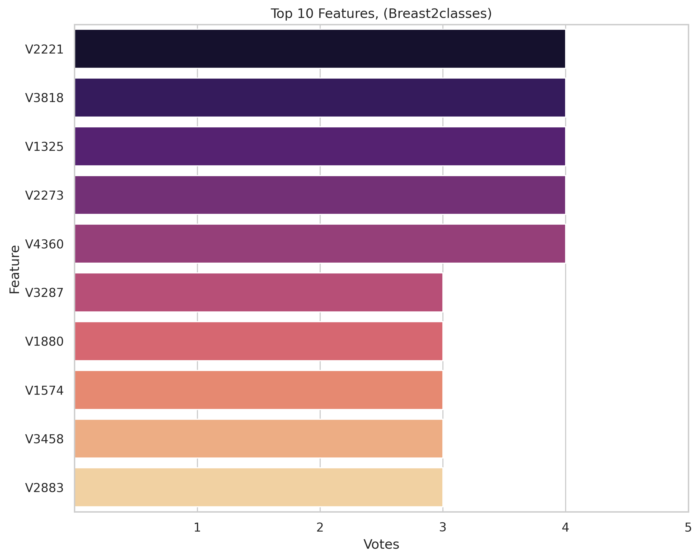
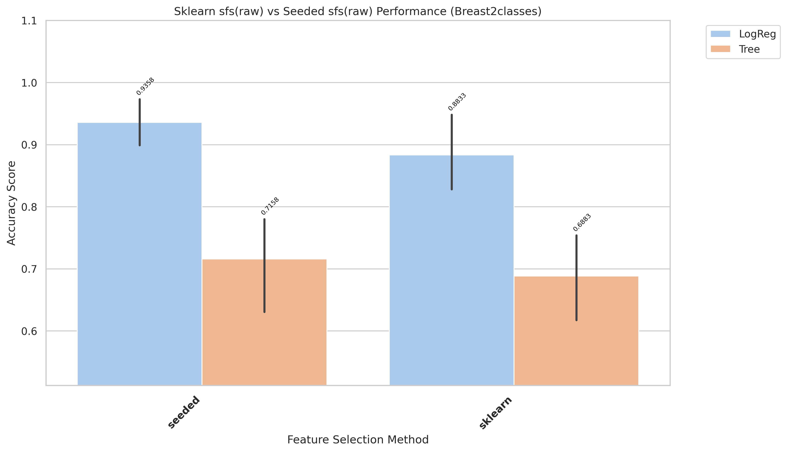
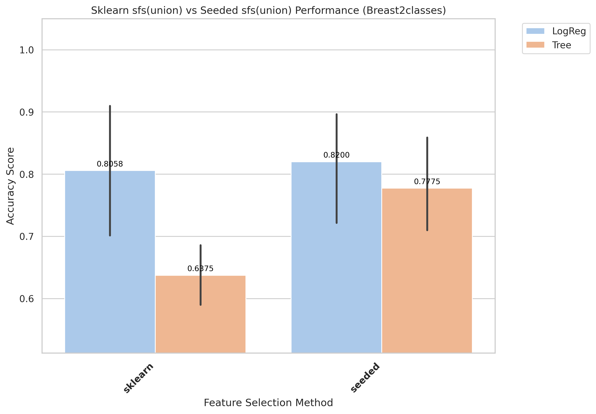
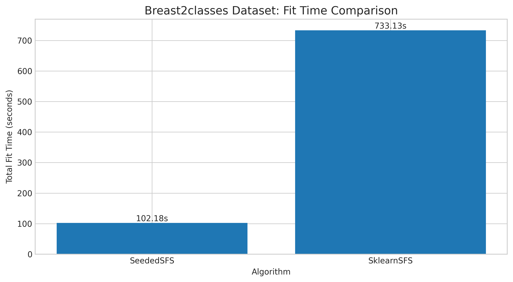
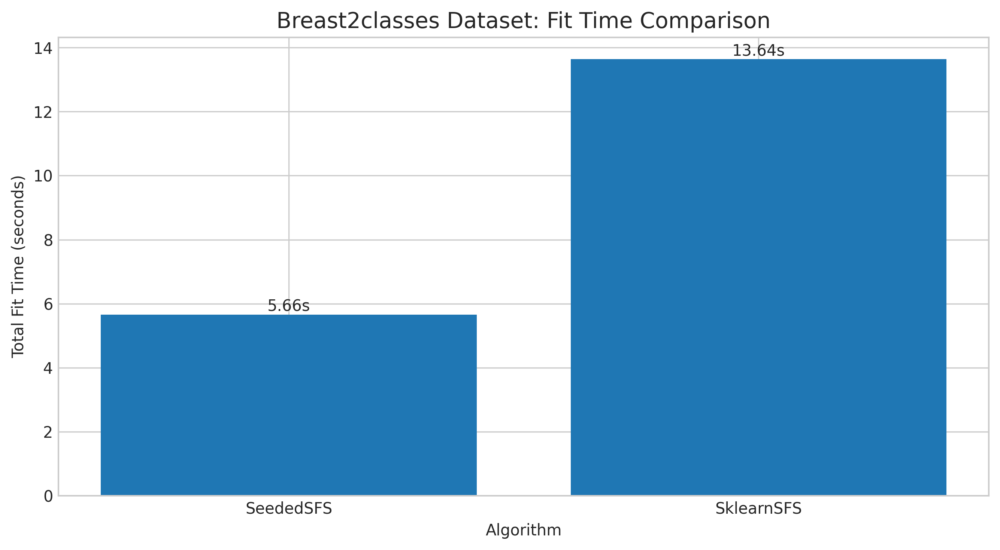

# Breast2classes Results and Evaluation

[Back to index](results.md)

## 1) EDA (Exploratory Data Analysis)

- Notebook entry point(s):
- `notebook/Breast2classes/01_eda.ipynb`

[Insert Chart: EDA Summary]

## 2) Data Preprocessing

- Notebook entry point(s):
- `notebook/Breast2classes/02_preprocess.ipynb`
- Output location convention: `data/processed/Breast2classes/01_clean/`

## 3) Filter Selection

- Notebook entry point(s):
- `notebook/Breast2classes/03_filter_selection.ipynb`
- Report artifact: `results/Breast2classes/filter/reports/filter_compare_50features_Breast2classes.txt`

[Insert Chart: Filter Selection Comparison]

## 4) Modeling (Filter-stage comparison)

- Notebook entry point(s):
- `notebook/Breast2classes/04_modeling.ipynb`
- Modeling outputs are tracked under `results/Breast2classes/filter/` when available.

## 5) Ensemble Filter (Voting + union feature set)

- Notebook entry point(s):
- `notebook/Breast2classes/05_esemble_filter.ipynb`
- Seed pool file: `data/processed/Breast2classes/03_ensemble/top50_features_voting.csv`
- Seed pool size: 10
- Top voting features: `V2221(4)`, `V3818(4)`, `V1325(4)`, `V2273(4)`, `V4360(4)`

[Insert Chart: Ensemble Voting / Union Features]

## 6) Wrapper: Sklearn SFS (Raw vs Union execution)

- Script entry point(s):
- `notebook/Breast2classes/06_sklearn_sfs-raw.py`
- `notebook/Breast2classes/06_sklearn_sfs-union.py`

| Variant | Sklearn Selected | Sklearn Global Best | Sklearn Fit Time (ms) |
|---|---:|---:|---:|
| Raw | 4 | 0.8583 | 315,016 |
| Union | 4 | 0.8567 | 13,638 |

## 7) Wrapper: Seeded SFS (Raw vs Union execution)

- Script entry point(s):
- `notebook/Breast2classes/07_sfs-raw.py`
- `notebook/Breast2classes/07_sfs-union.py`

| Variant | Seeded Selected | Seeded Global Best | Seeded Fit Time (ms) |
|---|---:|---:|---:|
| Raw | 11 | 0.935 | 102,179 |
| Union | 9 | 0.8958 | 5,660 |

## 8) Accuracy Evaluation (Comparing Raw vs Union)

- Notebook entry point(s):
- `notebook/Breast2classes/8_accuracu_evaluate.ipynb`
- `notebook/Breast2classes/8_accuracu_evaluate_union.ipynb`

[Insert Chart: Accuracy Comparison Raw vs Union]

- **Observation:** Raw seeded performs materially better than union seeded in evaluation.
- **Explanation:** Discriminative information appears spread beyond union-restricted candidates.
- **Takeaway:** Keep raw seeded as default for best predictive performance.

- Raw best configuration: `seeded + LogReg`, mean accuracy **0.9083**, std 0.0381
- Union best configuration: `seeded + LogReg`, mean accuracy 0.8200, std 0.1188
- Final selected features (winning setup, raw seeded): 11 features

## 9) Time Evaluation (Comparing fit times for Raw vs Union)

- Notebook entry point(s):
- `notebook/Breast2classes/9_time_evaluate.ipynb`
- `notebook/Breast2classes/9_time_evaluate_union.ipynb`

[Insert Chart: Time Comparison Raw vs Union]

- **Observation:** Union runs are generally faster than raw runs across wrapper methods.
- **Explanation:** Union reduces candidate-space size, reducing total model-fit operations.
- **Takeaway:** Use union for rapid iteration; use raw when chasing peak wrapper score.
