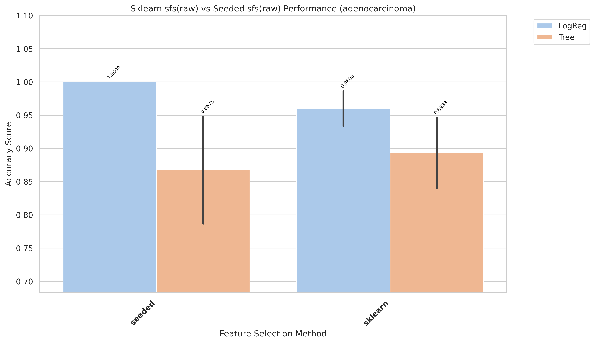
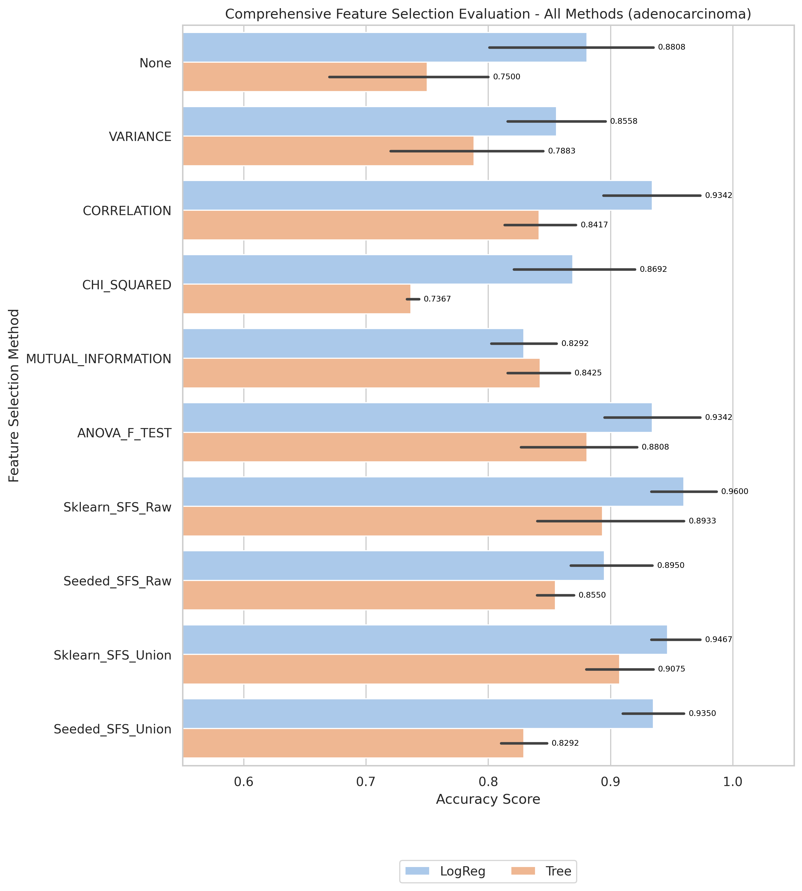

# adenocarcinoma Results and Evaluation

[Back to index](./README.md)

## 1) EDA (Exploratory Data Analysis)

- Notebook entry point(s):
- `notebook/adenocarcinoma/01_eda.ipynb`
- Shape: (76, 9869)

[Insert Chart: EDA Summary]

**Caption:**

- Purpose: Check whether the dataset is imbalanced.
- How to read: The x-axis (V1) shows class labels (0 and 1), and the y-axis (count) shows the number of samples in each class.

## 2) Data Preprocessing

- Notebook entry point(s):
- `notebook/adenocarcinoma/02_preprocess.ipynb`
- Output location convention: `data/processed/adenocarcinoma/01_clean/`

## 3) Filter Selection

- Notebook entry point(s):
- `notebook/adenocarcinoma/03_filter_selection.ipynb`
- filted data is stored in: `data/processed/adenocarcinoma/02_filter`

## 4) Modeling (Filter-stage comparison)

- Notebook entry point(s):
- `notebook/adenocarcinoma/04_modeling.ipynb`
- Modeling outputs are tracked under `results/adenocarcinoma/filter/` when available.

CROSS-VALIDATION SUMMARY (ranked)
|rank| Method| Model| mean_accuracy|
|-|-|-|-|
|1| ANOVA_F_TEST| LogReg| 0.9342|  
| 1| CORRELATION| LogReg| 0.9342|  
| 2| None| LogReg| 0.8808|  
| 2| ANOVA_F_TEST| Tree| 0.8808|  
| 3| CHI_SQUARED| LogReg| 0.8692|  
| 4| VARIANCE| LogReg| 0.8558|  
| 5| MUTUAL_INFORMATION| Tree| 0.8425|  
| 6| CORRELATION| Tree| 0.8417|  
| 7| MUTUAL_INFORMATION| LogReg| 0.8292|  
| 8| VARIANCE| Tree| 0.7883|  
| 9| None| Tree| 0.7500|  
| 10| CHI_SQUARED| Tree| 0.7367|

- Report artifact: `results/adenocarcinoma/filter/reports/evaluation_adenocarcinoma.txt`

[Insert Chart: Filter Selection Comparison]

**Caption:**

- Purpose: Compare filter-method performance to select the best feature set for the next stage.
- How to read: The x-axis lists filter methods, and the y-axis shows evaluation scores; higher bars/scores indicate better methods.

## 5) Ensemble Filter (Voting + union feature set)

- Notebook entry point(s):
- `notebook/adenocarcinoma/05_esemble_filter.ipynb`
- Seed pool file: `data/processed/adenocarcinoma/03_ensemble/top50_features_voting.csv`
- Seed pool size: 10
- Top voting features: `V7301(4)`, `V8621(3)`, `V6316(3)`, `V3089(3)`, `V9771(3)`

[Insert Chart: Ensemble Voting / Union Features]

**Caption:**

- Purpose: Show agreement among filter methods when voting for features.
- How to read: The x-axis lists feature names, and the y-axis shows vote counts; features with higher votes are prioritized.

## 6) Wrapper: Sklearn SFS (Raw vs Union execution)

- Script entry point(s):
- `notebook/adenocarcinoma/06_sklearn_sfs-raw.py`
- `notebook/adenocarcinoma/06_sklearn_sfs-union.py`

| Variant | Sklearn Selected | Sklearn Global Best | Sklearn Fit Time (ms) |
| ------- | ---------------: | ------------------: | --------------------: |
| Raw     |                3 |              0.9733 |               644,417 |
| Union   |                2 |              0.9474 |                13,152 |

## 7) Wrapper: Seeded SFS (Raw vs Union execution)

- Script entry point(s):
- `notebook/adenocarcinoma/07_sfs-raw.py`
- `notebook/adenocarcinoma/07_sfs-union.py`

| Variant | Seeded Selected | Seeded Global Best | Seeded Fit Time (ms) |
| ------- | --------------: | -----------------: | -------------------: |
| Raw     |               3 |           1.000000 |           190.424533 |
| Union   |               6 |             0.9608 |               13,509 |

## 8) Accuracy Evaluation (Comparing Raw vs Union)

- Notebook entry point(s):
- `notebook/adenocarcinoma/8_accuracu_evaluate.ipynb`
- `notebook/adenocarcinoma/8_accuracu_evaluate_union.ipynb`

[Insert Chart: Accuracy Comparison Raw vs Union]

**Caption:**

- Purpose: Compare accuracy across wrapper configurations (Sklearn SFS and Seeded SFS) for each data variant.
- How to read:
  - The x-axis shows configurations/methods, and the y-axis shows accuracy; higher values indicate better performance.
  - Vertical black lines (error bars) show Standard Deviation across cross-validation folds. Shorter bars indicate more stable model performance.

**Caption:**

- Purpose: Compare accuracy across wrapper configurations (Sklearn SFS and Seeded SFS) for each data variant.
- How to read:
  - The x-axis shows configurations/methods, and the y-axis shows accuracy; higher values indicate better performance.
  - Vertical black lines (error bars) show Standard Deviation across cross-validation folds. Shorter bars indicate more stable model performance.

- **Observation:** Union sklearn is best in final evaluation despite lower wrapper score than raw sklearn.
- **Explanation:** Wrapper objective and downstream evaluation objective are correlated but not identical.
- **Takeaway:** Use final evaluation ranking as the model selection criterion.

- Raw best configuration: `sklearn + LogReg`, mean accuracy 0.9211, std 0.0000 (2-fold)
- Union best configuration: `sklearn + LogReg`, mean accuracy **0.9467**, std 0.0298

## 9) Time Evaluation (Comparing fit times for Raw vs Union)

- Notebook entry point(s):
- `notebook/adenocarcinoma/9_time_evaluate.ipynb`
- `notebook/adenocarcinoma/9_time_evaluate_union.ipynb`

[Insert Chart: Time Comparison Raw vs Union]

**Caption:**

- Purpose: Compare training-time cost across wrapper methods on the same dataset.
- How to read: The x-axis shows methods/configurations, and the y-axis shows total fit time (ms); lower bars mean faster runtime.
  

**Caption:**

- Purpose: Compare training-time cost across wrapper methods on the same dataset.
- How to read: The x-axis shows methods/configurations, and the y-axis shows total fit time (ms); lower bars mean faster runtime.

- **Observation:** Union runs are generally faster than raw runs across wrapper methods.
- **Explanation:** Union reduces candidate-space size, reducing total model-fit operations.
- **Takeaway:** Use union for rapid iteration; use raw when chasing peak wrapper score.

## 10) Final Evaluation (All Methods Comparison)

- Notebook entry point(s):
- `notebook/adenocarcinoma/10_final_evaluate.ipynb`
- Report artifact: `results/adenocarcinoma/evaluation/reports/final_evaluation_all_methods_adenocarcinoma_adenocarcinoma.txt`

[Insert Chart: Final Evaluation - All Methods]

**Caption:**

- Purpose: Compare all feature selection methods (Filter, Ensemble, Sklearn SFS, Seeded SFS) with both LogReg and Tree models.
- How to read:
  - The x-axis lists all method/model combinations (e.g., "Sklearn_SFS_Raw + LogReg").
  - The y-axis shows cross-validation accuracy; higher bars indicate better performance.
  - Vertical error bars show Standard Deviation across folds; shorter bars indicate more stable models.
