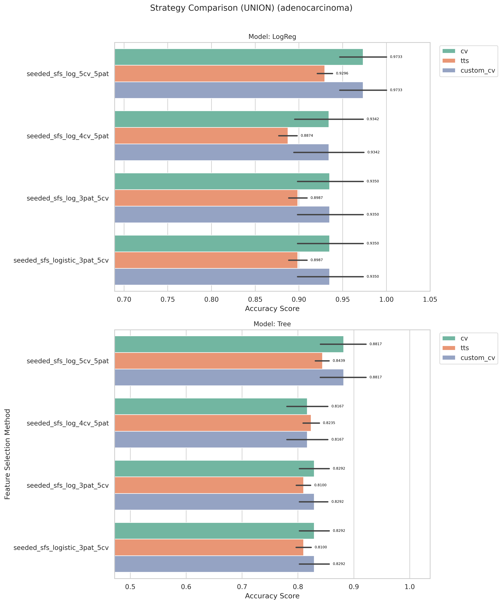
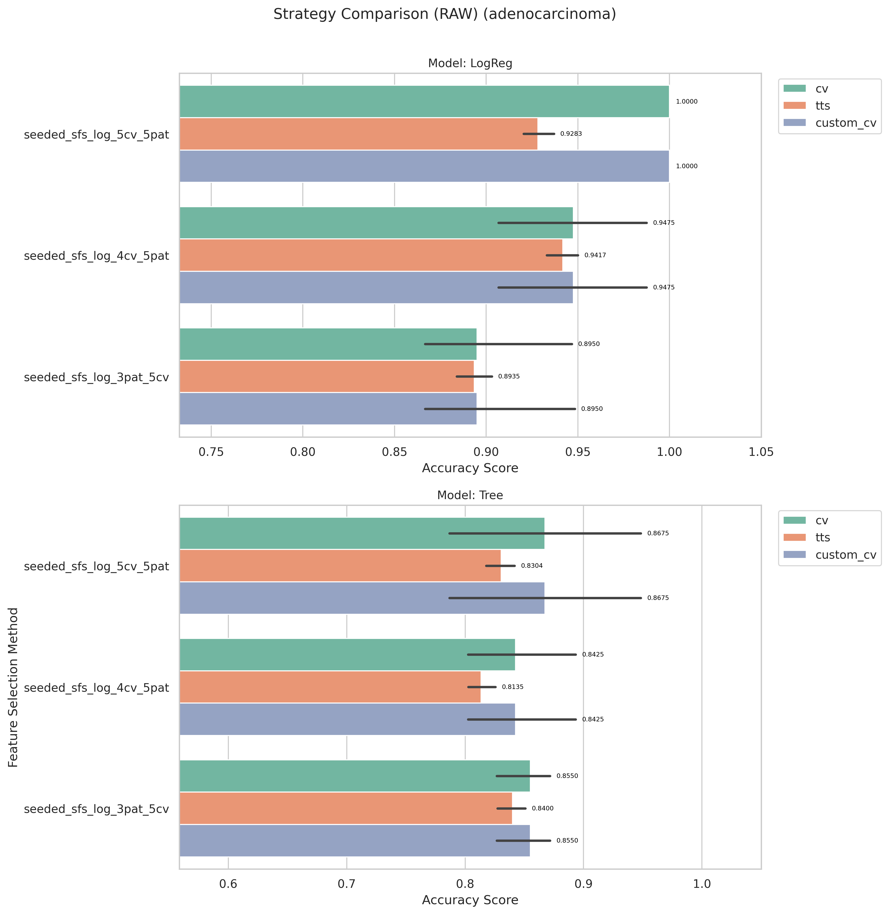

# adenocarcinoma Kết quả và Đánh giá

_Đọc bản tiếng Anh tại [result-adenocarcinoma.md](result-adenocarcinoma.md)_

[Quay lại mục lục](./README.vi.md)

## 1) EDA (Phân tích khám phá dữ liệu)

- Điểm vào notebook:
- `notebook/adenocarcinoma/01_eda.ipynb`
- Kích thước: (76, 9869)

[Chèn biểu đồ: Tổng quan EDA]

**Chú thích:**

- Mục đích: Kiểm tra xem bộ dữ liệu có bị mất cân bằng (imbalanced) hay không.
- Cách đọc: Trục hoành (V1) thể hiện các nhãn lớp (0 và 1), trục tung (count) là số lượng mẫu của từng lớp.

## 2) Tiền xử lý dữ liệu

- Điểm vào notebook:
- `notebook/adenocarcinoma/02_preprocess.ipynb`
- Quy ước thư mục đầu ra: `data/processed/adenocarcinoma/01_clean/`

## 3) Lọc đặc trưng (Filter Selection)

- Điểm vào notebook:
- `notebook/adenocarcinoma/03_filter_selection.ipynb`

**Chú thích:**

- Mục đích: So sánh hiệu năng các phương pháp filter để chọn ra nhóm đặc trưng tốt nhất cho bước tiếp theo.
- Cách đọc: Trục hoành là các phương pháp filter, trục tung là điểm đánh giá; cột/điểm càng cao thì phương pháp càng tốt.

## 4) Mô hình hóa (so sánh ở giai đoạn filter)

- Điểm vào notebook:
- `notebook/adenocarcinoma/04_modeling.ipynb`
- Kết quả modeling được theo dõi dưới `results/adenocarcinoma/filter/` khi có sẵn.

TỔNG QUAN VALIDATION CHÉO (xếp hạng)
| Hạng | Phương pháp | Mô hình | accuracy_tb |
|-|-|-|-|
|1| ANOVA_F_TEST| LogReg| 0.9342|
| 1| CORRELATION| LogReg| 0.9342|
| 2| None| LogReg| 0.8808|
| 2| ANOVA_F_TEST| Tree| 0.8808|
| 3| CHI_SQUARED| LogReg| 0.8692|
| 4| VARIANCE| LogReg| 0.8558|
| 5| MUTUAL_INFORMATION| Tree| 0.8425|
| 6| CORRELATION| Tree| 0.8417|
| 7| MUTUAL_INFORMATION| LogReg| 0.8292|
| 8| VARIANCE| Tree| 0.7883|
| 9| None| Tree| 0.7500|
| 10| CHI_SQUARED| Tree| 0.7367|

- Báo cáo: `results/adenocarcinoma/filter/reports/evaluation_adenocarcinoma.txt`
  [Chèn biểu đồ: So sánh Filter Selection]
  

## 5) Ensemble Filter (Bỏ phiếu + tập đặc trưng union)

- Điểm vào notebook:
- `notebook/adenocarcinoma/05_esemble_filter.ipynb`
- Tệp seed pool: `data/processed/adenocarcinoma/03_ensemble/top50_features_voting.csv`
- Kích thước seed pool: 10
- Đặc trưng có số phiếu cao nhất: `V7301(4)`, `V8621(3)`, `V6316(3)`, `V3089(3)`, `V9771(3)`

[Chèn biểu đồ: Bỏ phiếu Ensemble / Đặc trưng Union]

**Chú thích:**

- Mục đích: Hiển thị mức độ đồng thuận của các phương pháp filter khi bỏ phiếu chọn đặc trưng.
- Cách đọc: Trục hoành là tên đặc trưng, trục tung là số phiếu (vote count); đặc trưng có phiếu cao hơn được ưu tiên hơn.

## 6) Wrapper: Sklearn SFS (chạy Raw vs Union)

- Điểm vào script:
- `notebook/adenocarcinoma/06_sklearn_sfs-raw.py`
- `notebook/adenocarcinoma/06_sklearn_sfs-union.py`

| Biến thể | Sklearn Số đặc trưng chọn | Sklearn Global Best | Sklearn Thời gian fit (ms) |
| -------- | ------------------------: | ------------------: | -------------------------: |
| Raw      |                         3 |              0.9733 |                    644,417 |
| Union    |                         2 |              0.9474 |                     13,152 |

## 7) Wrapper: Seeded SFS (chạy Raw vs Union)

- Điểm vào script:
- `notebook/adenocarcinoma/07_sfs-raw.py`
- `notebook/adenocarcinoma/07_sfs-union.py`

| Biến thể | Seeded Số đặc trưng chọn | Seeded Global Best | Seeded Thời gian fit (ms) |
| -------- | -----------------------: | -----------------: | ------------------------: |
| Raw      |                        3 |            1.000000 |                   190.425 |
| Union    |                        6 |             0.9608 |                    13,509 |

## 8) Đánh giá Accuracy (so sánh Raw vs Union)

- Điểm vào notebook:
- `notebook/adenocarcinoma/8_accuracu_evaluate.ipynb`
- `notebook/adenocarcinoma/8_accuracu_evaluate_union.ipynb`

[Chèn biểu đồ: So sánh Accuracy Raw vs Union]

**Chú thích:**

- Mục đích: So sánh độ chính xác giữa các cấu hình wrapper (Sklearn SFS và Seeded SFS) theo từng biến thể dữ liệu.
- Cách đọc:
  - Trục hoành là từng cấu hình/phương pháp, trục tung là accuracy; giá trị cao hơn thể hiện hiệu năng tốt hơn.
  - Vạch đen thẳng đứng (Error bar): Thể hiện độ lệch chuẩn (Standard Deviation) qua các fold cross-validation. Vạch này càng ngắn chứng tỏ mô hình dự đoán càng ổn định, ít biến động.

**Chú thích:**

- Mục đích: So sánh độ chính xác giữa các cấu hình wrapper (Sklearn SFS và Seeded SFS) theo từng biến thể dữ liệu.
- Cách đọc:
  - Trục hoành là từng cấu hình/phương pháp, trục tung là accuracy; giá trị cao hơn thể hiện hiệu năng tốt hơn.
  - Vạch đen thẳng đứng (Error bar): Thể hiện độ lệch chuẩn (Standard Deviation) qua các fold cross-validation. Vạch này càng ngắn chứng tỏ mô hình dự đoán càng ổn định, ít biến động.

- **Quan sát:** Union sklearn tốt nhất trong đánh giá cuối cùng mặc dù điểm wrapper thấp hơn raw sklearn.
- **Giải thích:** Mục tiêu của wrapper và mục tiêu đánh giá downstream có tương quan nhưng không đồng nhất.
- **Kết luận:** Sử dụng thứ hạng đánh giá cuối cùng làm tiêu chí chọn mô hình.

- Cấu hình raw tốt nhất: `sklearn + LogReg`, accuracy trung bình 0.9211, std 0.0000 (2-fold)
- Cấu hình union tốt nhất: `sklearn + LogReg`, accuracy trung bình **0.9467**, std 0.0298

## 9) Đánh giá thời gian (so sánh thời gian fit Raw vs Union)

- Điểm vào notebook:
- `notebook/adenocarcinoma/9_time_evaluate.ipynb`
- `notebook/adenocarcinoma/9_time_evaluate_union.ipynb`

[Chèn biểu đồ: So sánh thời gian Raw vs Union]

**Chú thích:**

- Mục đích: So sánh chi phí thời gian huấn luyện giữa các phương pháp wrapper trên cùng bộ dữ liệu.
- Cách đọc: Trục hoành là phương pháp/cấu hình, trục tung là tổng thời gian fit (ms); cột thấp hơn nghĩa là chạy nhanh hơn.
  

**Chú thích:**

- Mục đích: So sánh chi phí thời gian huấn luyện giữa các phương pháp wrapper trên cùng bộ dữ liệu.
- Cách đọc: Trục hoành là phương pháp/cấu hình, trục tung là tổng thời gian fit (ms); cột thấp hơn nghĩa là chạy nhanh hơn.

- **Quan sát:** Các lần chạy union thường nhanh hơn raw trên hầu hết phương pháp wrapper.
- **Giải thích:** Union làm giảm không gian ứng viên, từ đó giảm tổng số lần fit mô hình.
- **Kết luận:** Dùng union để lặp thử nhanh; dùng raw khi cần tối đa hóa wrapper score.

## 10) Đánh Giá Cuối Cùng (So Sánh Tất Cả Phương Pháp)

- Điểm vào notebook:
- `notebook/adenocarcinoma/10_final_evaluate.ipynb`
- Báo cáo: `results/adenocarcinoma/evaluation/reports/final_evaluation_all_methods_adenocarcinoma_adenocarcinoma.txt`

[Biểu Đồ: Đánh Giá Cuối Cùng - Tất Cả Phương Pháp]

**Chú Thích:**
- Mục đích: So sánh tất cả phương pháp lựa chọn đặc trưng (Filter, Ensemble, Sklearn SFS, Seeded SFS) với cả hai mô hình LogReg và Tree.
- Cách đọc:
  - Trục X liệt kê tất cả các kết hợp phương pháp/mô hình (ví dụ: "Sklearn_SFS_Raw + LogReg").
  - Trục Y hiển thị độ chính xác cross-validation; các cột cao hơn cho biết hiệu suất tốt hơn.
  - Các thanh lỗi dọc hiển thị độ lệch chuẩn (Std) trên các fold; các thanh ngắn hơn chỉ ra mô hình ổn định hơn.

**Quan Sát Chính:**
- Cấu hình tốt nhất: Sklearn_SFS_Raw + LogReg với độ chính xác 0.9600 (σ=0.0365)
- Xếp thứ hai: Sklearn_SFS_Union + LogReg với độ chính xác 0.9467
- Khuyến nghị: Xem so sánh chi tiết trong biểu đồ và tệp báo cáo ở trên.

## 11) Xác minh kết quả

- Để đảm bảo phương pháp đánh giá không bị lỗi, tác giả sử dụng thêm 2 phương pháp khác để xác minh:
  - Chia dữ liệu 70/30 train/test + lặp lại 50 lần → lấy trung bình.
  - Xây dựng hàm cross-validation tùy chỉnh.

