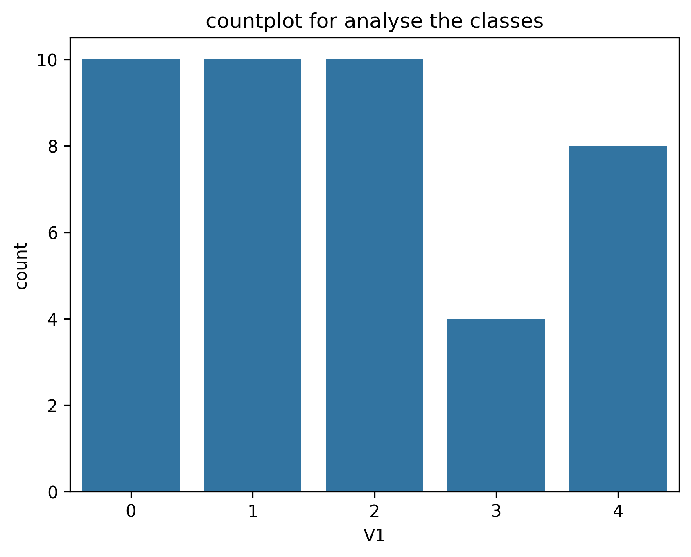
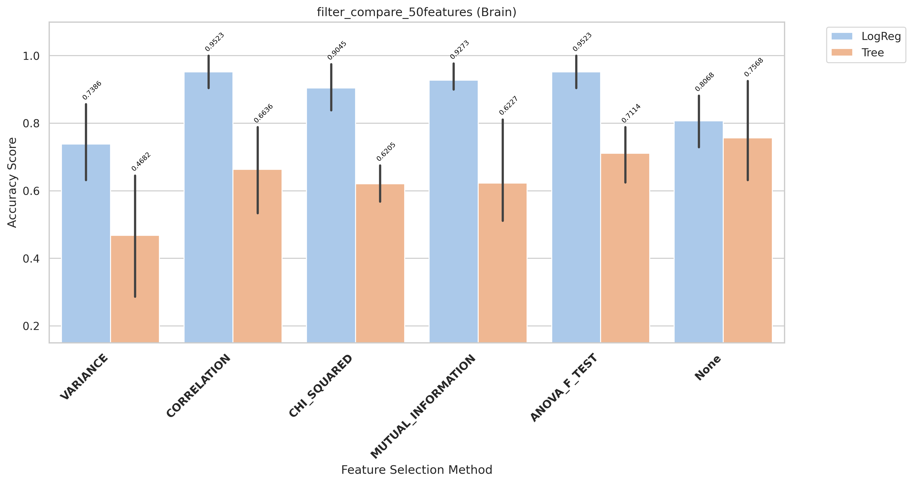
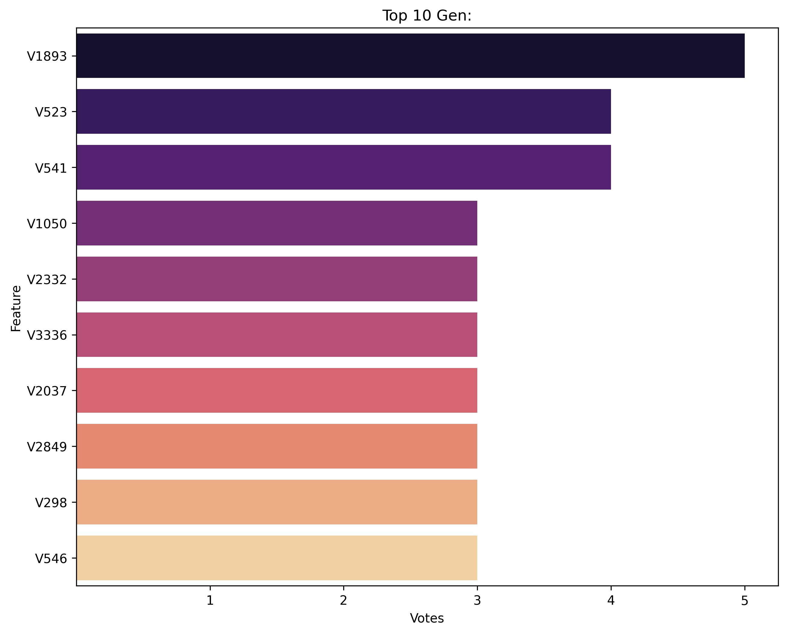
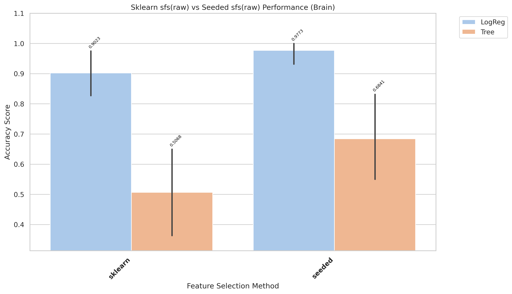
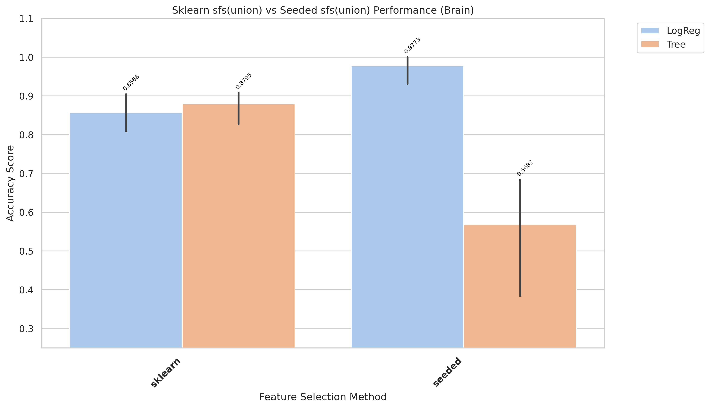
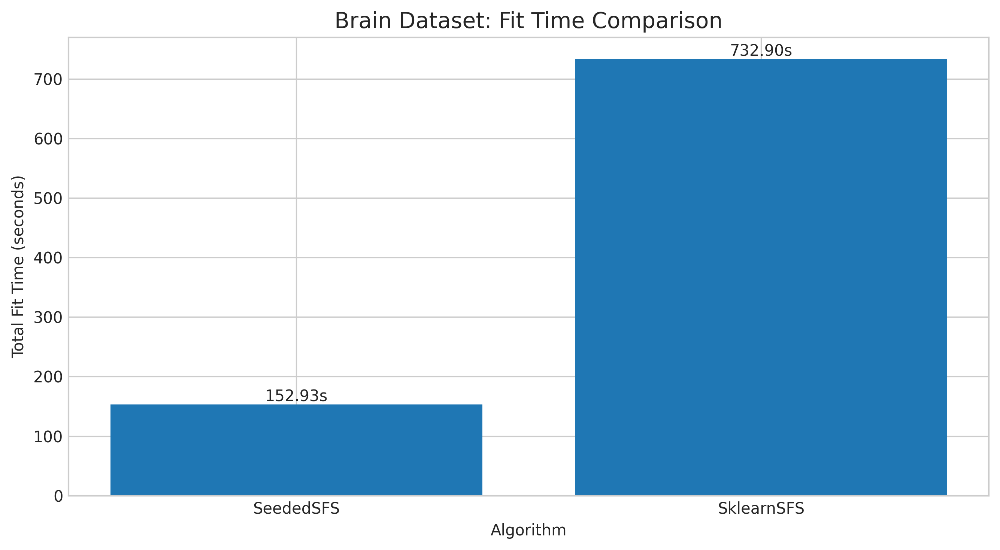
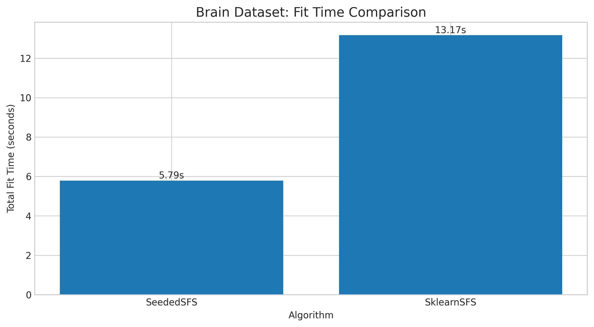
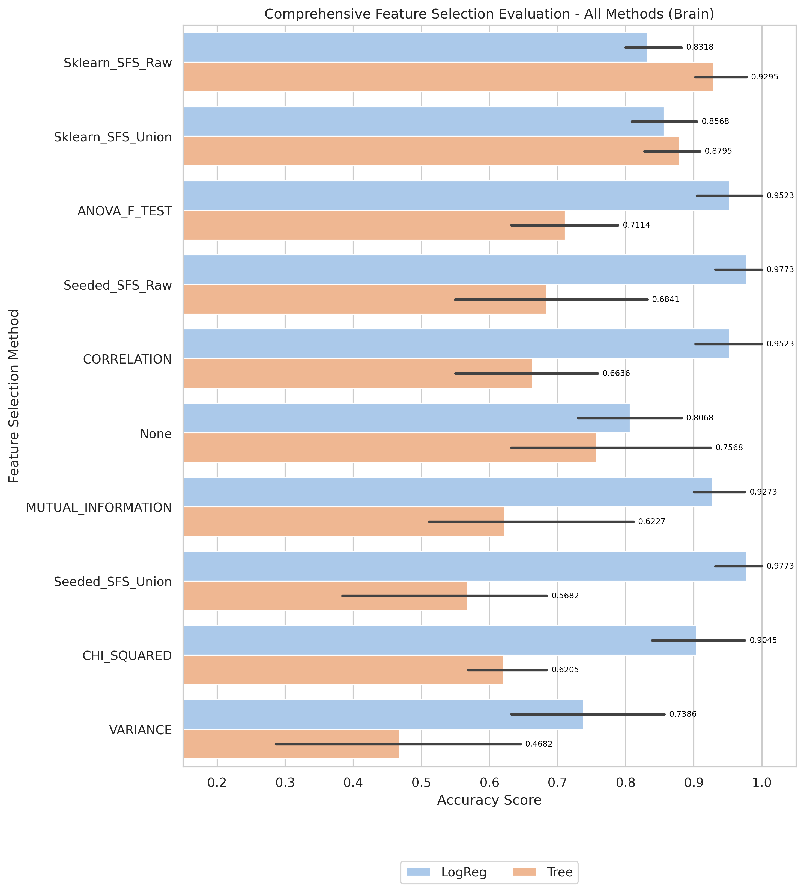

# Brain Results and Evaluation

[Back to index](../results.md)

## 1) EDA (Exploratory Data Analysis)

- Notebook entry point(s):
- `notebook/Brain/01_eda.ipynb`

[Insert Chart: EDA Summary]

**Caption:**

- Purpose: Check whether the dataset is imbalanced.
- How to read: The x-axis (V1) shows class labels (0 and 1), and the y-axis (count) shows the number of samples in each class.

## 2) Data Preprocessing

- Notebook entry point(s):
- Not explicitly available in current notebook folder.
- Output location convention: `data/processed/Brain/01_clean/`

## 3) Filter Selection

- Notebook entry point(s):
- `notebook/Brain/02_Filter_selection.ipynb`
- Result data: `data/processed/filter`

## 4) Modeling (Filter-stage comparison)

- Notebook entry point(s):
- `notebook/Brain/03_Modeling.ipynb`
- Report artifact: `results/Brain/filter/reports/filter_compare_50features_Brain.txt`

CROSS-VALIDATION SUMMARY (ranked)
| rank | Method| Model| mean_accuracy|
|-|-|-|-|
| 1| ANOVA_F_TEST| LogReg| 0.9523|  
| 1| CORRELATION| LogReg| 0.9523|  
| 2| MUTUAL_INFORMATION| LogReg| 0.9273|  
| 3| CHI_SQUARED| LogReg| 0.9045|  
| 4| None| LogReg| 0.8068|  
| 5| None| Tree| 0.7568|  
| 6| VARIANCE| LogReg| 0.7386|  
| 7| ANOVA_F_TEST| Tree| 0.7114|  
| 8| CORRELATION| Tree| 0.6636|  
| 9| MUTUAL_INFORMATION| Tree| 0.6227|  
| 10| CHI_SQUARED| Tree| 0.6205|  
| 11| VARIANCE| Tree| 0.4682|

[Insert Chart: Filter Selection Comparison]

**Caption:**

- Purpose: Compare filter-method performance to select the best feature set for the next stage.
- How to read: The x-axis lists filter methods, and the y-axis shows evaluation scores; higher bars/scores indicate better methods.

## 5) Ensemble Filter (Voting + union feature set)

- Notebook entry point(s):
- `notebook/Brain/04_Ensemble_fitler_selection.ipynb`
- `notebook/Brain/05_Union.ipynb`
- Seed pool file: `data/processed/Brain/03_ensemble/top50_features_voting.csv`
- Seed pool size: 10
- Top voting features: `V1893(5)`, `V523(4)`, `V541(4)`, `V1050(3)`, `V2332(3)`

[Insert Chart: Ensemble Voting / Union Features]

**Caption:**

- Purpose: Show agreement among filter methods when voting for features.
- How to read: The x-axis lists feature names, and the y-axis shows vote counts; features with higher votes are prioritized.

## 6) Wrapper: Sklearn SFS (Raw vs Union execution)

- Script entry point(s):
- `notebook/Brain/06_sklearn_sfs-raw.py`
- `notebook/Brain/06_sklearn_sfs-union.py`

| Variant | Sklearn Selected | Sklearn Global Best | Sklearn Fit Time (ms) |
| ------- | ---------------: | ------------------: | --------------------: |
| Raw     |                6 |              0.9295 |               732,895 |
| Union   |                4 |              0.8795 |                13,169 |

## 7) Wrapper: Seeded SFS (Raw vs Union execution)

- Runing SFS with:
  - logistic regressions core
  - 1 seeds

- Script entry point(s):
  - `notebook/Brain/07_sfs-raw.py`
  - `notebook/Brain/07_sfs-union.py`

| Variant | Seeded Selected | Seeded Global Best | Seeded Fit Time (s) |
| ------- | --------------: | -----------------: | ------------------: |
| Raw     |               6 |           0.977273 |          152.933121 |
| Union   |               6 |           0.977273 |            5.791480 |

## 8) Accuracy Evaluation (Comparing Raw vs Union)

- Notebook entry point(s):
- `notebook/Brain/08_accuracy_evaluate.ipynb`
- `notebook/Brain/08_accuracy_evaluate_union.ipynb`

[Insert Chart: Accuracy Comparison Raw vs Union]

**Caption:**

- Purpose: Compare accuracy across wrapper configurations (Sklearn SFS and Seeded SFS) for each data variant.
- How to read:
  - The x-axis shows configurations/methods, and the y-axis shows accuracy; higher values indicate better performance.
  - Vertical black lines (error bars) show Standard Deviation across cross-validation folds. Shorter bars indicate more stable model performance.

**Caption:**

- Purpose: Compare accuracy across wrapper configurations (Sklearn SFS and Seeded SFS) for each data variant.
- How to read:
  - The x-axis shows configurations/methods, and the y-axis shows accuracy; higher values indicate better performance.
  - Vertical black lines (error bars) show Standard Deviation across cross-validation folds. Shorter bars indicate more stable model performance.

- **Observation:** Score trajectory shows stepwise improvements with intermittent regressions.
- **Explanation:** Feature interactions are non-monotonic; global-best tracking preserves optimal subset.
- **Takeaway:** Retaining global-best rollback is important for robust final subset selection.

- Raw best configuration: see evaluation report.
- Union best configuration: see evaluation report.
- Final selected features (raw seeded): 11 features

## 9) Time Evaluation (Comparing fit times for Raw vs Union)

- Notebook entry point(s):
- `notebook/Brain/9_time_evaluate.ipynb`
- `notebook/Brain/9_time_evaluate_union.ipynb`

[Insert Chart: Time Comparison Raw vs Union]

**Caption:**

- Purpose: Compare training-time cost across wrapper methods on the same dataset.
- How to read: The x-axis shows methods/configurations, and the y-axis shows total fit time (ms); lower bars mean faster runtime.
  

**Caption:**

- Purpose: Compare training-time cost across wrapper methods on the same dataset.
- How to read: The x-axis shows methods/configurations, and the y-axis shows total fit time (ms); lower bars mean faster runtime.

- **Observation:** Union runs are generally faster than raw runs across wrapper methods.
- **Explanation:** Union reduces candidate-space size, reducing total model-fit operations.
- **Takeaway:** Use union for rapid iteration; use raw when chasing peak wrapper score.

## 10) Final Evaluation (All Methods Comparison)

- Notebook entry point(s):
- `notebook/Brain/10_final_evaluate.ipynb`
- Report artifact: `results/Brain/evaluation/reports/final_evaluation_all_methods_brain_Brain.txt`

[Insert Chart: Final Evaluation - All Methods]

**Caption:**

- Purpose: Compare all feature selection methods (Filter, Ensemble, Sklearn SFS, Seeded SFS) with both LogReg and Tree models.
- How to read:
  - The x-axis lists all method/model combinations (e.g., "Sklearn_SFS_Raw + LogReg").
  - The y-axis shows cross-validation accuracy; higher bars indicate better performance.
  - Vertical error bars show Standard Deviation across folds; shorter bars indicate more stable models.

**Key Observations:**

- Best configuration: ANOVA_F_TEST + LogReg with 0.9523 accuracy (σ=0.0552)
- Second best: CORRELATION + LogReg with 0.9523 accuracy
- Recommendation: See detailed comparison in the plot and report file above.
