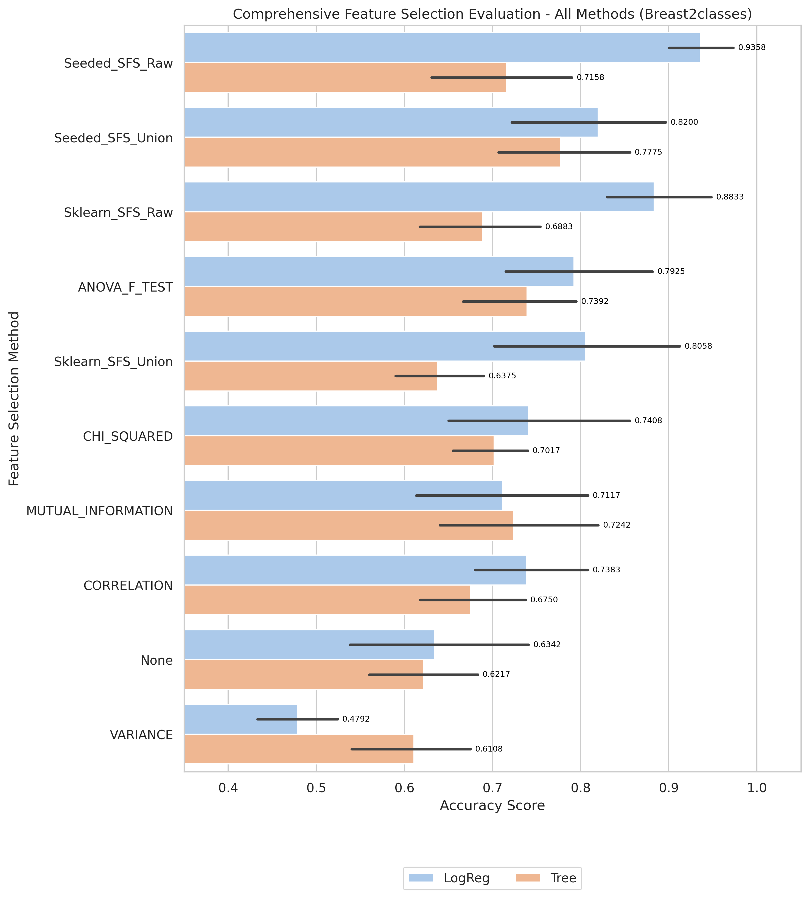
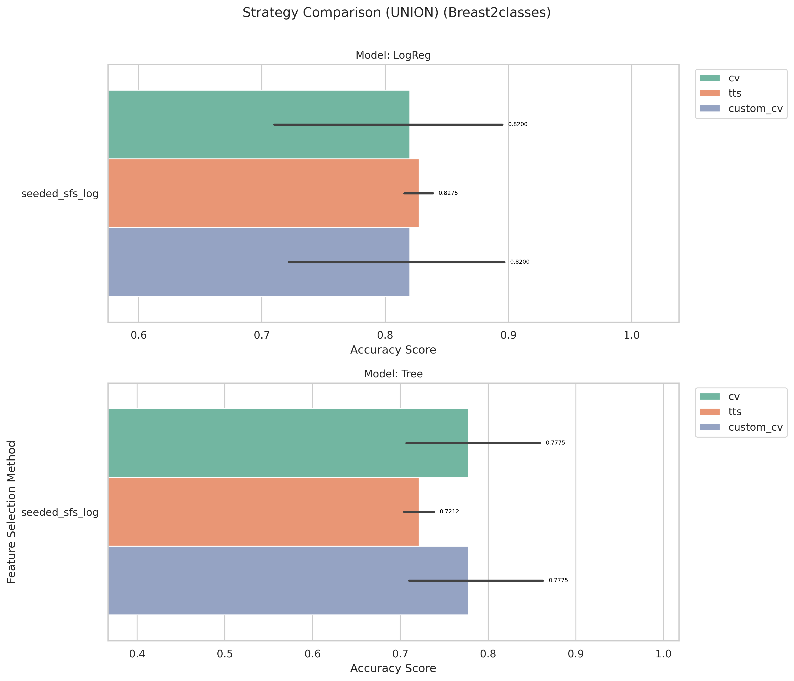
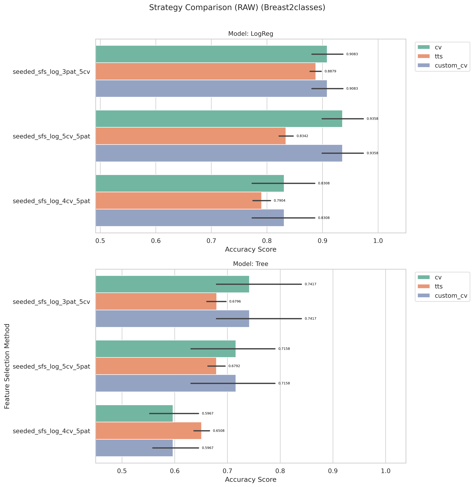

# Breast2classes Results and Evaluation

[Back to index](./README.md)

## 1) EDA (Exploratory Data Analysis)

- Notebook entry point(s):
- `notebook/Breast2classes/01_eda.ipynb`
- Shape: (77, 4870)

[Insert Chart: EDA Summary]

**Caption:**

- Purpose: Check whether the dataset is imbalanced.
- How to read: The x-axis (V1) shows class labels (0 and 1), and the y-axis (count) shows the number of samples in each class.

## 2) Data Preprocessing

- Notebook entry point(s):
- `notebook/Breast2classes/02_preprocess.ipynb`
- Output location convention: `data/processed/Breast2classes/01_clean/`

## 3) Filter Selection

- Notebook entry point(s):
- `notebook/Breast2classes/03_filter_selection.ipynb`
- Results data: `data/processed/Breast2classes/02_filter`

## 4) Modeling (Filter-stage comparison)

- Notebook entry point(s):
- `notebook/Breast2classes/04_modeling.ipynb`
- Report artifact: `results/Breast2classes/filter/reports/filter_compare_50features_Breast2classes.txt`

[Insert Chart: Filter Selection Comparison]

**Caption:**

- Purpose: Compare filter-method performance to select the best feature set for the next stage.
- How to read: The x-axis lists filter methods, and the y-axis shows evaluation scores; higher bars/scores indicate better methods.

## 5) Ensemble Filter (Voting + union feature set)

- Notebook entry point(s):
- `notebook/Breast2classes/05_esemble_filter.ipynb`
- Seed pool file: `data/processed/Breast2classes/03_ensemble/top50_features_voting.csv`
- Seed pool size: 10
- Top voting features: `V2221(4)`, `V3818(4)`, `V1325(4)`, `V2273(4)`, `V4360(4)`

[Insert Chart: Ensemble Voting / Union Features]

**Caption:**

- Purpose: Show agreement among filter methods when voting for features.
- How to read: The x-axis lists feature names, and the y-axis shows vote counts; features with higher votes are prioritized.

## 6) Wrapper: Sklearn SFS (Raw vs Union execution)

- Script entry point(s):
- `notebook/Breast2classes/06_sklearn_sfs-raw.py`
- `notebook/Breast2classes/06_sklearn_sfs-union.py`
- Runing with log model

| Variant | Sklearn Selected | Sklearn Global Best | Sklearn Fit Time (s) |
| ------- | ---------------: | ------------------: | -------------------: |
| Raw     |                7 |            0.922500 |              733.129 |
| Union   |                4 |              0.8567 |               13.638 |

## 7) Wrapper: Seeded SFS (Raw vs Union execution)

- Script entry point(s):
- `notebook/Breast2classes/07_sfs-raw.py`
- `notebook/Breast2classes/07_sfs-union.py`
- Runing with log model

| Variant | Seeded Selected | Seeded Global Best | Seeded Fit Time (s) |
| ------- | --------------: | -----------------: | ------------------: |
| Raw     |               9 |           0.935833 |             139.027 |
| Union   |               9 |           0.895833 |               6.114 |

## 8) Accuracy Evaluation (Comparing Raw vs Union)

- Notebook entry point(s):
- `notebook/Breast2classes/8_accuracu_evaluate.ipynb`
- `notebook/Breast2classes/8_accuracu_evaluate_union.ipynb`

[Insert Chart: Accuracy Comparison Raw vs Union]

**Caption:**

- Purpose: Compare accuracy across wrapper configurations (Sklearn SFS and Seeded SFS) for each data variant.
- How to read:
  - The x-axis shows configurations/methods, and the y-axis shows accuracy; higher values indicate better performance.
  - Vertical black lines (error bars) show Standard Deviation across cross-validation folds. Shorter bars indicate more stable model performance.
    

**Caption:**

- Purpose: Compare accuracy across wrapper configurations (Sklearn SFS and Seeded SFS) for each data variant.
- How to read:
  - The x-axis shows configurations/methods, and the y-axis shows accuracy; higher values indicate better performance.
  - Vertical black lines (error bars) show Standard Deviation across cross-validation folds. Shorter bars indicate more stable model performance.

- **Observation:** Raw seeded performs materially better than union seeded in evaluation.
- **Explanation:** Discriminative information appears spread beyond union-restricted candidates.
- **Takeaway:** Keep raw seeded as default for best predictive performance.

- Raw best configuration: `seeded + LogReg`, mean accuracy **0.9358**, std 0.0443
- Union best configuration: `seeded + LogReg`, mean accuracy 0.8200, std 0.1188
- Final selected features (winning setup, raw seeded): 9 features

## 9) Time Evaluation (Comparing fit times for Raw vs Union)

- Notebook entry point(s):
- `notebook/Breast2classes/9_time_evaluate.ipynb`
- `notebook/Breast2classes/9_time_evaluate_union.ipynb`

[Insert Chart: Time Comparison Raw vs Union]

**Caption:**

- Purpose: Compare training-time cost across wrapper methods on the same dataset.
- How to read: The x-axis shows methods/configurations, and the y-axis shows total fit time (ms); lower bars mean faster runtime.

**Caption:**

- Purpose: Compare training-time cost across wrapper methods on the same dataset.
- How to read: The x-axis shows methods/configurations, and the y-axis shows total fit time (ms); lower bars mean faster runtime.

- **Observation:** Union runs are generally faster than raw runs across wrapper methods.
- **Explanation:** Union reduces candidate-space size, reducing total model-fit operations.
- **Takeaway:** Use union for rapid iteration; use raw when chasing peak wrapper score.

## 10) Final Evaluation (All Methods Comparison)

- Notebook entry point(s):
- `notebook/Breast2classes/10_final_evaluate.ipynb`
- Report artifact: `results/Breast2classes/evaluation/reports/final_evaluation_all_methods_breast2classes_Breast2classes.txt`

[Insert Chart: Final Evaluation - All Methods]

**Caption:**

- Purpose: Compare all feature selection methods (Filter, Ensemble, Sklearn SFS, Seeded SFS) with both LogReg and Tree models.
- How to read:
  - The x-axis lists all method/model combinations (e.g., "Sklearn_SFS_Raw + LogReg").
  - The y-axis shows cross-validation accuracy; higher bars indicate better performance.
  - Vertical error bars show Standard Deviation across folds; shorter bars indicate more stable models.

| Rank | Method + Model             | CV Folds | Mean Accuracy |    Std | Median |    Min |    Max |
| ---- | -------------------------- | -------: | ------------: | -----: | -----: | -----: | -----: |
| 1    | Seeded_SFS_Raw + LogReg    |        5 |      0.935833 | 0.0443 | 0.9333 | 0.8750 | 1.0000 |
| 2    | Sklearn_SFS_Raw + LogReg   |        5 |        0.8833 | 0.0724 | 0.8750 | 0.8000 | 1.0000 |
| 3    | Seeded_SFS_Union + LogReg  |        5 |        0.8200 | 0.1188 | 0.8667 | 0.6250 | 0.9333 |
| 4    | Sklearn_SFS_Union + LogReg |        5 |        0.8058 | 0.1377 | 0.8000 | 0.6667 | 1.0000 |

**Key Observations:**

- Best configuration: Seeded_SFS_Raw + LogReg with 0.9358 accuracy (σ=0.0443)
- Second best: Sklearn_SFS_Raw + LogReg with 0.8833 accuracy
- Recommendation: See detailed comparison in the plot and report file above.

## 11) Verify the result

- To make sure the evaluate method is not broken, i using 2 more method to verify it:
  - 70/30 train/test split + 50time -> avg.
  - built a custom cross-validation function

