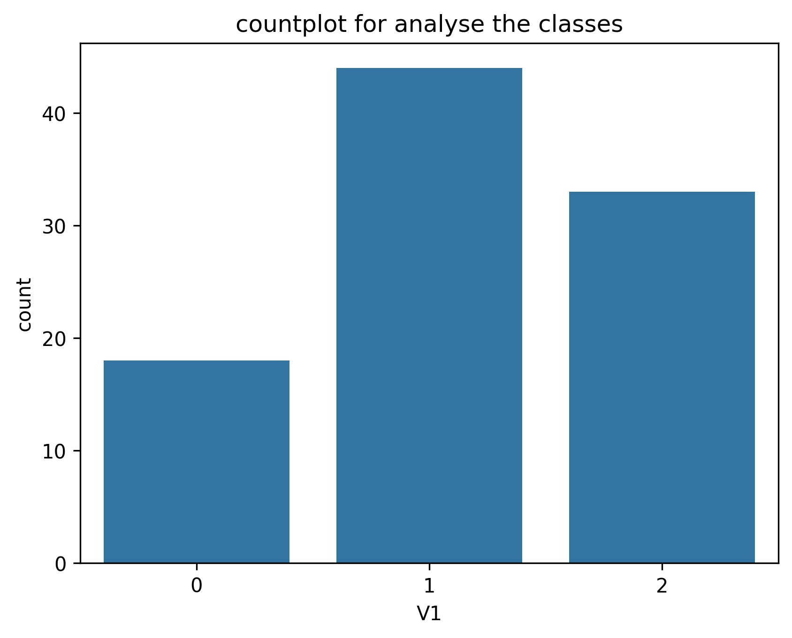
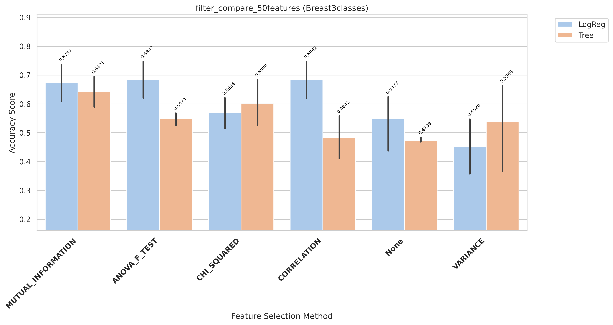
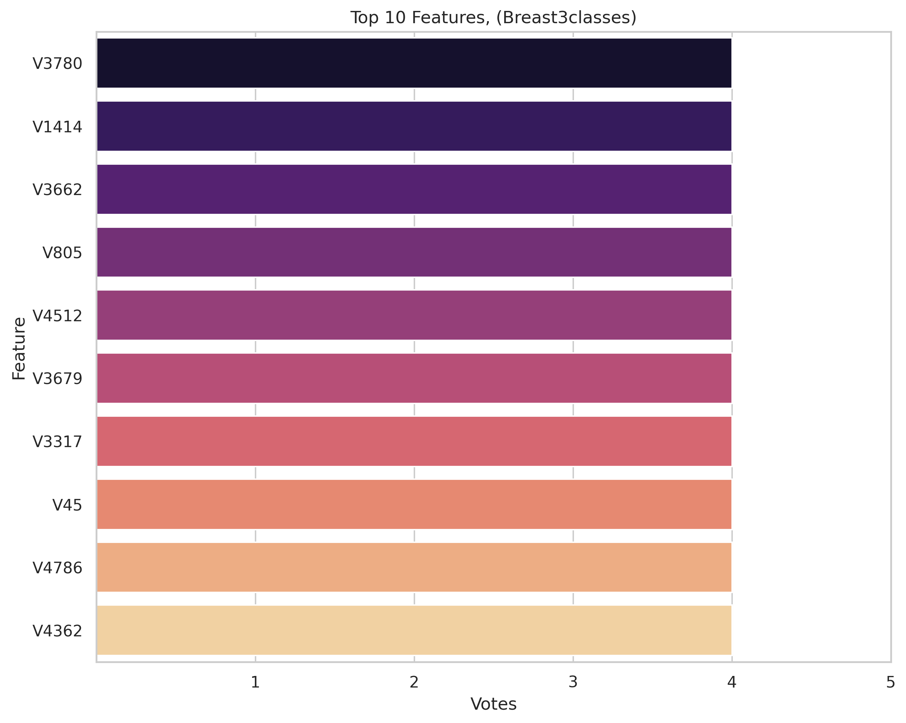
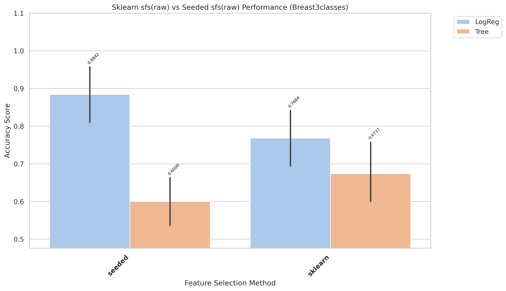
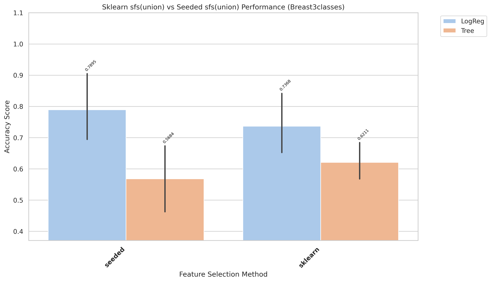
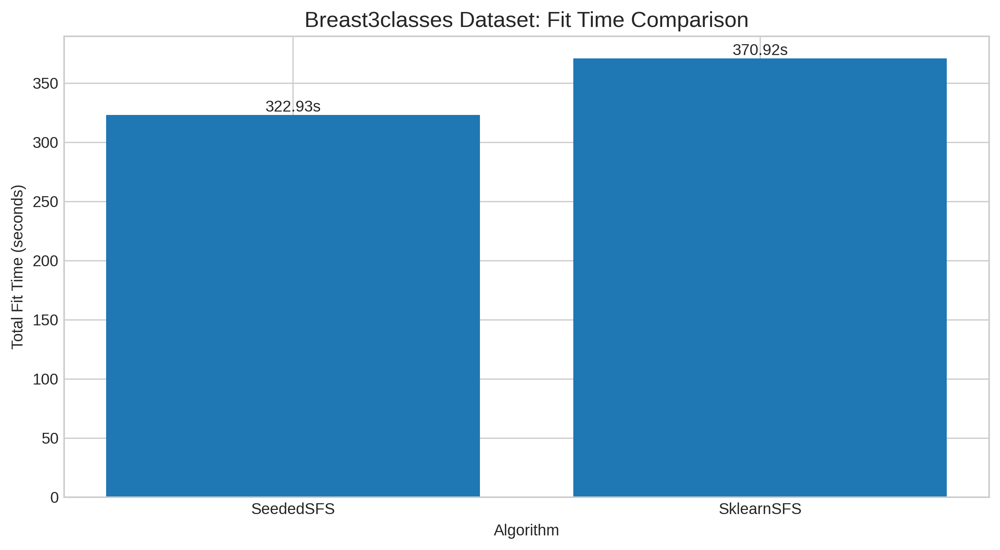
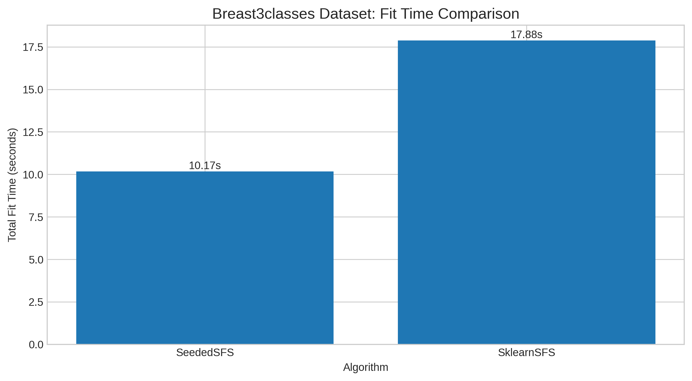

# Breast3classes Results and Evaluation

[Back to index](../results.md)

## 1) EDA (Exploratory Data Analysis)

- Notebook entry point(s):
- `notebook/Breast3classes/01_eda.ipynb`

[Insert Chart: EDA Summary]

## 2) Data Preprocessing

- Notebook entry point(s):
- `notebook/Breast3classes/02_preprocess.ipynb`
- Output location convention: `data/processed/Breast3classes/01_clean/`

## 3) Filter Selection

- Notebook entry point(s):
- `notebook/Breast3classes/03_filter_selection.ipynb`
- Report artifact: `results/Breast3classes/filter/reports/filter_compare_50features_Breast3classes.txt`

[Insert Chart: Filter Selection Comparison]

## 4) Modeling (Filter-stage comparison)

- Notebook entry point(s):
- `notebook/Breast3classes/04_modeling.ipynb`
- Modeling outputs are tracked under `results/Breast3classes/filter/` when available.

## 5) Ensemble Filter (Voting + union feature set)

- Notebook entry point(s):
- `notebook/Breast3classes/05_esemble_filter.ipynb`
- Seed pool file: `data/processed/Breast3classes/03_ensemble/top50_features_voting.csv`
- Seed pool size: 10
- Top voting features: `V3780(4)`, `V1414(4)`, `V3662(4)`, `V805(4)`, `V4512(4)`

[Insert Chart: Ensemble Voting / Union Features]

## 6) Wrapper: Sklearn SFS (Raw vs Union execution)

- Script entry point(s):
- `notebook/Breast3classes/06_sklearn_sfs-raw.py`
- `notebook/Breast3classes/06_sklearn_sfs-union.py`

| Variant | Sklearn Selected | Sklearn Global Best | Sklearn Fit Time (ms) |
|---|---:|---:|---:|
| Raw | 5 | 0.8 | 370,924 |
| Union | 6 | 0.8 | 17,883 |

## 7) Wrapper: Seeded SFS (Raw vs Union execution)

- Script entry point(s):
- `notebook/Breast3classes/07_sfs-raw.py`
- `notebook/Breast3classes/07_sfs-union.py`

| Variant | Seeded Selected | Seeded Global Best | Seeded Fit Time (ms) |
|---|---:|---:|---:|
| Raw | 6 | 0.8105 | 99,465 |
| Union | 8 | 0.8 | 13,782 |

## 8) Accuracy Evaluation (Comparing Raw vs Union)

- Notebook entry point(s):
- `notebook/Breast3classes/8_accuracu_evaluate.ipynb`
- `notebook/Breast3classes/8_accuracu_evaluate_union.ipynb`

[Insert Chart: Accuracy Comparison Raw vs Union]

- **Observation:** Sklearn LogReg ranks first in both raw and union evaluation.
- **Explanation:** For this multiclass setting, sklearn-selected subsets align better with downstream classifier behavior.
- **Takeaway:** Use sklearn baseline as primary configuration for this dataset.

- Raw best configuration: `sklearn + LogReg`, mean accuracy **0.7684**, std 0.1026
- Union best configuration: `sklearn + LogReg`, mean accuracy 0.7368, std 0.1289

## 9) Time Evaluation (Comparing fit times for Raw vs Union)

- Notebook entry point(s):
- `notebook/Breast3classes/9_time_evaluate.ipynb`
- `notebook/Breast3classes/9_time_evaluate_union.ipynb`

[Insert Chart: Time Comparison Raw vs Union]

- **Observation:** Union runs are generally faster than raw runs across wrapper methods.
- **Explanation:** Union reduces candidate-space size, reducing total model-fit operations.
- **Takeaway:** Use union for rapid iteration; use raw when chasing peak wrapper score.
