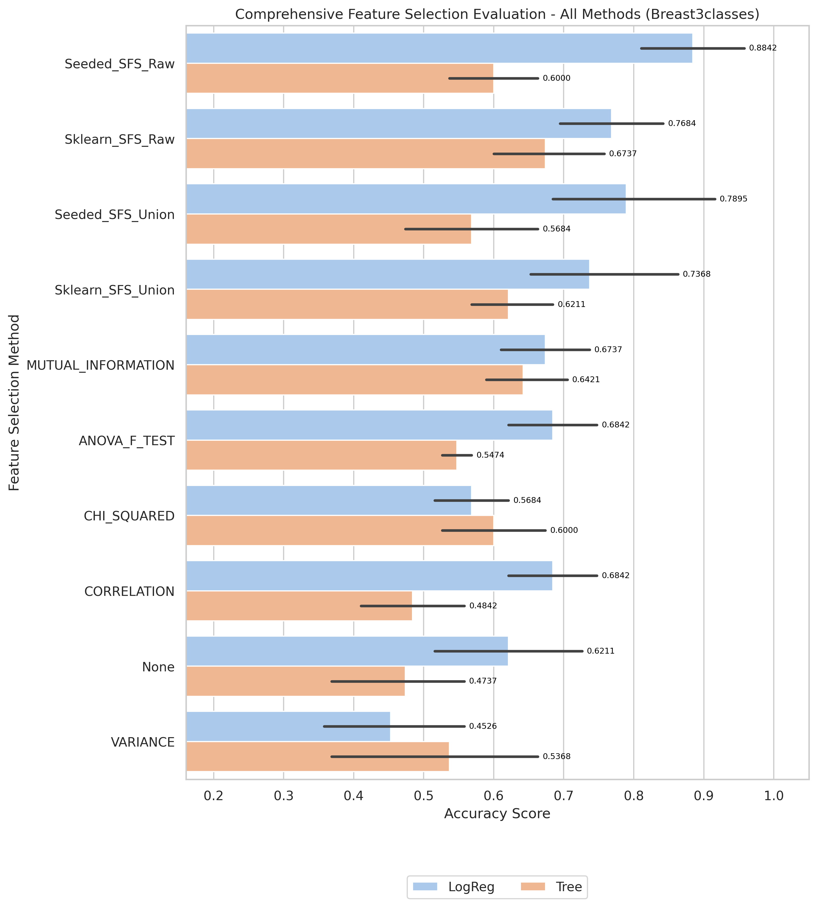
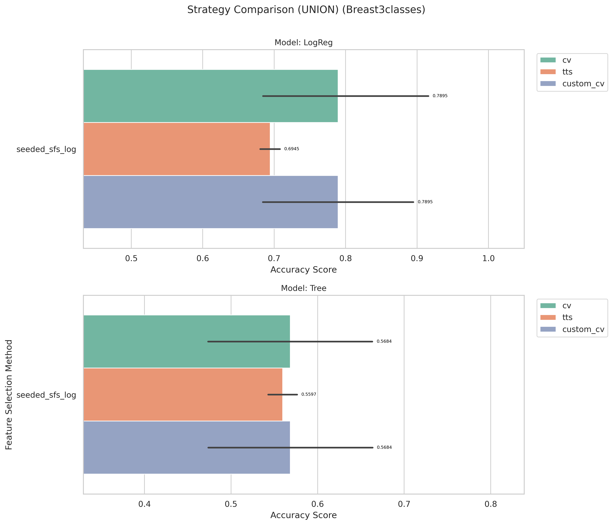
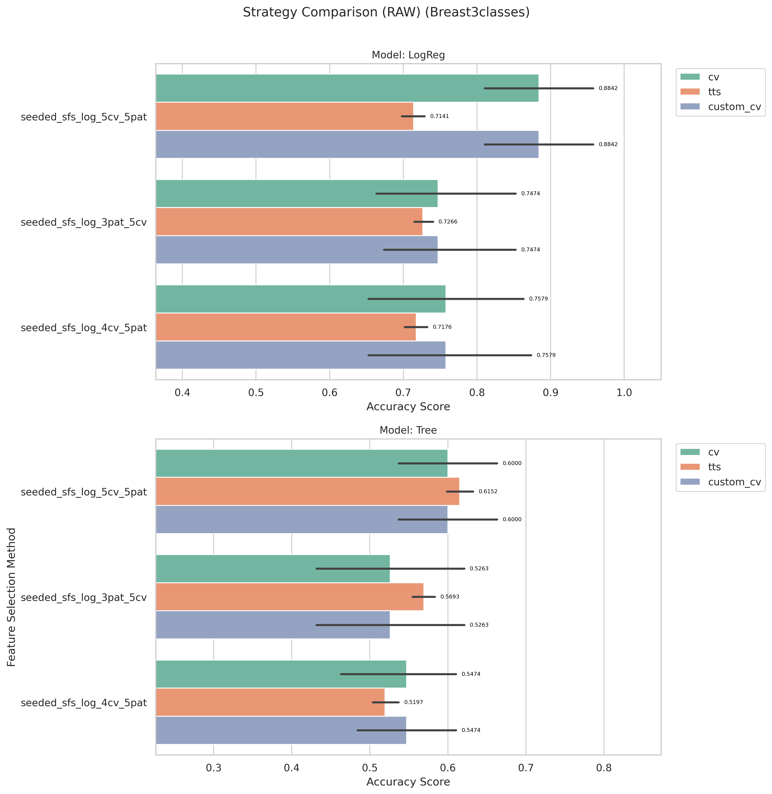

# Breast3classes Kết quả và Đánh giá

_Đọc bản tiếng Anh tại [result-breast3classes.md](result-breast3classes.md)_

[Quay lại mục lục](./README.vi.md)

## 1) EDA (Phân tích khám phá dữ liệu)

- Điểm vào notebook:
- `notebook/Breast3classes/01_eda.ipynb`
- Shape: (95,4870)

[Chèn biểu đồ: Tổng quan EDA]

**Chú thích:**
- Mục đích: Kiểm tra xem bộ dữ liệu có bị mất cân bằng (imbalanced) hay không.
- Cách đọc: Trục hoành (V1) thể hiện các nhãn lớp (0 và 1), trục tung (count) là số lượng mẫu của từng lớp.

## 2) Tiền xử lý dữ liệu

- Điểm vào notebook:
- `notebook/Breast3classes/02_preprocess.ipynb`
- Quy ước thư mục đầu ra: `data/processed/Breast3classes/01_clean/`

## 3) Lọc đặc trưng (Filter Selection)

- Điểm vào notebook:
- `notebook/Breast3classes/03_filter_selection.ipynb`
- Dữ liệu kết quả: `data/processed/Breast3classes/02_filter`

## 4) Mô hình hóa (so sánh ở giai đoạn filter)

- Điểm vào notebook:
- `notebook/Breast3classes/04_modeling.ipynb`
- Tệp báo cáo: `results/Breast3classes/filter/reports/filter_compare_50features_Breast3classes.txt`

[Chèn biểu đồ: So sánh Filter Selection]

**Chú thích:**

- Mục đích: So sánh hiệu năng các phương pháp filter để chọn ra nhóm đặc trưng tốt nhất cho bước tiếp theo.
- Cách đọc: Trục hoành là các phương pháp filter, trục tung là điểm đánh giá; cột/điểm càng cao thì phương pháp càng tốt.

## 5) Ensemble Filter (Bỏ phiếu + tập đặc trưng union)

- Điểm vào notebook:
- `notebook/Breast3classes/05_esemble_filter.ipynb`
- Tệp seed pool: `data/processed/Breast3classes/03_ensemble/top50_features_voting.csv`
- Kích thước seed pool: 10
- Đặc trưng có số phiếu cao nhất: `V3780(4)`, `V1414(4)`, `V3662(4)`, `V805(4)`, `V4512(4)`

[Chèn biểu đồ: Bỏ phiếu Ensemble / Đặc trưng Union]

**Chú thích:**
- Mục đích: Hiển thị mức độ đồng thuận của các phương pháp filter khi bỏ phiếu chọn đặc trưng.
- Cách đọc: Trục hoành là tên đặc trưng, trục tung là số phiếu (vote count); đặc trưng có phiếu cao hơn được ưu tiên hơn.

## 6) Wrapper: Sklearn SFS (chạy Raw vs Union)

- Điểm vào script:
- `notebook/Breast3classes/06_sklearn_sfs-raw.py`
- `notebook/Breast3classes/06_sklearn_sfs-union.py`

| Biến thể | Sklearn Số đặc trưng chọn | Sklearn Global Best | Sklearn Thời gian fit (s) |
| ------- | -----------------------: | ------------------: | -----------------------: |
| Raw     |                        5 |                 0.8 |                  370.924 |
| Union   |                        6 |                 0.8 |                   17.883 |

## 7) Wrapper: Seeded SFS (chạy Raw vs Union)

- Điểm vào script:
- `notebook/Breast3classes/07_sfs-raw.py`
- `notebook/Breast3classes/07_sfs-union.py`

| Biến thể | Seeded Số đặc trưng chọn | Seeded Global Best | Seeded Thời gian fit (s) |
| ------- | -----------------------: | -----------------: | -----------------------: |
| Raw     |                       17 |           0.884211 |                  322.930 |
| Union   |                        8 |                0.8 |                   13.782 |

## 8) Đánh giá Accuracy (so sánh Raw vs Union)

- Điểm vào notebook:
- `notebook/Breast3classes/8_accuracu_evaluate.ipynb`
- `notebook/Breast3classes/8_accuracu_evaluate_union.ipynb`

[Chèn biểu đồ: So sánh Accuracy Raw vs Union]

**Chú thích:**
- Mục đích: So sánh độ chính xác giữa các cấu hình wrapper (Sklearn SFS và Seeded SFS) theo từng biến thể dữ liệu.
- Cách đọc:
  - Trục hoành là từng cấu hình/phương pháp, trục tung là accuracy; giá trị cao hơn thể hiện hiệu năng tốt hơn.
  - Vạch đen thẳng đứng (Error bar): Thể hiện độ lệch chuẩn (Standard Deviation) qua các fold cross-validation. Vạch này càng ngắn chứng tỏ mô hình dự đoán càng ổn định, ít biến động.

**Chú thích:**
- Mục đích: So sánh độ chính xác giữa các cấu hình wrapper (Sklearn SFS và Seeded SFS) theo từng biến thể dữ liệu.
- Cách đọc:
  - Trục hoành là từng cấu hình/phương pháp, trục tung là accuracy; giá trị cao hơn thể hiện hiệu năng tốt hơn.
  - Vạch đen thẳng đứng (Error bar): Thể hiện độ lệch chuẩn (Standard Deviation) qua các fold cross-validation. Vạch này càng ngắn chứng tỏ mô hình dự đoán càng ổn định, ít biến động.

- **Quan sát:** Seeded LogReg xếp hạng cao nhất ở cả đánh giá raw và union.
- **Giải thích:** Trong bối cảnh đa lớp này, các tập con do seeded chọn phù hợp hơn với hành vi của bộ phân loại phía sau.
- **Kết luận:** Dùng seeded làm cấu hình chính cho bộ dữ liệu này.

- Cấu hình tốt nhất (raw): `seeded + LogReg`, accuracy trung bình **0.8842**, std 0.0942
- Cấu hình tốt nhất (union): `seeded + LogReg`, accuracy trung bình **0.7895**, std 0.1441

## 9) Đánh giá thời gian (so sánh thời gian fit Raw vs Union)

- Điểm vào notebook:
- `notebook/Breast3classes/9_time_evaluate.ipynb`
- `notebook/Breast3classes/9_time_evaluate_union.ipynb`

[Chèn biểu đồ: So sánh thời gian Raw vs Union]

**Chú thích:**
- Mục đích: So sánh chi phí thời gian huấn luyện giữa các phương pháp wrapper trên cùng bộ dữ liệu.
- Cách đọc: Trục hoành là phương pháp/cấu hình, trục tung là tổng thời gian fit (ms); cột thấp hơn nghĩa là chạy nhanh hơn.

**Chú thích:**
- Mục đích: So sánh chi phí thời gian huấn luyện giữa các phương pháp wrapper trên cùng bộ dữ liệu.
- Cách đọc: Trục hoành là phương pháp/cấu hình, trục tung là tổng thời gian fit (ms); cột thấp hơn nghĩa là chạy nhanh hơn.

- **Quan sát:** Các lần chạy union thường nhanh hơn raw trên hầu hết phương pháp wrapper.
- **Giải thích:** Union làm giảm không gian ứng viên, từ đó giảm tổng số lần fit mô hình.
- **Kết luận:** Dùng union để lặp thử nhanh; dùng raw khi cần tối đa hóa wrapper score.

## 10) Đánh Giá Cuối Cùng (So Sánh Tất Cả Phương Pháp)

- Điểm vào notebook:
- `notebook/Breast3classes/10_final_evaluate.ipynb`
- Báo cáo: `results/Breast3classes/evaluation/reports/final_evaluation_all_methods_breast3classes_Breast3classes.txt`

[Biểu Đồ: Đánh Giá Cuối Cùng - Tất Cả Phương Pháp]

**Chú Thích:**
- Mục đích: So sánh tất cả phương pháp lựa chọn đặc trưng (Filter, Ensemble, Sklearn SFS, Seeded SFS) với cả hai mô hình LogReg và Tree.
- Cách đọc:
  - Trục X liệt kê tất cả các kết hợp phương pháp/mô hình (ví dụ: "Sklearn_SFS_Raw + LogReg").
  - Trục Y hiển thị độ chính xác cross-validation; các cột cao hơn cho biết hiệu suất tốt hơn.
  - Các thanh lỗi dọc hiển thị độ lệch chuẩn (Std) trên các fold; các thanh ngắn hơn chỉ ra mô hình ổn định hơn.

| Xếp Hạng | Phương Pháp + Mô Hình               | CV Folds | Accuracy Trung Bình |    Std | Median |    Min |    Max |
| ------- | ----------------------------------- | -------: | ------------------: | -----: | -----: | -----: | -----: |
| 1       | Seeded_SFS_Raw + LogReg             |        5 |            0.8842 | 0.0942 | 0.8947 | 0.7895 | 1.0000 |
| 2       | Seeded_SFS_Union + LogReg           |        5 |            0.7895 | 0.1441 | 0.7895 | 0.6316 | 1.0000 |
| 3       | Sklearn_SFS_Raw + LogReg            |        5 |            0.7684 | 0.1026 | 0.7368 | 0.6316 | 0.8947 |
| 4       | Sklearn_SFS_Union + LogReg          |        5 |            0.7368 | 0.1289 | 0.7368 | 0.6316 | 0.9474 |

**Quan Sát Chính:**
- Cấu hình tốt nhất: Seeded_SFS_Raw + LogReg với độ chính xác 0.8842 (σ=0.0942)
- Xếp thứ hai: Seeded_SFS_Union + LogReg với độ chính xác 0.7895
- Khuyến nghị: Xem so sánh chi tiết trong biểu đồ và tệp báo cáo ở trên.

## 11) Xác minh kết quả

- Để đảm bảo phương pháp đánh giá không bị lỗi, tác giả sử dụng thêm 2 phương pháp khác để xác minh:
  - Chia dữ liệu 70/30 train/test + lặp lại 50 lần → lấy trung bình.
  - Xây dựng hàm cross-validation tùy chỉnh.

