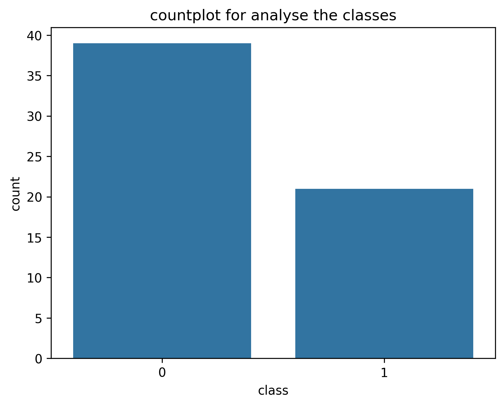
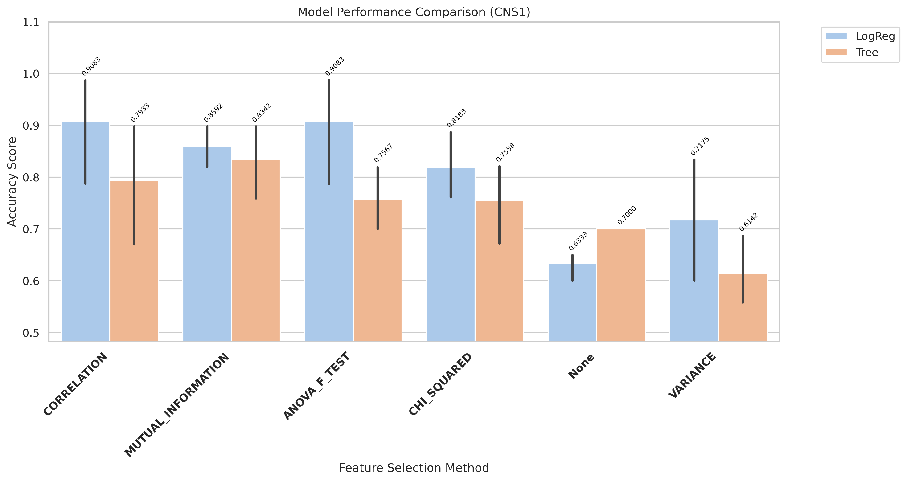
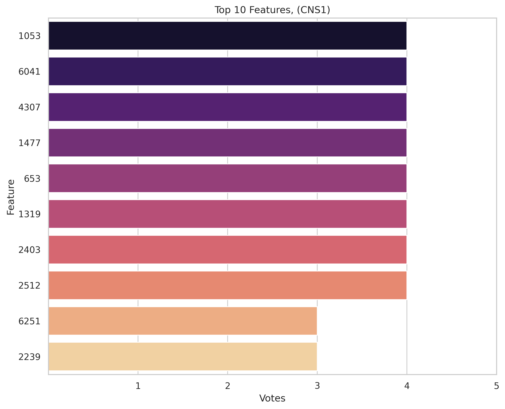
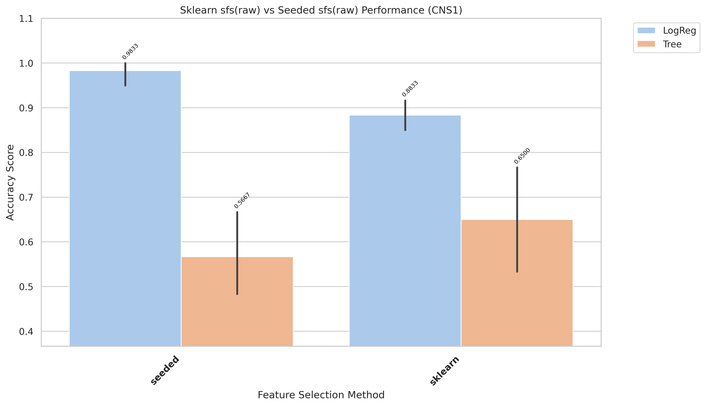
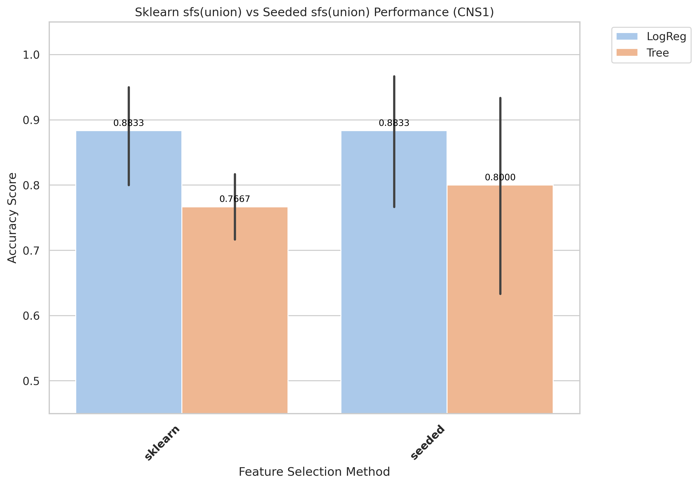
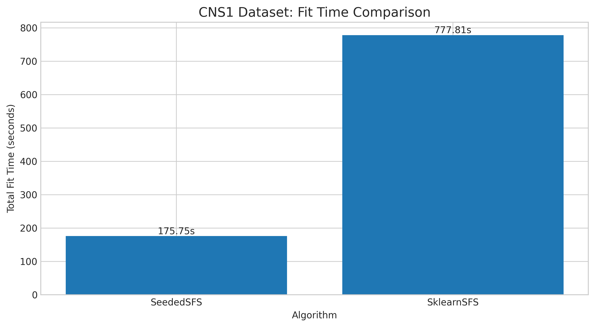
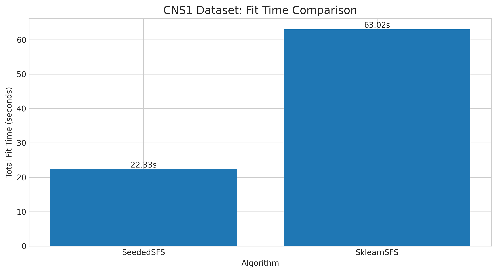

# CNS1 Results and Evaluation

[Back to index](../results.md)

## 1) EDA (Exploratory Data Analysis)

- Notebook entry point(s):
- `notebook/CNS1/01_eda.ipynb`

[Insert Chart: EDA Summary]

## 2) Data Preprocessing

- Notebook entry point(s):
- `notebook/CNS1/02_preprocess.ipynb`
- Output location convention: `data/processed/CNS1/01_clean/`

## 3) Filter Selection

- Notebook entry point(s):
- `notebook/CNS1/03_filter_selection.ipynb`
- Report artifact: `results/CNS1/filter/reports/evaluation_CNS1.txt`

[Insert Chart: Filter Selection Comparison]

## 4) Modeling (Filter-stage comparison)

- Notebook entry point(s):
- `notebook/CNS1/04_modeling.ipynb`
- Modeling outputs are tracked under `results/CNS1/filter/` when available.

## 5) Ensemble Filter (Voting + union feature set)

- Notebook entry point(s):
- `notebook/CNS1/05_esemble_filter.ipynb`
- Seed pool file: `data/processed/CNS1/03_ensemble/top50_features_voting.csv`
- Seed pool size: 10
- Top voting features: `1053(4)`, `6041(4)`, `4307(4)`, `1477(4)`, `653(4)`

[Insert Chart: Ensemble Voting / Union Features]

## 6) Wrapper: Sklearn SFS (Raw vs Union execution)

- Script entry point(s):
- `notebook/CNS1/06_sklearn_sfs-raw.py`
- `notebook/CNS1/06_sklearn_sfs-union.py`

| Variant | Sklearn Selected | Sklearn Global Best | Sklearn Fit Time (ms) |
|---|---:|---:|---:|
| Raw | 6 | 0.9167 | 801,554 |
| Union | 4 | 0.9 | 63,018 |

## 7) Wrapper: Seeded SFS (Raw vs Union execution)

- Script entry point(s):
- `notebook/CNS1/07_sfs-raw.py`
- `notebook/CNS1/07_sfs-union.py`

| Variant | Seeded Selected | Seeded Global Best | Seeded Fit Time (ms) |
|---|---:|---:|---:|
| Raw | 9 | 0.95 | 484,297 |
| Union | 5 | 0.9167 | 22,330 |

## 8) Accuracy Evaluation (Comparing Raw vs Union)

- Notebook entry point(s):
- `notebook/CNS1/8_accuracu_evaluate.ipynb`
- `notebook/CNS1/8_accuracu_evaluate_union.ipynb`

[Insert Chart: Accuracy Comparison Raw vs Union]

- **Observation:** Raw seeded reaches higher wrapper score but requires much longer runtime.
- **Explanation:** Raw search evaluates a larger candidate space than union.
- **Takeaway:** Select variant by objective: raw for score maximization, union for efficiency.

- Raw best configuration: `sklearn + LogReg`, mean accuracy 0.8833, std 0.0456
- Union best configuration: `sklearn + LogReg`, mean accuracy 0.8833, std 0.0950

## 9) Time Evaluation (Comparing fit times for Raw vs Union)

- Notebook entry point(s):
- `notebook/CNS1/9_time_evaluate.ipynb`
- `notebook/CNS1/9_time_evaluate_union.ipynb`

[Insert Chart: Time Comparison Raw vs Union]

- **Observation:** Union runs are generally faster than raw runs across wrapper methods.
- **Explanation:** Union reduces candidate-space size, reducing total model-fit operations.
- **Takeaway:** Use union for rapid iteration; use raw when chasing peak wrapper score.
