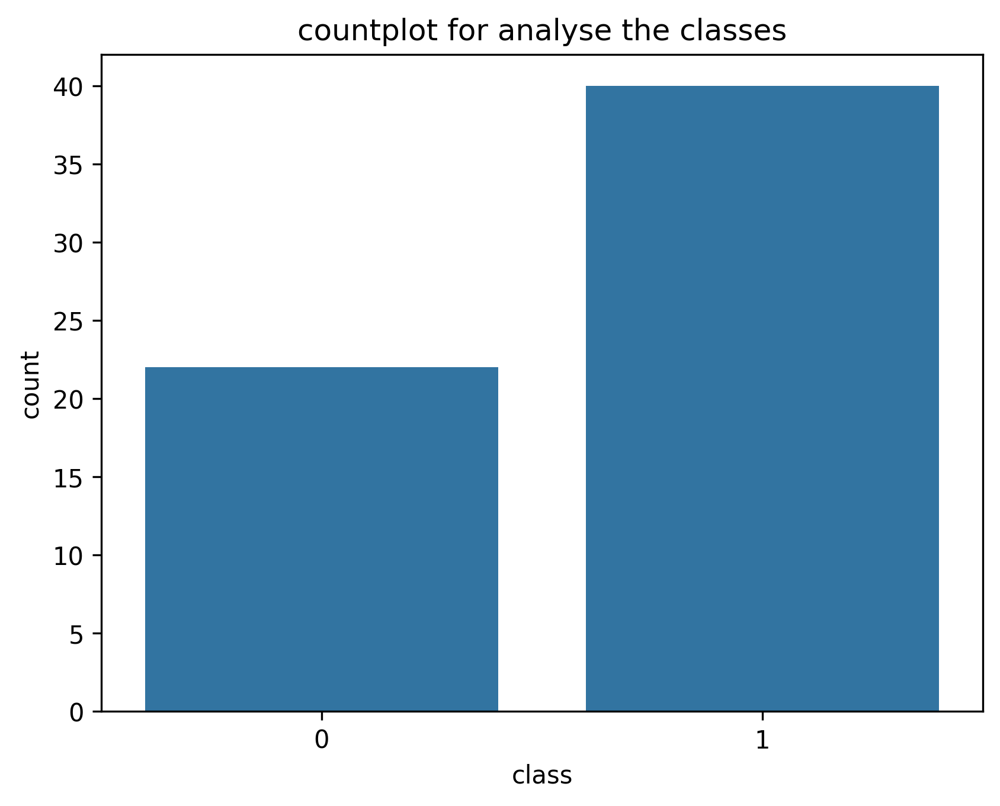
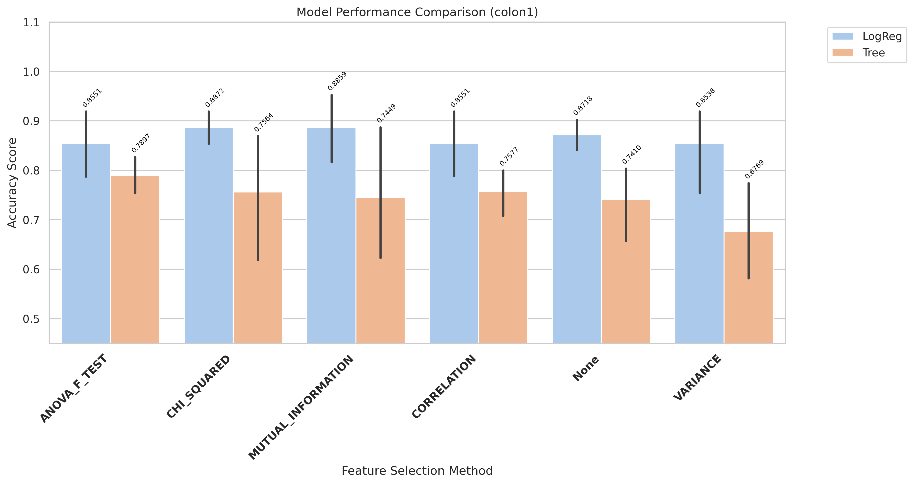
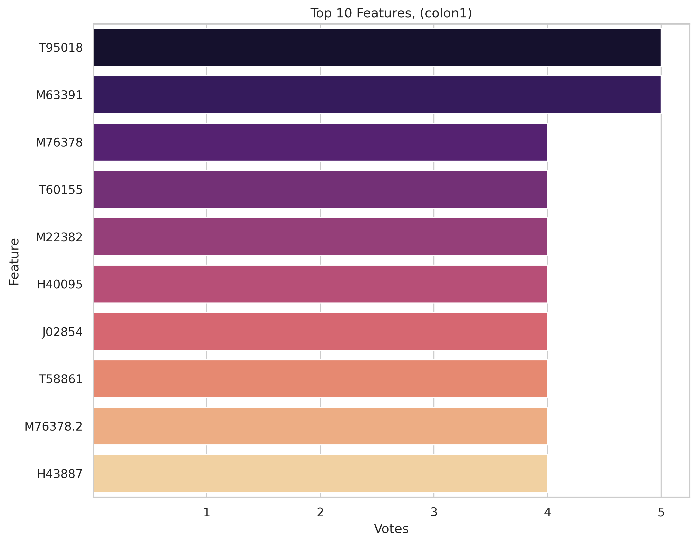
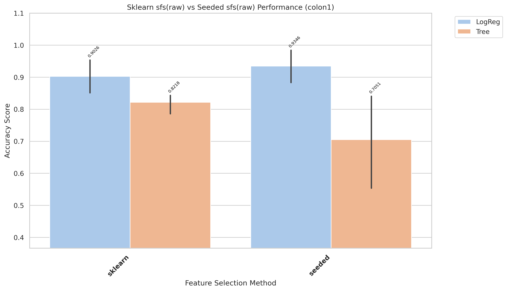
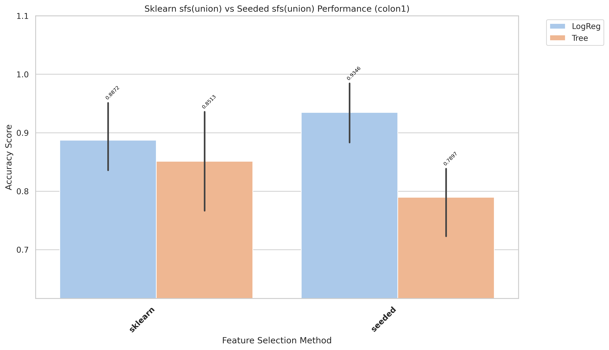
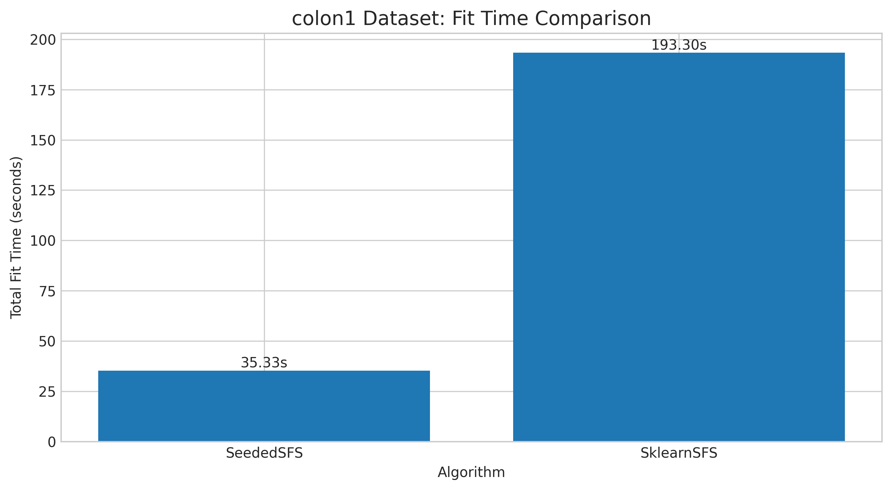
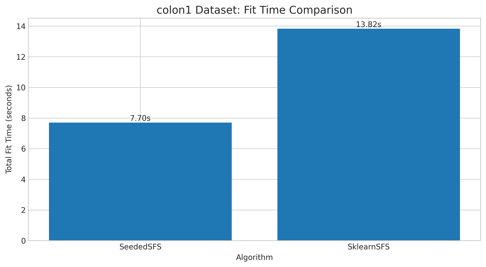

# colon1 Kết quả và Đánh giá

_Đọc bản tiếng Anh tại [result-colon1.md](result-colon1.md)_

[Quay lại mục lục](./README.vi.md)

## 1) EDA (Phân tích khám phá dữ liệu)

- Điểm vào notebook:
- `notebook/colon1/01_eda.ipynb`

[Chèn biểu đồ: Tổng quan EDA]

**Chú thích:**
- Mục đích: Kiểm tra xem bộ dữ liệu có bị mất cân bằng (imbalanced) hay không.
- Cách đọc: Trục hoành (V1) thể hiện các nhãn lớp (0 và 1), trục tung (count) là số lượng mẫu của từng lớp.

## 2) Tiền xử lý dữ liệu

- Điểm vào notebook:
- `notebook/colon1/02_preprocess.ipynb`
- Quy ước thư mục đầu ra: `data/processed/colon1/01_clean/`

## 3) Lọc đặc trưng (Filter Selection)

- Điểm vào notebook:
- `notebook/colon1/03_filter_selection.ipynb`
- Tệp báo cáo: `results/colon1/filter/reports/evaluation_colon1.txt`

[Chèn biểu đồ: So sánh Filter Selection]

**Chú thích:**
- Mục đích: So sánh hiệu năng các phương pháp filter để chọn ra nhóm đặc trưng tốt nhất cho bước tiếp theo.
- Cách đọc: Trục hoành là các phương pháp filter, trục tung là điểm đánh giá; cột/điểm càng cao thì phương pháp càng tốt.

## 4) Mô hình hóa (so sánh ở giai đoạn filter)

- Điểm vào notebook:
- `notebook/colon1/04_modeling.ipynb`
- Kết quả modeling được lưu dưới `results/colon1/filter/` khi có sẵn.

## 5) Ensemble Filter (Bỏ phiếu + tập đặc trưng union)

- Điểm vào notebook:
- `notebook/colon1/05_esemble_filter.ipynb`
- Tệp seed pool: `data/processed/colon1/03_ensemble/top50_features_voting.csv`
- Kích thước seed pool: 10
- Đặc trưng có số phiếu cao nhất: `T95018(5)`, `M63391(5)`, `M76378(4)`, `T60155(4)`, `M22382(4)`

[Chèn biểu đồ: Bỏ phiếu Ensemble / Đặc trưng Union]

**Chú thích:**
- Mục đích: Hiển thị mức độ đồng thuận của các phương pháp filter khi bỏ phiếu chọn đặc trưng.
- Cách đọc: Trục hoành là tên đặc trưng, trục tung là số phiếu (vote count); đặc trưng có phiếu cao hơn được ưu tiên hơn.

## 6) Wrapper: Sklearn SFS (chạy Raw vs Union)

- Điểm vào script:
- `notebook/colon1/06_sklearn_sfs-raw.py`
- `notebook/colon1/06_sklearn_sfs-union.py`

| Biến thể | Sklearn Số đặc trưng chọn | Sklearn Global Best | Sklearn Thời gian fit (ms) |
|---|---:|---:|---:|
| Raw | 4 | 0.9513 | 193,300 |
| Union | 3 | 0.9032 | 13,822 |

## 7) Wrapper: Seeded SFS (chạy Raw vs Union)

- Điểm vào script:
- `notebook/colon1/07_sfs-raw.py`
- `notebook/colon1/07_sfs-union.py`

| Biến thể | Seeded Số đặc trưng chọn | Seeded Global Best | Seeded Thời gian fit (ms) |
|---|---:|---:|---:|
| Raw | 8 | 0.9346 | 188,278 |
| Union | 5 | 0.9359 | 7,700 |

## 8) Đánh giá Accuracy (so sánh Raw vs Union)

- Điểm vào notebook:
- `notebook/colon1/8_accuracu_evaluate.ipynb`
- `notebook/colon1/8_accuracu_evaluate_union.ipynb`

[Chèn biểu đồ: So sánh Accuracy Raw vs Union]

**Chú thích:**
- Mục đích: So sánh độ chính xác giữa các cấu hình wrapper (Sklearn SFS và Seeded SFS) theo từng biến thể dữ liệu.
- Cách đọc:
  - Trục hoành là từng cấu hình/phương pháp, trục tung là accuracy; giá trị cao hơn thể hiện hiệu năng tốt hơn.
  - Vạch đen thẳng đứng (Error bar): Thể hiện độ lệch chuẩn (Standard Deviation) qua các fold cross-validation. Vạch này càng ngắn chứng tỏ mô hình dự đoán càng ổn định, ít biến động.

**Chú thích:**
- Mục đích: So sánh độ chính xác giữa các cấu hình wrapper (Sklearn SFS và Seeded SFS) theo từng biến thể dữ liệu.
- Cách đọc:
  - Trục hoành là từng cấu hình/phương pháp, trục tung là accuracy; giá trị cao hơn thể hiện hiệu năng tốt hơn.
  - Vạch đen thẳng đứng (Error bar): Thể hiện độ lệch chuẩn (Standard Deviation) qua các fold cross-validation. Vạch này càng ngắn chứng tỏ mô hình dự đoán càng ổn định, ít biến động.

- **Quan sát:** Điểm số tăng mạnh ở các vòng lặp đầu và sau đó chững lại quanh mức 0.9346.
- **Giải thích:** Các ứng viên được chọn sớm bổ sung tín hiệu mạnh; các ứng viên sau chỉ cải thiện biên nhỏ.
- **Kết luận:** Mô hình đã được tối ưu hiệu quả với số lượng đặc trưng thấp.

- Cấu hình tốt nhất (raw): `seeded + LogReg`, accuracy trung bình **0.9179**, std 0.1021
- Cấu hình tốt nhất (union): `seeded + LogReg`, accuracy trung bình 0.8872, std 0.0436
- Các đặc trưng cuối cùng được chọn (thiết lập thắng cuộc, raw seeded):
  `T95018, T63508, X14958, T57780, H09263, T49423, H16991, T83673`

## 9) Đánh giá thời gian (so sánh thời gian fit Raw vs Union)

- Điểm vào notebook:
- `notebook/colon1/9_time_evaluate.ipynb`
- `notebook/colon1/9_time_evaluate_union.ipynb`

[Chèn biểu đồ: So sánh thời gian Raw vs Union]

**Chú thích:**
- Mục đích: So sánh chi phí thời gian huấn luyện giữa các phương pháp wrapper trên cùng bộ dữ liệu.
- Cách đọc: Trục hoành là phương pháp/cấu hình, trục tung là tổng thời gian fit (ms); cột thấp hơn nghĩa là chạy nhanh hơn.

**Chú thích:**
- Mục đích: So sánh chi phí thời gian huấn luyện giữa các phương pháp wrapper trên cùng bộ dữ liệu.
- Cách đọc: Trục hoành là phương pháp/cấu hình, trục tung là tổng thời gian fit (ms); cột thấp hơn nghĩa là chạy nhanh hơn.

- **Quan sát:** Các lần chạy union thường nhanh hơn raw trên hầu hết phương pháp wrapper.
- **Giải thích:** Union làm giảm không gian ứng viên, từ đó giảm tổng số lần fit mô hình.
- **Kết luận:** Dùng union để lặp thử nhanh; dùng raw khi cần tối đa hóa wrapper score.
