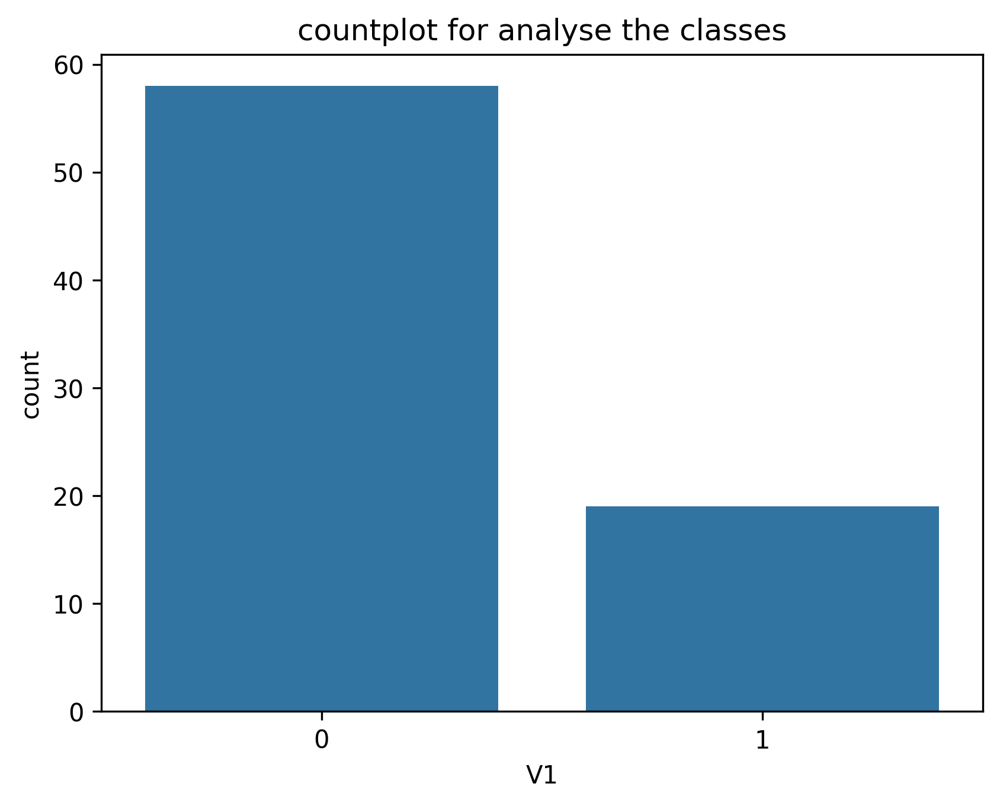
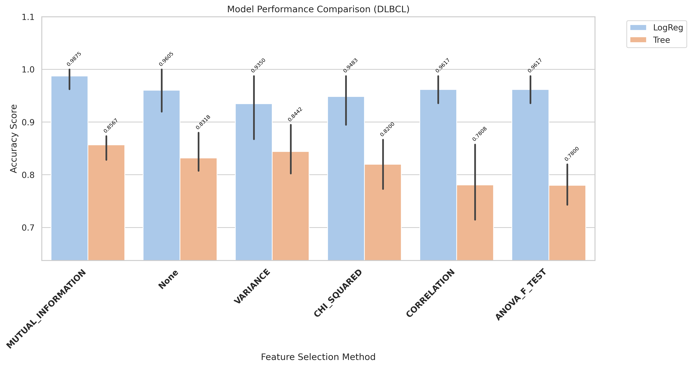
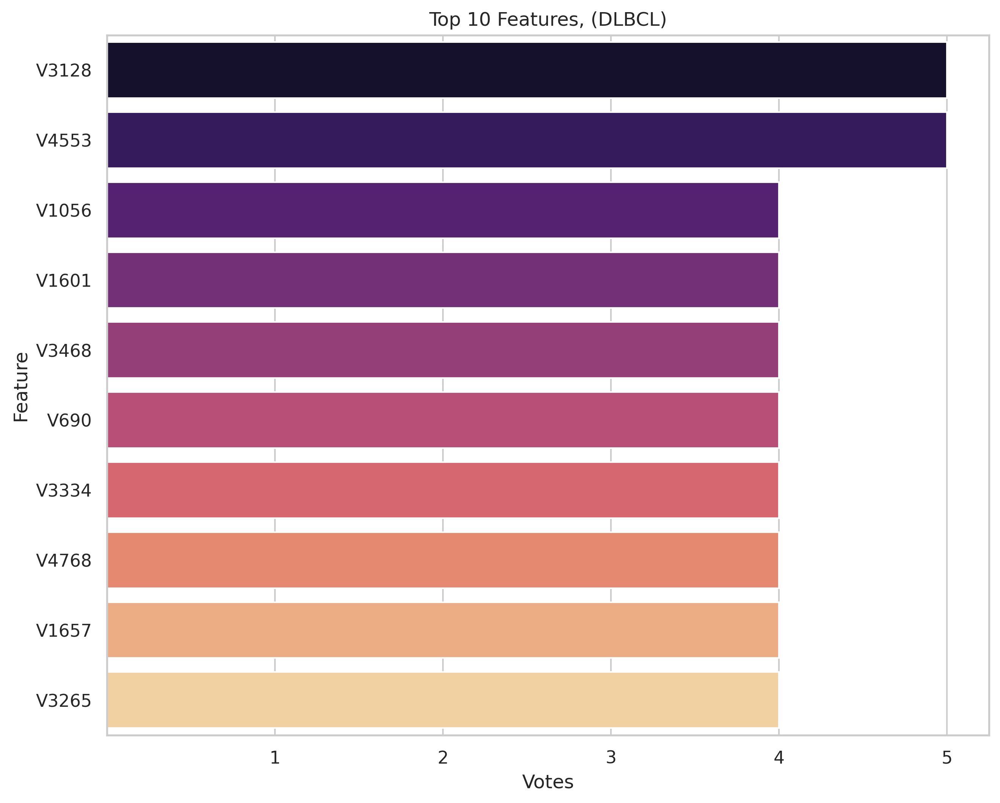
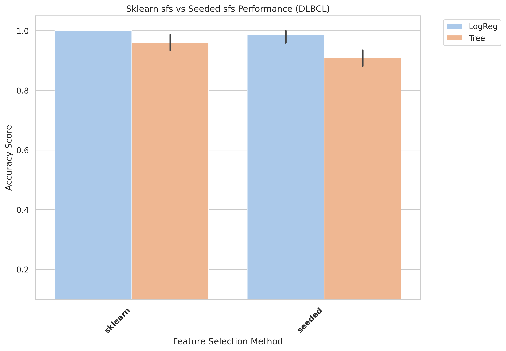
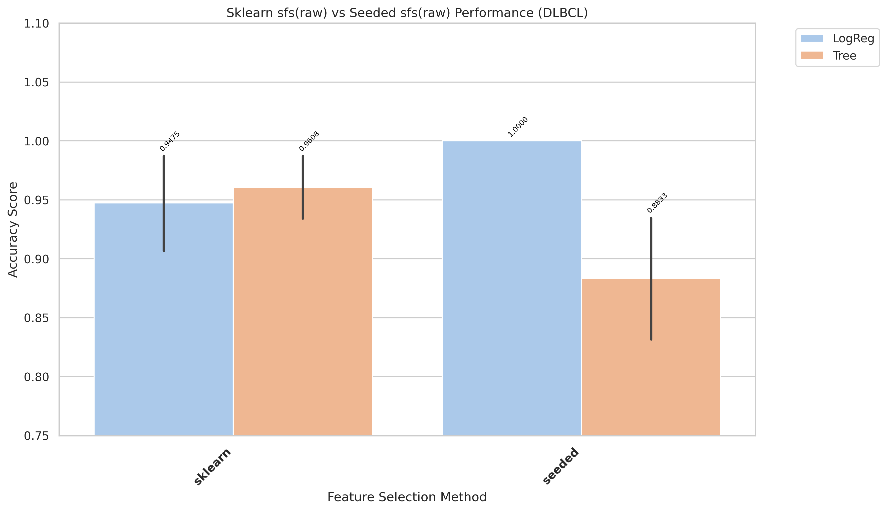
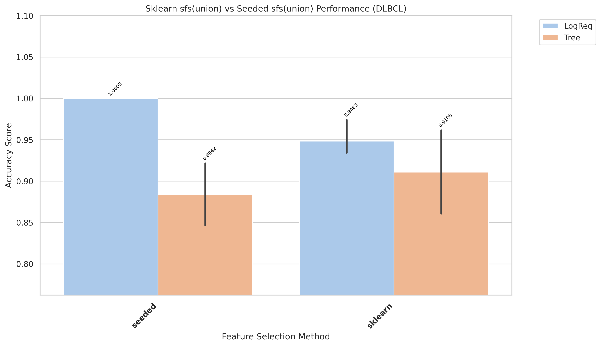
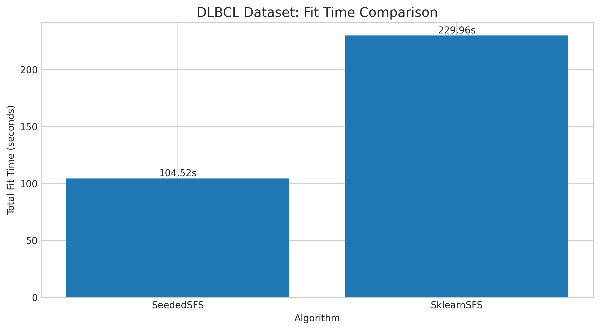
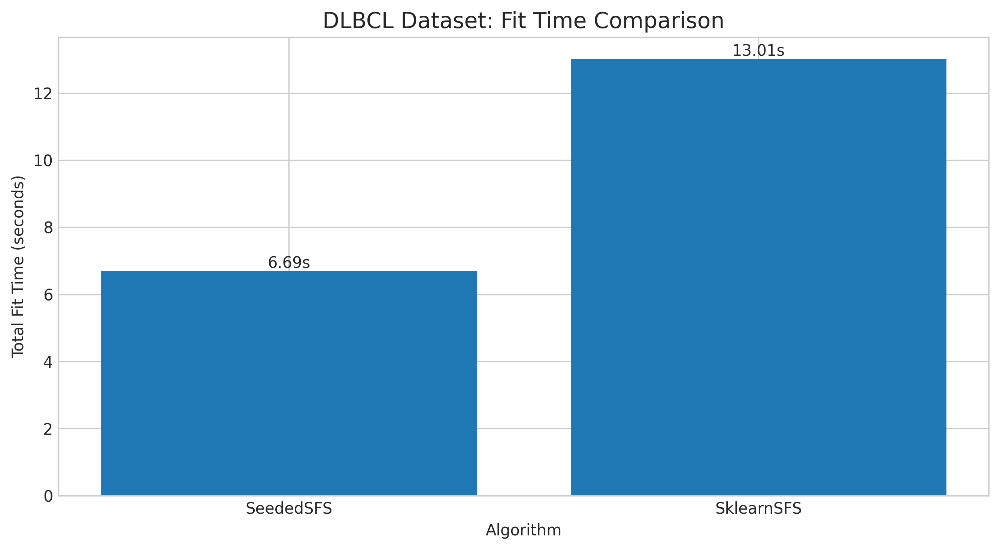

# DLBCL Results and Evaluation

[Back to index](../results.md)

## 1) EDA (Exploratory Data Analysis)

- Notebook entry point(s):
- `notebook/DLBCL/01_eda.ipynb`

[Insert Chart: EDA Summary]

**Caption:**
- Purpose: Check whether the dataset is imbalanced.
- How to read: The x-axis (V1) shows class labels (0 and 1), and the y-axis (count) shows the number of samples in each class.

## 2) Data Preprocessing

- Notebook entry point(s):
- `notebook/DLBCL/02_preprocess.ipynb`
- Output location convention: `data/processed/DLBCL/01_clean/`

## 3) Filter Selection

- Notebook entry point(s):
- `notebook/DLBCL/03_filter_selection.ipynb`
- Report artifact: `results/DLBCL/filter/reports/evaluation_DLBCL.txt`

[Insert Chart: Filter Selection Comparison]

**Caption:**
- Purpose: Compare filter-method performance to select the best feature set for the next stage.
- How to read: The x-axis lists filter methods, and the y-axis shows evaluation scores; higher bars/scores indicate better methods.

## 4) Modeling (Filter-stage comparison)

- Notebook entry point(s):
- `notebook/DLBCL/04_modeling.ipynb`
- Modeling outputs are tracked under `results/DLBCL/filter/` when available.

## 5) Ensemble Filter (Voting + union feature set)

- Notebook entry point(s):
- `notebook/DLBCL/05_esemble_filter.ipynb`
- Seed pool file: `data/processed/DLBCL/03_ensemble/top50_features_voting.csv`
- Seed pool size: 10
- Top voting features: `V3128(5)`, `V4553(5)`, `V1056(4)`, `V1601(4)`, `V3468(4)`

[Insert Chart: Ensemble Voting / Union Features]

**Caption:**
- Purpose: Show agreement among filter methods when voting for features.
- How to read: The x-axis lists feature names, and the y-axis shows vote counts; features with higher votes are prioritized.

## 6) Wrapper: Sklearn SFS (Raw vs Union execution)

- Script entry point(s):
- `notebook/DLBCL/06_sklearn_sfs-raw.py`
- `notebook/DLBCL/06_sklearn_sfs-union.py`

| Variant | Sklearn Selected | Sklearn Global Best | Sklearn Fit Time (ms) |
|---|---:|---:|---:|
| Raw | 2 | 1 | 229,964 |
| Union | 3 | 1 | 13,010 |

## 7) Wrapper: Seeded SFS (Raw vs Union execution)

- Script entry point(s):
- `notebook/DLBCL/07_sfs-raw.py`
- `notebook/DLBCL/07_sfs-union.py`

| Variant | Seeded Selected | Seeded Global Best | Seeded Fit Time (ms) |
|---|---:|---:|---:|
| Raw | 3 | 0.9867 | 104,516 |
| Union | 3 | 0.9742 | 6,687 |

## 8) Accuracy Evaluation (Comparing Raw vs Union)

- Notebook entry point(s):
- `notebook/DLBCL/8_accuracu_evaluate.ipynb`
- `notebook/DLBCL/8_accuracu_evaluate_union.ipynb`

[Insert Chart: Accuracy Comparison Raw vs Union]

**Caption:**
- Purpose: Compare accuracy across wrapper configurations (Sklearn SFS and Seeded SFS) for each data variant.
- How to read: The x-axis shows configurations/methods, and the y-axis shows accuracy; higher values indicate better performance.

**Caption:**
- Purpose: Compare accuracy across wrapper configurations (Sklearn SFS and Seeded SFS) for each data variant.
- How to read: The x-axis shows configurations/methods, and the y-axis shows accuracy; higher values indicate better performance.

**Caption:**
- Purpose: Compare accuracy across wrapper configurations (Sklearn SFS and Seeded SFS) for each data variant.
- How to read: The x-axis shows configurations/methods, and the y-axis shows accuracy; higher values indicate better performance.

- **Observation:** Near-ceiling performance is reached with 2-3 features.
- **Explanation:** Predictive signal is concentrated in a compact feature subset.
- **Takeaway:** Favor minimal feature sets for interpretability and operational simplicity.

- Raw best configuration: `seeded + LogReg`, mean accuracy **0.9867**, std 0.0298
- Union best configuration: `seeded + LogReg`, mean accuracy 0.9492, std 0.0817
- Final selected features (winning setup, raw seeded): `V3128, V454, V120`

## 9) Time Evaluation (Comparing fit times for Raw vs Union)

- Notebook entry point(s):
- `notebook/DLBCL/9_time_evaluate.ipynb`
- `notebook/DLBCL/9_time_evaluate_union.ipynb`

[Insert Chart: Time Comparison Raw vs Union]

**Caption:**
- Purpose: Compare training-time cost across wrapper methods on the same dataset.
- How to read: The x-axis shows methods/configurations, and the y-axis shows total fit time (ms); lower bars mean faster runtime.

**Caption:**
- Purpose: Compare training-time cost across wrapper methods on the same dataset.
- How to read: The x-axis shows methods/configurations, and the y-axis shows total fit time (ms); lower bars mean faster runtime.

**Caption:**
- Purpose: Compare training-time cost across wrapper methods on the same dataset.
- How to read: The x-axis shows methods/configurations, and the y-axis shows total fit time (ms); lower bars mean faster runtime.

- **Observation:** Union runs are generally faster than raw runs across wrapper methods.
- **Explanation:** Union reduces candidate-space size, reducing total model-fit operations.
- **Takeaway:** Use union for rapid iteration; use raw when chasing peak wrapper score.
