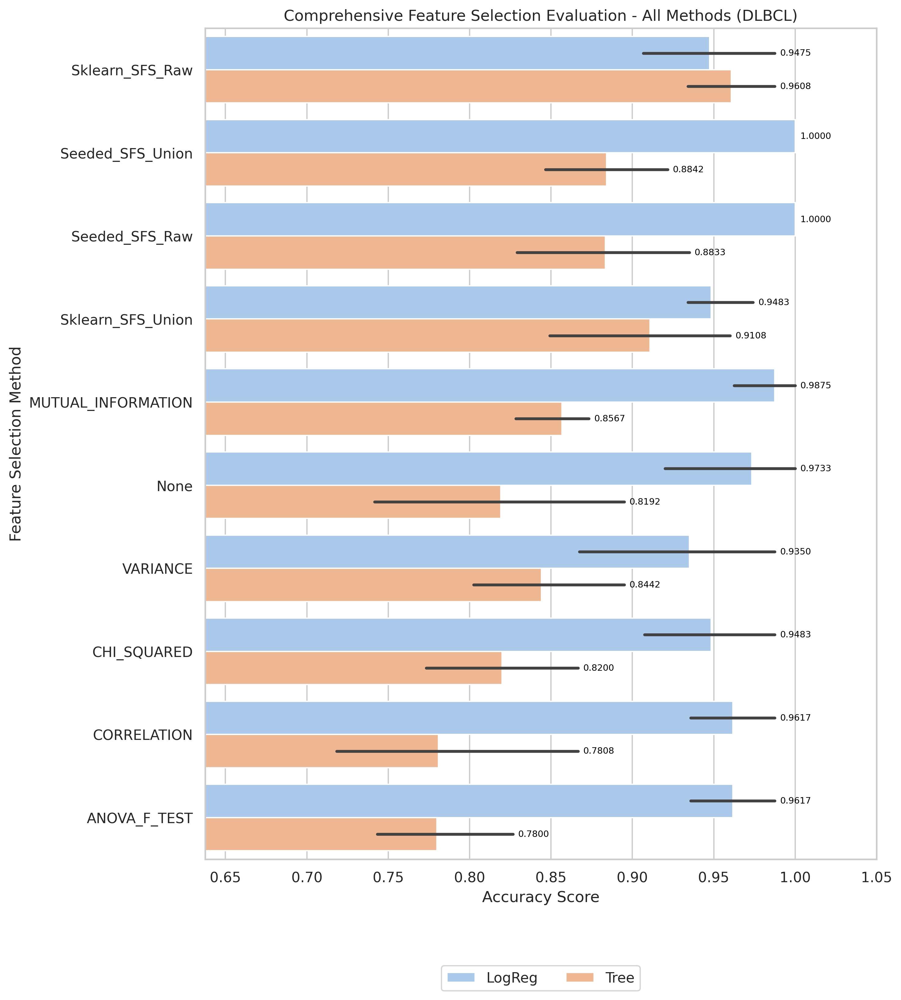

# DLBCL Kết quả và Đánh giá

_Đọc bản tiếng Anh tại [result-dlbcl.md](result-dlbcl.md)_

[Quay lại mục lục](./README.vi.md)

## 1) EDA (Phân tích khám phá dữ liệu)

- Điểm vào notebook:
- `notebook/DLBCL/01_eda.ipynb`

[Chèn biểu đồ: Tổng quan EDA]

**Chú thích:**

- Mục đích: Kiểm tra xem bộ dữ liệu có bị mất cân bằng (imbalanced) hay không.
- Cách đọc: Trục hoành (V1) thể hiện các nhãn lớp (0 và 1), trục tung (count) là số lượng mẫu của từng lớp.

## 2) Tiền xử lý dữ liệu

- Điểm vào notebook:
- `notebook/DLBCL/02_preprocess.ipynb`
- Quy ước thư mục đầu ra: `data/processed/DLBCL/01_clean/`

## 3) Lọc đặc trưng (Filter Selection)

- Điểm vào notebook:
- `notebook/DLBCL/03_filter_selection.ipynb`
- Tệp báo cáo: `results/DLBCL/filter/reports/evaluation_DLBCL.txt`

[Chèn biểu đồ: So sánh Filter Selection]

**Chú thích:**

- Mục đích: So sánh hiệu năng các phương pháp filter để chọn ra nhóm đặc trưng tốt nhất cho bước tiếp theo.
- Cách đọc: Trục hoành là các phương pháp filter, trục tung là điểm đánh giá; cột/điểm càng cao thì phương pháp càng tốt.

## 4) Mô hình hóa (so sánh ở giai đoạn filter)

- Điểm vào notebook:
- `notebook/DLBCL/04_modeling.ipynb`
- Kết quả modeling được lưu dưới `results/DLBCL/filter/` khi có sẵn.

## 5) Ensemble Filter (Bỏ phiếu + tập đặc trưng union)

- Điểm vào notebook:
- `notebook/DLBCL/05_esemble_filter.ipynb`
- Tệp seed pool: `data/processed/DLBCL/03_ensemble/top50_features_voting.csv`
- Kích thước seed pool: 10
- Đặc trưng có số phiếu cao nhất: `V3128(5)`, `V4553(5)`, `V1056(4)`, `V1601(4)`, `V3468(4)`

[Chèn biểu đồ: Bỏ phiếu Ensemble / Đặc trưng Union]

**Chú thích:**

- Mục đích: Hiển thị mức độ đồng thuận của các phương pháp filter khi bỏ phiếu chọn đặc trưng.
- Cách đọc: Trục hoành là tên đặc trưng, trục tung là số phiếu (vote count); đặc trưng có phiếu cao hơn được ưu tiên hơn.

## 6) Wrapper: Sklearn SFS (chạy Raw vs Union)

- Điểm vào script:
- `notebook/DLBCL/06_sklearn_sfs-raw.py`
- `notebook/DLBCL/06_sklearn_sfs-union.py`

| Biến thể | Sklearn Số đặc trưng chọn | Sklearn Global Best | Sklearn Thời gian fit (s) |
| -------- | ------------------------: | ------------------: | ------------------------: |
| Raw      |                         2 |                   1 |                   229.964 |
| Union    |                         3 |                   1 |                    13.010 |

## 7) Wrapper: Seeded SFS (chạy Raw vs Union)

- Điểm vào script:
- `notebook/DLBCL/07_sfs-raw.py`
- `notebook/DLBCL/07_sfs-union.py`

| Biến thể | Seeded Số đặc trưng chọn | Seeded Global Best | Seeded Thời gian fit (s) |
| -------- | -----------------------: | -----------------: | -----------------------: |
| Raw      |                        5 |           1.000000 |                  114.106 |
| Union    |                        8 |           1.000000 |                    6.418 |

## 8) Đánh giá Accuracy (so sánh Raw vs Union)

- Điểm vào notebook:
- `notebook/DLBCL/8_accuracu_evaluate.ipynb`
- `notebook/DLBCL/8_accuracu_evaluate_union.ipynb`

[Chèn biểu đồ: So sánh Accuracy Raw vs Union]

**Chú thích:**

- Mục đích: So sánh độ chính xác giữa các cấu hình wrapper (Sklearn SFS và Seeded SFS) theo từng biến thể dữ liệu.
- Cách đọc:
  - Trục hoành là từng cấu hình/phương pháp, trục tung là accuracy; giá trị cao hơn thể hiện hiệu năng tốt hơn.
  - Vạch đen thẳng đứng (Error bar): Thể hiện độ lệch chuẩn (Standard Deviation) qua các fold cross-validation. Vạch này càng ngắn chứng tỏ mô hình dự đoán càng ổn định, ít biến động.
    

**Chú thích:**

- Mục đích: So sánh độ chính xác giữa các cấu hình wrapper (Sklearn SFS và Seeded SFS) theo từng biến thể dữ liệu.
- Cách đọc:
  - Trục hoành là từng cấu hình/phương pháp, trục tung là accuracy; giá trị cao hơn thể hiện hiệu năng tốt hơn.
  - Vạch đen thẳng đứng (Error bar): Thể hiện độ lệch chuẩn (Standard Deviation) qua các fold cross-validation. Vạch này càng ngắn chứng tỏ mô hình dự đoán càng ổn định, ít biến động.
    

**Chú thích:**

- Mục đích: So sánh độ chính xác giữa các cấu hình wrapper (Sklearn SFS và Seeded SFS) theo từng biến thể dữ liệu.
- Cách đọc:
  - Trục hoành là từng cấu hình/phương pháp, trục tung là accuracy; giá trị cao hơn thể hiện hiệu năng tốt hơn.
  - Vạch đen thẳng đứng (Error bar): Thể hiện độ lệch chuẩn (Standard Deviation) qua các fold cross-validation. Vạch này càng ngắn chứng tỏ mô hình dự đoán càng ổn định, ít biến động.

- **Quan sát:** Seeded SFS đạt accuracy tuyệt đối (1.0000) ở cả hai biến thể raw và union.
- **Giải thích:** Tín hiệu dự đoán của bộ dữ liệu tập trung cao độ và được seeded SFS nắm bắt nhất quán.
- **Kết luận:** Dùng seeded làm cấu hình chính; cả hai biến thể đều đạt hiệu năng tối đa.

- Cấu hình tốt nhất (raw): `seeded + LogReg`, accuracy trung bình **1.0000**, std 0.0000
- Cấu hình tốt nhất (union): `seeded + LogReg`, accuracy trung bình **1.0000**, std 0.0000

## 9) Đánh giá thời gian (so sánh thời gian fit Raw vs Union)

- Điểm vào notebook:
- `notebook/DLBCL/9_time_evaluate.ipynb`
- `notebook/DLBCL/9_time_evaluate_union.ipynb`

[Chèn biểu đồ: So sánh thời gian Raw vs Union]

**Chú thích:**

- Mục đích: So sánh chi phí thời gian huấn luyện giữa các phương pháp wrapper trên cùng bộ dữ liệu.
- Cách đọc: Trục hoành là phương pháp/cấu hình, trục tung là tổng thời gian fit (ms); cột thấp hơn nghĩa là chạy nhanh hơn.

**Chú thích:**

- Mục đích: So sánh chi phí thời gian huấn luyện giữa các phương pháp wrapper trên cùng bộ dữ liệu.
- Cách đọc: Trục hoành là phương pháp/cấu hình, trục tung là tổng thời gian fit (ms); cột thấp hơn nghĩa là chạy nhanh hơn.

- **Quan sát:** Các lần chạy union thường nhanh hơn raw trên hầu hết phương pháp wrapper.
- **Giải thích:** Union làm giảm không gian ứng viên, từ đó giảm tổng số lần fit mô hình.
- **Kết luận:** Dùng union để lặp thử nhanh; dùng raw khi cần tối đa hóa wrapper score.

## 10) Đánh Giá Cuối Cùng (So Sánh Tất Cả Phương Pháp)

- Điểm vào notebook:
- `notebook/DLBCL/10_final_evaluate.ipynb`
- Báo cáo: `results/DLBCL/evaluation/reports/final_evaluation_all_methods_dlbcl_DLBCL.txt`

[Biểu Đồ: Đánh Giá Cuối Cùng - Tất Cả Phương Pháp]

**Chú Thích:**

- Mục đích: So sánh tất cả phương pháp lựa chọn đặc trưng (Filter, Ensemble, Sklearn SFS, Seeded SFS) với cả hai mô hình LogReg và Tree.
- Cách đọc:
  - Trục X liệt kê tất cả các kết hợp phương pháp/mô hình (ví dụ: "Sklearn_SFS_Raw + LogReg").
  - Trục Y hiển thị độ chính xác cross-validation; các cột cao hơn cho biết hiệu suất tốt hơn.
  - Các thanh lỗi dọc hiển thị độ lệch chuẩn (Std) trên các fold; các thanh ngắn hơn chỉ ra mô hình ổn định hơn.

| Xếp Hạng | Phương Pháp + Mô Hình       | CV Folds | Accuracy Trung Bình |    Std | Median |    Min |    Max |
| -------- | --------------------------- | -------: | ------------------: | -----: | -----: | -----: | -----: |
| 1        | Seeded_SFS_Union + LogReg   |        5 |              1.0000 | 0.0000 | 1.0000 | 1.0000 | 1.0000 |
| 1        | Seeded_SFS_Raw + LogReg     |        5 |              1.0000 | 0.0000 | 1.0000 | 1.0000 | 1.0000 |
| 2        | MUTUAL_INFORMATION + LogReg |        5 |              0.9875 | 0.0280 | 1.0000 | 0.9375 | 1.0000 |
| 3        | None + LogReg               |        5 |              0.9733 | 0.0596 | 1.0000 | 0.8667 | 1.0000 |
| 4        | Sklearn_SFS_Raw + Tree      |        5 |              0.9608 | 0.0358 | 0.9375 | 0.9333 | 1.0000 |
| 5        | Sklearn_SFS_Union + LogReg  |        5 |              0.9483 | 0.0290 | 0.9375 | 0.9333 | 1.0000 |

**Quan Sát Chính:**

- Cấu hình tốt nhất: Seeded_SFS_Union + LogReg và Seeded_SFS_Raw + LogReg đều đạt 1.0000 (σ=0.0000)
- Biến thể union của seeded tiết kiệm nhất (6.418s so với 229.964s của sklearn raw)

