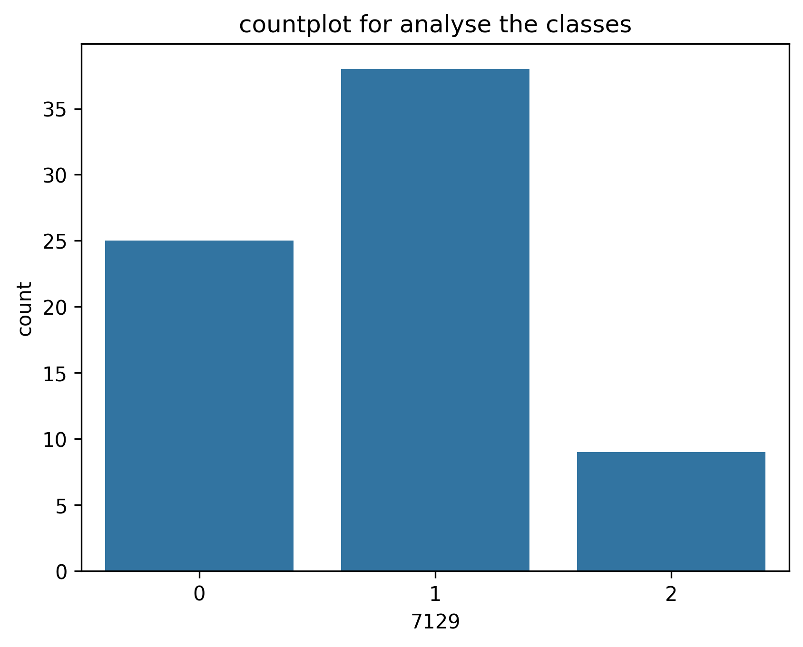
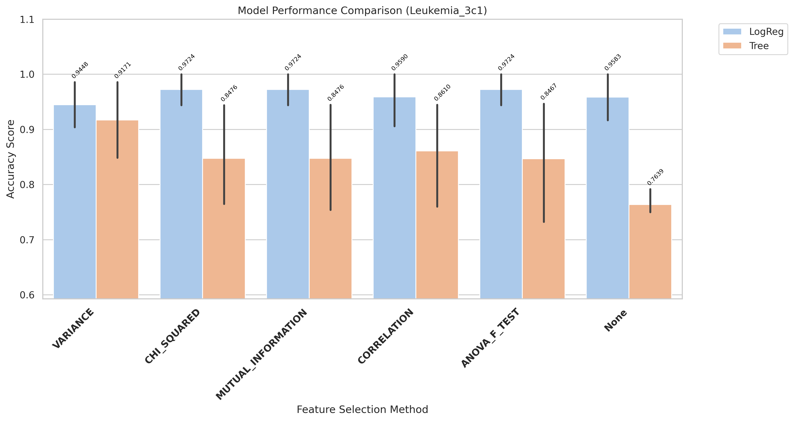
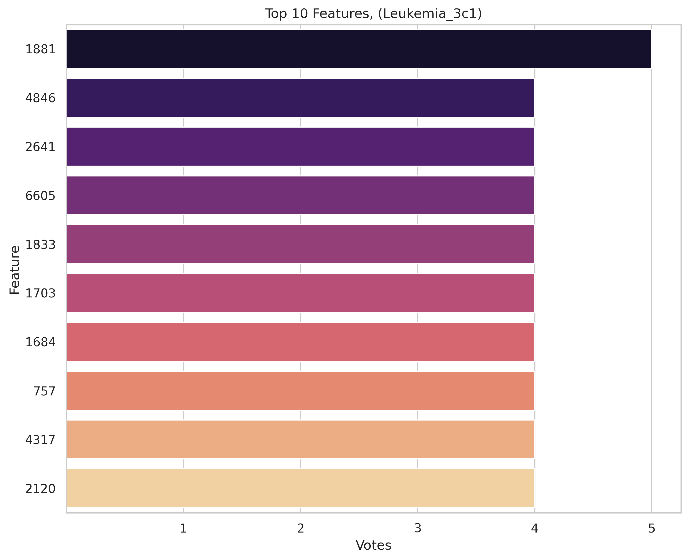
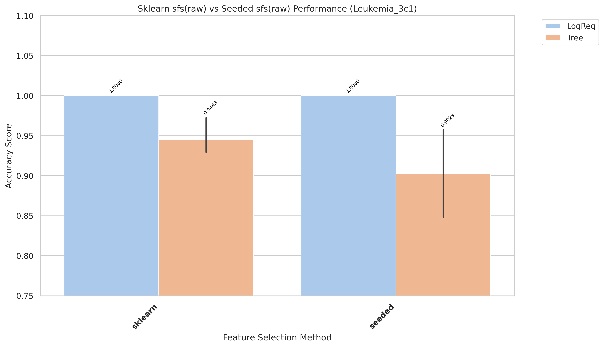
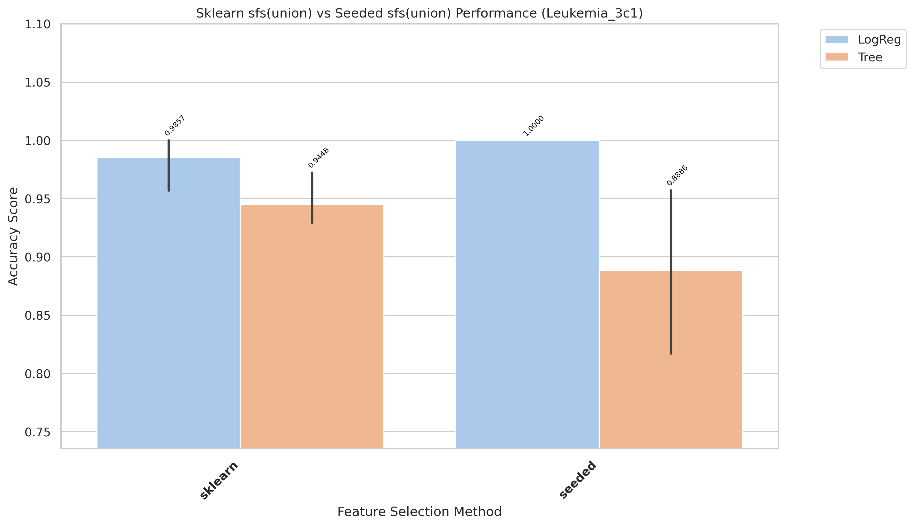
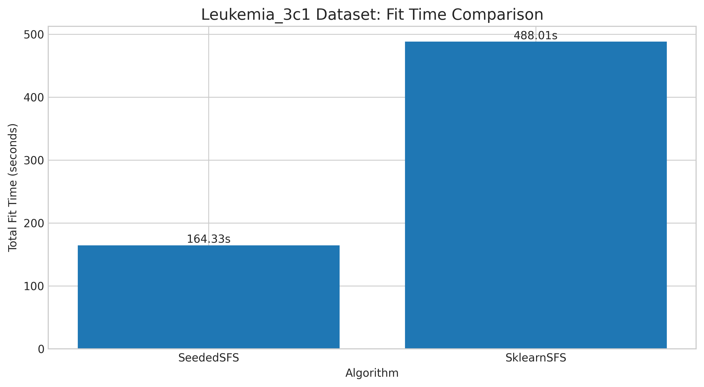
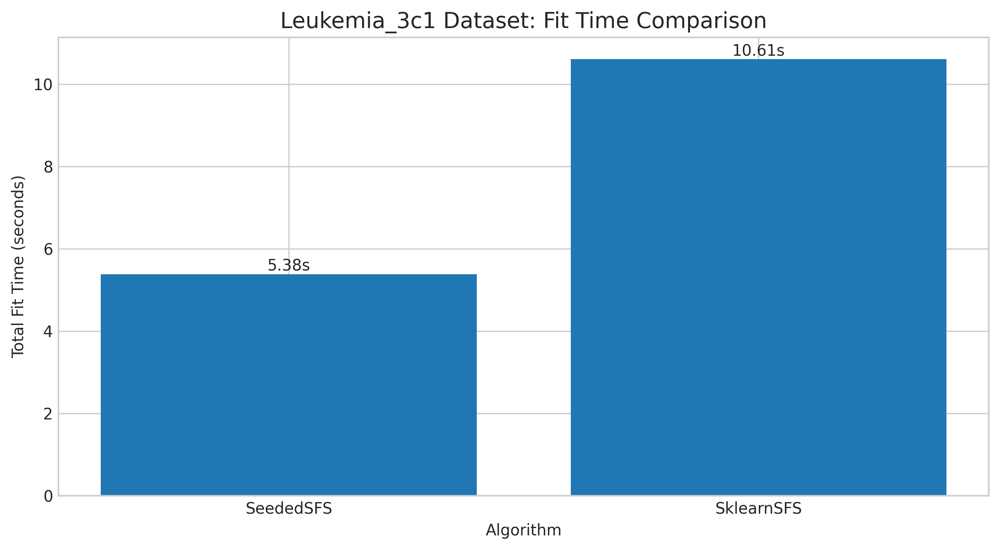

# Leukemia_3c1 Results and Evaluation

[Back to index](../results.md)

## 1) EDA (Exploratory Data Analysis)

- Notebook entry point(s):
- `notebook/Leukemia_3c1/01_eda.ipynb`

[Insert Chart: EDA Summary]

**Caption:**
- Purpose: Check whether the dataset is imbalanced.
- How to read: The x-axis (V1) shows class labels (0 and 1), and the y-axis (count) shows the number of samples in each class.

## 2) Data Preprocessing

- Notebook entry point(s):
- `notebook/Leukemia_3c1/02_preprocess.ipynb`
- Output location convention: `data/processed/Leukemia_3c1/01_clean/`

## 3) Filter Selection

- Notebook entry point(s):
- `notebook/Leukemia_3c1/03_filter_selection.ipynb`
- Report artifact: `results/Leukemia_3c1/filter/reports/evaluation_Leukemia_3c1.txt`

[Insert Chart: Filter Selection Comparison]

**Caption:**
- Purpose: Compare filter-method performance to select the best feature set for the next stage.
- How to read: The x-axis lists filter methods, and the y-axis shows evaluation scores; higher bars/scores indicate better methods.

## 4) Modeling (Filter-stage comparison)

- Notebook entry point(s):
- `notebook/Leukemia_3c1/04_modeling.ipynb`
- Modeling outputs are tracked under `results/Leukemia_3c1/filter/` when available.

## 5) Ensemble Filter (Voting + union feature set)

- Notebook entry point(s):
- `notebook/Leukemia_3c1/05_esemble_filter.ipynb`
- Seed pool file: `data/processed/Leukemia_3c1/03_ensemble/top50_features_voting.csv`
- Seed pool size: 10
- Top voting features: `1881(5)`, `4846(4)`, `2641(4)`, `6605(4)`, `1833(4)`

[Insert Chart: Ensemble Voting / Union Features]

**Caption:**
- Purpose: Show agreement among filter methods when voting for features.
- How to read: The x-axis lists feature names, and the y-axis shows vote counts; features with higher votes are prioritized.

## 6) Wrapper: Sklearn SFS (Raw vs Union execution)

- Script entry point(s):
- `notebook/Leukemia_3c1/06_sklearn_sfs-raw.py`
- `notebook/Leukemia_3c1/06_sklearn_sfs-union.py`

| Variant | Sklearn Selected | Sklearn Global Best | Sklearn Fit Time (ms) |
|---|---:|---:|---:|
| Raw | 2 | 0.96 | 275,768 |
| Union | 2 | 0.96 | 9,501 |

## 7) Wrapper: Seeded SFS (Raw vs Union execution)

- Script entry point(s):
- `notebook/Leukemia_3c1/07_sfs-raw.py`
- `notebook/Leukemia_3c1/07_sfs-union.py`

| Variant | Seeded Selected | Seeded Global Best | Seeded Fit Time (ms) |
|---|---:|---:|---:|
| Raw | 2 | 0.96 | 33,883 |
| Union | 2 | 0.96 | 2,850 |

## 8) Accuracy Evaluation (Comparing Raw vs Union)

- Notebook entry point(s):
- `notebook/Leukemia_3c1/8_accuracu_evaluate.ipynb`
- `notebook/Leukemia_3c1/8_accuracu_evaluate_union.ipynb`

[Insert Chart: Accuracy Comparison Raw vs Union]

**Caption:**
- Purpose: Compare accuracy across wrapper configurations (Sklearn SFS and Seeded SFS) for each data variant.
- How to read: The x-axis shows configurations/methods, and the y-axis shows accuracy; higher values indicate better performance.

**Caption:**
- Purpose: Compare accuracy across wrapper configurations (Sklearn SFS and Seeded SFS) for each data variant.
- How to read: The x-axis shows configurations/methods, and the y-axis shows accuracy; higher values indicate better performance.

- **Observation:** Accuracy is effectively unchanged across methods and variants.
- **Explanation:** The dataset is separable with a very small number of features.
- **Takeaway:** Use union seeded for fastest equivalent performance.

- Raw best configuration: `seeded + Tree`, mean accuracy **0.9600**, std 0.0894
- Union best configuration: `seeded + Tree`, mean accuracy **0.9600**, std 0.0894

## 9) Time Evaluation (Comparing fit times for Raw vs Union)

- Notebook entry point(s):
- `notebook/Leukemia_3c1/9_time_evaluate.ipynb`
- `notebook/Leukemia_3c1/9_time_evaluate_union.ipynb`

[Insert Chart: Time Comparison Raw vs Union]

**Caption:**
- Purpose: Compare training-time cost across wrapper methods on the same dataset.
- How to read: The x-axis shows methods/configurations, and the y-axis shows total fit time (ms); lower bars mean faster runtime.

**Caption:**
- Purpose: Compare training-time cost across wrapper methods on the same dataset.
- How to read: The x-axis shows methods/configurations, and the y-axis shows total fit time (ms); lower bars mean faster runtime.

- **Observation:** Union runs are generally faster than raw runs across wrapper methods.
- **Explanation:** Union reduces candidate-space size, reducing total model-fit operations.
- **Takeaway:** Use union for rapid iteration; use raw when chasing peak wrapper score.
