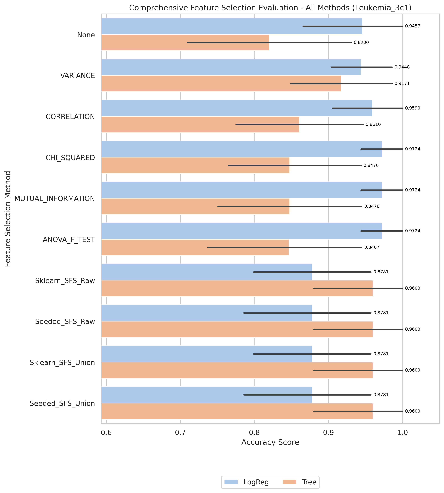

# Leukemia_3c1 Kết quả và Đánh giá

_Đọc bản tiếng Anh tại [result-leukemia_3c1.md](result-leukemia_3c1.md)_

[Quay lại mục lục](./README.vi.md)

## 1) EDA (Phân tích khám phá dữ liệu)

- Điểm vào notebook:
- `notebook/Leukemia_3c1/01_eda.ipynb`
- Shape: (72, 7130)

[Chèn biểu đồ: Tổng quan EDA]

**Chú thích:**
- Mục đích: Kiểm tra xem bộ dữ liệu có bị mất cân bằng (imbalanced) hay không.
- Cách đọc: Trục hoành (V1) thể hiện các nhãn lớp (0 và 1), trục tung (count) là số lượng mẫu của từng lớp.

## 2) Tiền xử lý dữ liệu

- Điểm vào notebook:
- `notebook/Leukemia_3c1/02_preprocess.ipynb`
- Quy ước thư mục đầu ra: `data/processed/Leukemia_3c1/01_clean/`

## 3) Lọc đặc trưng (Filter Selection)

- Điểm vào notebook:
- `notebook/Leukemia_3c1/03_filter_selection.ipynb`
- Dữ liệu kết quả: `data/processed/Leukemia_3c1/02_filter/`

**Chú thích:**

- Mục đích: So sánh hiệu năng các phương pháp filter để chọn ra nhóm đặc trưng tốt nhất cho bước tiếp theo.
- Cách đọc: Trục hoành là các phương pháp filter, trục tung là điểm đánh giá; cột/điểm càng cao thì phương pháp càng tốt.

## 4) Mô hình hóa (so sánh ở giai đoạn filter)

- Điểm vào notebook:
- `notebook/Leukemia_3c1/04_modeling.ipynb`
- Tệp báo cáo: `results/Leukemia_3c1/filter/reports/evaluation_Leukemia_3c1.txt`

[Chèn biểu đồ: So sánh Filter Selection]

## 5) Ensemble Filter (Bỏ phiếu + tập đặc trưng union)

- Điểm vào notebook:
- `notebook/Leukemia_3c1/05_esemble_filter.ipynb`
- Tệp seed pool: `data/processed/Leukemia_3c1/03_ensemble/top50_features_voting.csv`
- Kích thước seed pool: 10
- Đặc trưng có số phiếu cao nhất: `1881(5)`, `4846(4)`, `2641(4)`, `6605(4)`, `1833(4)`

[Chèn biểu đồ: Bỏ phiếu Ensemble / Đặc trưng Union]

**Chú thích:**
- Mục đích: Hiển thị mức độ đồng thuận của các phương pháp filter khi bỏ phiếu chọn đặc trưng.
- Cách đọc: Trục hoành là tên đặc trưng, trục tung là số phiếu (vote count); đặc trưng có phiếu cao hơn được ưu tiên hơn.

## 6) Wrapper: Sklearn SFS (chạy Raw vs Union)

- Điểm vào script:
- `notebook/Leukemia_3c1/06_sklearn_sfs-raw.py`
- `notebook/Leukemia_3c1/06_sklearn_sfs-union.py`

| Biến thể | Sklearn Số đặc trưng chọn | Sklearn Global Best | Sklearn Thời gian fit (s) |
| ------- | -----------------------: | ------------------: | -----------------------: |
| Raw     |                        4 |            1.000000 |                  488.009 |
| Union   |                        3 |            0.985714 |                   10.609 |

## 7) Wrapper: Seeded SFS (chạy Raw vs Union)

- Điểm vào script:
- `notebook/Leukemia_3c1/07_sfs-raw.py`
- `notebook/Leukemia_3c1/07_sfs-union.py`

| Biến thể | Seeded Số đặc trưng chọn | Seeded Global Best | Seeded Thời gian fit (s) |
| ------- | -----------------------: | -----------------: | -----------------------: |
| Raw     |                        4 |           1.000000 |                  162.259 |
| Union   |                        4 |           1.000000 |                    5.384 |

## 8) Đánh giá Accuracy (so sánh Raw vs Union)

- Điểm vào notebook:
- `notebook/Leukemia_3c1/8_accuracu_evaluate.ipynb`
- `notebook/Leukemia_3c1/8_accuracu_evaluate_union.ipynb`

[Chèn biểu đồ: So sánh Accuracy Raw vs Union]

**Chú thích:**
- Mục đích: So sánh độ chính xác giữa các cấu hình wrapper (Sklearn SFS và Seeded SFS) theo từng biến thể dữ liệu.
- Cách đọc:
  - Trục hoành là từng cấu hình/phương pháp, trục tung là accuracy; giá trị cao hơn thể hiện hiệu năng tốt hơn.
  - Vạch đen thẳng đứng (Error bar): Thể hiện độ lệch chuẩn (Standard Deviation) qua các fold cross-validation. Vạch này càng ngắn chứng tỏ mô hình dự đoán càng ổn định, ít biến động.

**Chú thích:**
- Mục đích: So sánh độ chính xác giữa các cấu hình wrapper (Sklearn SFS và Seeded SFS) theo từng biến thể dữ liệu.
- Cách đọc:
  - Trục hoành là từng cấu hình/phương pháp, trục tung là accuracy; giá trị cao hơn thể hiện hiệu năng tốt hơn.
  - Vạch đen thẳng đứng (Error bar): Thể hiện độ lệch chuẩn (Standard Deviation) qua các fold cross-validation. Vạch này càng ngắn chứng tỏ mô hình dự đoán càng ổn định, ít biến động.

- **Quan sát:** Accuracy gần như không thay đổi giữa các phương pháp và biến thể.
- **Giải thích:** Bộ dữ liệu có thể phân tách tốt chỉ với số lượng đặc trưng rất nhỏ.
- **Kết luận:** Dùng union seeded để đạt hiệu năng tương đương với thời gian nhanh nhất.

- Cấu hình tốt nhất (raw): `seeded + LogReg`, accuracy trung bình **1.0000**, std 0.0000
- Cấu hình tốt nhất (union): `seeded + LogReg`, accuracy trung bình **1.0000**, std 0.0000

## 9) Đánh giá thời gian (so sánh thời gian fit Raw vs Union)

- Điểm vào notebook:
- `notebook/Leukemia_3c1/9_time_evaluate.ipynb`
- `notebook/Leukemia_3c1/9_time_evaluate_union.ipynb`

[Chèn biểu đồ: So sánh thời gian Raw vs Union]

**Chú thích:**
- Mục đích: So sánh chi phí thời gian huấn luyện giữa các phương pháp wrapper trên cùng bộ dữ liệu.
- Cách đọc: Trục hoành là phương pháp/cấu hình, trục tung là tổng thời gian fit (ms); cột thấp hơn nghĩa là chạy nhanh hơn.

**Chú thích:**
- Mục đích: So sánh chi phí thời gian huấn luyện giữa các phương pháp wrapper trên cùng bộ dữ liệu.
- Cách đọc: Trục hoành là phương pháp/cấu hình, trục tung là tổng thời gian fit (ms); cột thấp hơn nghĩa là chạy nhanh hơn.

- **Quan sát:** Các lần chạy union thường nhanh hơn raw trên hầu hết phương pháp wrapper.
- **Giải thích:** Union làm giảm không gian ứng viên, từ đó giảm tổng số lần fit mô hình.
- **Kết luận:** Dùng union để lặp thử nhanh; dùng raw khi cần tối đa hóa wrapper score.

## 10) Đánh Giá Cuối Cùng (So Sánh Tất Cả Phương Pháp)

- Điểm vào notebook:
- `notebook/Leukemia_3c1/10_final_evaluate.ipynb`
- Báo cáo: `results/Leukemia_3c1/evaluation/reports/final_evaluation_all_methods_leukemia_3c1_Leukemia_3c1.txt`

[Biểu Đồ: Đánh Giá Cuối Cùng - Tất Cả Phương Pháp]

**Chú Thích:**
- Mục đích: So sánh tất cả phương pháp lựa chọn đặc trưng (Filter, Ensemble, Sklearn SFS, Seeded SFS) với cả hai mô hình LogReg và Tree.
- Cách đọc:
  - Trục X liệt kê tất cả các kết hợp phương pháp/mô hình (ví dụ: "Sklearn_SFS_Raw + LogReg").
  - Trục Y hiển thị độ chính xác cross-validation; các cột cao hơn cho biết hiệu suất tốt hơn.
  - Các thanh lỗi dọc hiển thị độ lệch chuẩn (Std) trên các fold; các thanh ngắn hơn chỉ ra mô hình ổn định hơn.

| Xếp Hạng | Phương Pháp + Mô Hình                    | CV Folds | Accuracy Trung Bình |    Std | Median |    Min |    Max |
| ------- | ---------------------------------------- | -------: | ------------------: | -----: | -----: | -----: | -----: |
| 1       | Seeded_SFS_Union + LogReg                |        5 |            1.0000 | 0.0000 | 1.0000 | 1.0000 | 1.0000 |
| 1       | Sklearn_SFS_Raw + LogReg                 |        5 |            1.0000 | 0.0000 | 1.0000 | 1.0000 | 1.0000 |
| 1       | Seeded_SFS_Raw + LogReg                  |        5 |            1.0000 | 0.0000 | 1.0000 | 1.0000 | 1.0000 |
| 2       | Sklearn_SFS_Union + LogReg               |        5 |            0.9857 | 0.0319 | 1.0000 | 0.9286 | 1.0000 |
| 3       | ANOVA_F_TEST + LogReg                    |        5 |            0.9724 | 0.0379 | 1.0000 | 0.9286 | 1.0000 |
| 3       | CHI_SQUARED + LogReg                     |        5 |            0.9724 | 0.0379 | 1.0000 | 0.9286 | 1.0000 |
| 3       | MUTUAL_INFORMATION + LogReg              |        5 |            0.9724 | 0.0379 | 1.0000 | 0.9286 | 1.0000 |

**Quan Sát Chính:**
- Cấu hình tốt nhất: Seeded_SFS_Union / Sklearn_SFS_Raw / Seeded_SFS_Raw + LogReg đều đạt 1.0000 accuracy (σ=0.0000)
- Xếp thứ hai: Sklearn_SFS_Union + LogReg với 0.9857 accuracy
- Khuyến nghị: Xem so sánh chi tiết trong biểu đồ và tệp báo cáo ở trên.