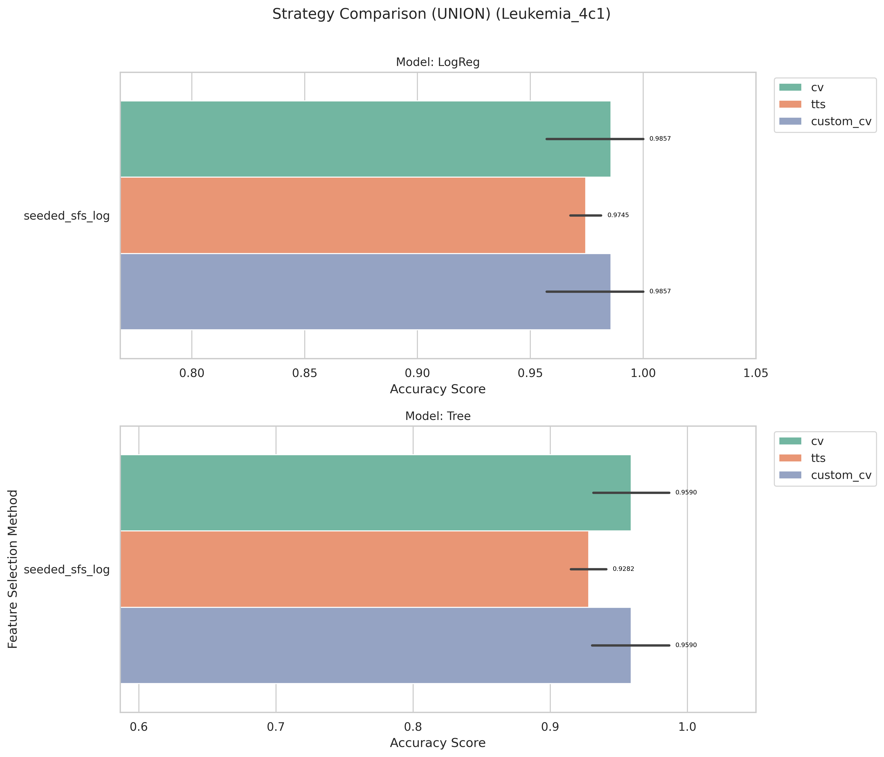
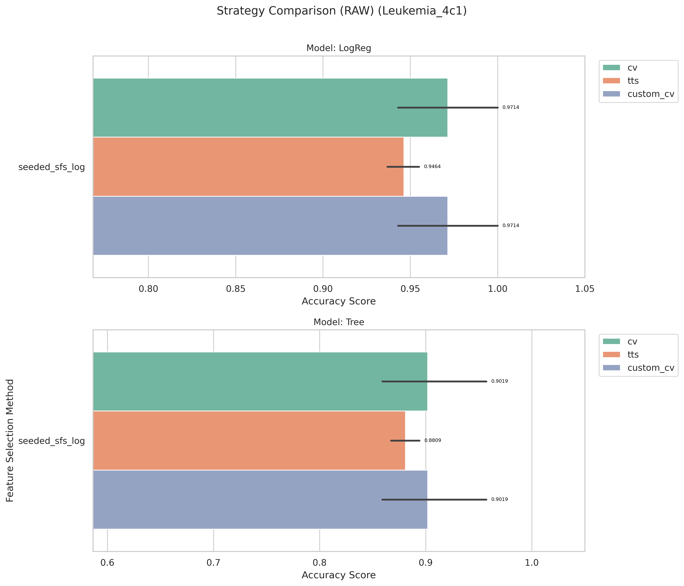

# Leukemia_4c1 Results and Evaluation

[Back to index](./README.md)

## 1) EDA (Exploratory Data Analysis)

- Notebook entry point(s):
- `notebook/Leukemia_4c1/01_eda.ipynb`
- Shape: (72, 7130)

[Insert Chart: EDA Summary]

**Caption:**

- Purpose: Check whether the dataset is imbalanced.
- How to read: The x-axis (V1) shows class labels (0 and 1), and the y-axis (count) shows the number of samples in each class.

## 2) Data Preprocessing

- Notebook entry point(s):
- `notebook/Leukemia_4c1/02_preprocess.ipynb`
- Output location convention: `data/processed/Leukemia_4c1/01_clean/`

## 3) Filter Selection

- Notebook entry point(s):
- `notebook/Leukemia_4c1/03_filter_selection.ipynb`
- Results data: `data/processed/Leukemia_4c1/02_filter`

## 4) Modeling (Filter-stage comparison)

- Notebook entry point(s):
- `notebook/Leukemia_4c1/04_modeling.ipynb`
- Report artifact: `results/Leukemia_4c1/filter/reports/evaluation_Leukemia_4c1.txt`

[Insert Chart: Filter Selection Comparison]

**Caption:**

- Purpose: Compare filter-method performance to select the best feature set for the next stage.
- How to read: The x-axis lists filter methods, and the y-axis shows evaluation scores; higher bars/scores indicate better methods.

## 5) Ensemble Filter (Voting + union feature set)

- Notebook entry point(s):
- `notebook/Leukemia_4c1/05_esemble_filter.ipynb`
- Seed pool file: `data/processed/Leukemia_4c1/03_ensemble/top*_features_voting*.csv`
- Seed pool size: 10
- Top voting features: `1881(5)`, `4195(4)`, `759(4)`, `6040(4)`, `4049(4)`

[Insert Chart: Ensemble Voting / Union Features]

**Caption:**

- Purpose: Show agreement among filter methods when voting for features.
- How to read: The x-axis lists feature names, and the y-axis shows vote counts; features with higher votes are prioritized.

## 6) Wrapper: Sklearn SFS (Raw vs Union execution)

- Script entry point(s):
- `notebook/Leukemia_4c1/06_sklearn_sfs-raw.py`
- `notebook/Leukemia_4c1/06_sklearn_sfs-union.py`

| Variant | Sklearn Selected | Sklearn Global Best | Sklearn Fit Time (s) |
| ------- | ---------------: | ------------------: | -------------------: |
| Raw     |                5 |            1.000000 |              587.822 |
| Union   |                4 |            0.986111 |               11.934 |

## 7) Wrapper: Seeded SFS (Raw vs Union execution)

- Script entry point(s):
- `notebook/Leukemia_4c1/07_sfs-raw.py`
- `notebook/Leukemia_4c1/07_sfs-union.py`

| Variant | Seeded Selected | Seeded Global Best | Seeded Fit Time (s) |
| ------- | --------------: | -----------------: | ------------------: |
| Raw     |               6 |           0.986111 |              69.081 |
| Union   |               8 |           1.000000 |               6.948 |

## 8) Accuracy Evaluation (Comparing Raw vs Union)

- Notebook entry point(s):
- `notebook/Leukemia_4c1/8_accuracu_evaluate.ipynb`
- `notebook/Leukemia_4c1/8_accuracu_evaluate_union.ipynb`

[Insert Chart: Accuracy Comparison Raw vs Union]

**Caption:**

- Purpose: Compare accuracy across wrapper configurations (Sklearn SFS and Seeded SFS) for each data variant.
- How to read:
  - The x-axis shows configurations/methods, and the y-axis shows accuracy; higher values indicate better performance.
  - Vertical black lines (error bars) show Standard Deviation across cross-validation folds. Shorter bars indicate more stable model performance.

**Caption:**

- Purpose: Compare accuracy across wrapper configurations (Sklearn SFS and Seeded SFS) for each data variant.
- How to read:
  - The x-axis shows configurations/methods, and the y-axis shows accuracy; higher values indicate better performance.
  - Vertical black lines (error bars) show Standard Deviation across cross-validation folds. Shorter bars indicate more stable model performance.

- **Observation:** Two configurations (seeded SFS Union LogReg and sklearn SFS Raw LogReg) achieve perfect accuracy.
- **Explanation:** Both raw and union variants produce strong feature subsets for this dataset; seeded wins union, sklearn wins raw.
- **Takeaway:** Use sklearn for raw runs, seeded for union runs; both can be production-ready.

- Raw best configuration: `sklearn + LogReg`, mean accuracy **1.0000**, std 0.0000
- Union best configuration: `seeded + LogReg`, mean accuracy **1.0000**, std 0.0000

## 9) Time Evaluation (Comparing fit times for Raw vs Union)

- Notebook entry point(s):
- `notebook/Leukemia_4c1/9_time_evaluate.ipynb`
- `notebook/Leukemia_4c1/9_time_evaluate_union.ipynb`

[Insert Chart: Time Comparison Raw vs Union]

**Caption:**

- Purpose: Compare training-time cost across wrapper methods on the same dataset.
- How to read: The x-axis shows methods/configurations, and the y-axis shows total fit time (ms); lower bars mean faster runtime.

**Caption:**

- Purpose: Compare training-time cost across wrapper methods on the same dataset.
- How to read: The x-axis shows methods/configurations, and the y-axis shows total fit time (ms); lower bars mean faster runtime.

- **Observation:** Union runs are generally faster than raw runs across wrapper methods.
- **Explanation:** Union reduces candidate-space size, reducing total model-fit operations.
- **Takeaway:** Use union for rapid iteration; use raw when chasing peak wrapper score.

## 10) Final Evaluation (All Methods Comparison)

- Notebook entry point(s):
- `notebook/Leukemia_4c1/10_final_evaluate.ipynb`
- Report artifact: `results/Leukemia_4c1/evaluation/reports/final_evaluation_all_methods_leukemia_4c1_Leukemia_4c1.txt`

[Insert Chart: Final Evaluation - All Methods]

**Caption:**

- Purpose: Compare all feature selection methods (Filter, Ensemble, Sklearn SFS, Seeded SFS) with both LogReg and Tree models.
- How to read:
  - The x-axis lists all method/model combinations (e.g., "Sklearn_SFS_Raw + LogReg").
  - The y-axis shows cross-validation accuracy; higher bars indicate better performance.
  - Vertical error bars show Standard Deviation across folds; shorter bars indicate more stable models.

| Rank | Method + Model              | CV Folds | Mean Accuracy |    Std | Median |    Min |    Max |
| ---- | --------------------------- | -------: | ------------: | -----: | -----: | -----: | -----: |
| 1    | Seeded_SFS_Union + LogReg   |        4 |        1.0000 | 0.0000 | 1.0000 | 1.0000 | 1.0000 |
| 1    | Sklearn_SFS_Raw + LogReg    |        4 |        1.0000 | 0.0000 | 1.0000 | 1.0000 | 1.0000 |
| 2    | Seeded_SFS_Raw + LogReg     |        4 |        0.9861 | 0.0278 | 1.0000 | 0.9444 | 1.0000 |
| 2    | Sklearn_SFS_Union + LogReg  |        4 |        0.9861 | 0.0278 | 1.0000 | 0.9444 | 1.0000 |
| 3    | Seeded_SFS_Union + Tree     |        4 |        0.9722 | 0.0321 | 0.9722 | 0.9444 | 1.0000 |
| 4    | ANOVA_F_TEST + LogReg       |        4 |        0.9583 | 0.0278 | 0.9444 | 0.9444 | 1.0000 |

**Key Observations:**

- Best configurations: Seeded_SFS_Union + LogReg and Sklearn_SFS_Raw + LogReg both achieve 1.0000 accuracy (σ=0.0000)
- Seeded union variant is the most cost-effective (6.948s fit time vs 587.822s for sklearn raw)

## 11) Verify the result

- To make sure the evaluate method is not broken, i using 2 more method to verify it:
  - 70/30 train/test split + 50time -> avg.
  - built a custom cross-validation function

