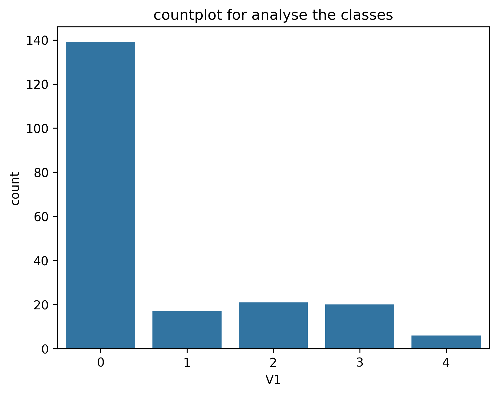
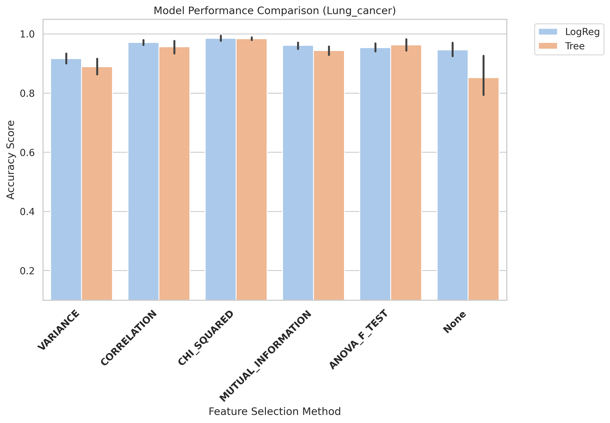
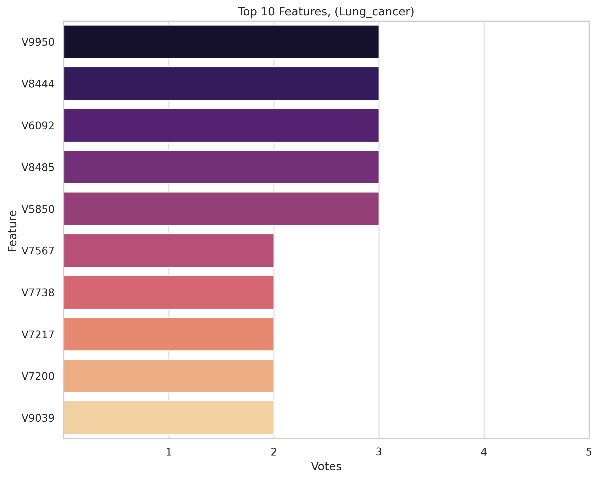
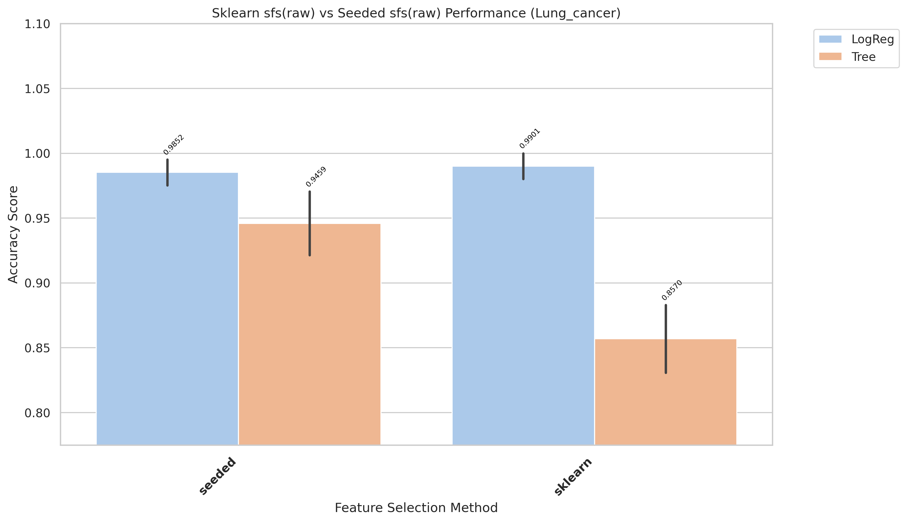
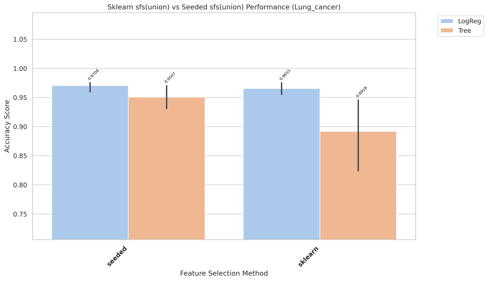
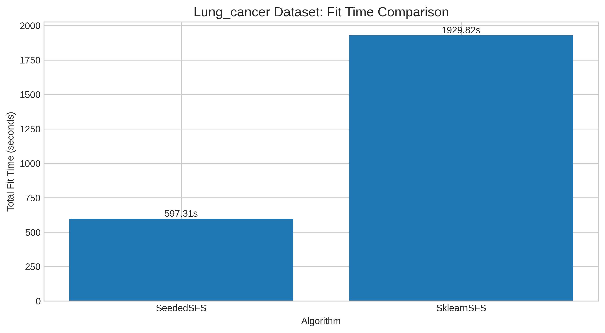
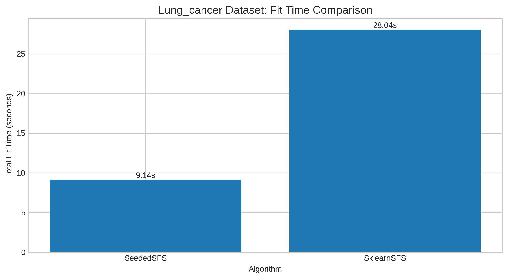

# Lung_cancer Results and Evaluation

[Back to index](../results.md)

## 1) EDA (Exploratory Data Analysis)

- Notebook entry point(s):
- `notebook/Lung_cancer/01_eda.ipynb`

[Insert Chart: EDA Summary]

## 2) Data Preprocessing

- Notebook entry point(s):
- Not explicitly available in current notebook folder.
- Output location convention: `data/processed/Lung_cancer/01_clean/`

## 3) Filter Selection

- Notebook entry point(s):
- `notebook/Lung_cancer/02_Filter_selection.ipynb`
- Report artifact: `results/Lung_cancer/filter/reports/evaluation_Lung_cancer.txt`

[Insert Chart: Filter Selection Comparison]

## 4) Modeling (Filter-stage comparison)

- Notebook entry point(s):
- `notebook/Lung_cancer/03_modeling.ipynb`
- Modeling outputs are tracked under `results/Lung_cancer/filter/` when available.

## 5) Ensemble Filter (Voting + union feature set)

- Notebook entry point(s):
- `notebook/Lung_cancer/04_Ensemble_filter_selection.ipynb`
- Seed pool file: `data/processed/Lung_cancer/03_ensemble/top17_features_voting.csv`
- Seed pool size used in ranking: 10
- Top voting features: `V9950(3)`, `V8444(3)`, `V6092(3)`, `V8485(3)`, `V5850(3)`

[Insert Chart: Ensemble Voting / Union Features]

## 6) Wrapper: Sklearn SFS (Raw vs Union execution)

- Script entry point(s):
- `notebook/Lung_cancer/06_sklearn_sfs-raw.py`
- `notebook/Lung_cancer/06_sklearn_sfs-union.py`

| Variant | Sklearn Selected | Sklearn Global Best | Sklearn Fit Time (ms) |
|---|---:|---:|---:|
| Raw | 6 | 0.9607 | 1,226,250 |
| Union | 4 | 0.9063 | 7,452 |

## 7) Wrapper: Seeded SFS (Raw vs Union execution)

- Script entry point(s):
- `notebook/Lung_cancer/07_sfs-raw.py`
- `notebook/Lung_cancer/07_sfs-union.py`

| Variant | Seeded Selected | Seeded Global Best | Seeded Fit Time (ms) |
|---|---:|---:|---:|
| Raw | 10 | 0.9804 | 216,747 |
| Union | 7 | 0.9459 | 2,981 |

## 8) Accuracy Evaluation (Comparing Raw vs Union)

- Notebook entry point(s):
- `notebook/Lung_cancer/7_accuracu_evaluate.ipynb`
- `notebook/Lung_cancer/7_accuracu_evaluate_union.ipynb`

[Insert Chart: Accuracy Comparison Raw vs Union]

- **Observation:** Raw sklearn runtime is much higher than all other variants.
- **Explanation:** Larger raw feature space combined with iterative sklearn search increases total fit cost.
- **Takeaway:** Use union for fast experimentation; reserve raw runs for final verification.

- Raw best configuration: `sklearn + Tree`, mean accuracy **0.9607**, std 0.0326
- Union best configuration: `seeded + Tree`, mean accuracy 0.9262, std 0.0571
- Final selected features (winning setup, raw sklearn): 6 features

## 9) Time Evaluation (Comparing fit times for Raw vs Union)

- Notebook entry point(s):
- `notebook/Lung_cancer/8_time_evaluate.ipynb`
- `notebook/Lung_cancer/8_time_evaluate_union.ipynb`

[Insert Chart: Time Comparison Raw vs Union]

- **Observation:** Union runs are generally faster than raw runs across wrapper methods.
- **Explanation:** Union reduces candidate-space size, reducing total model-fit operations.
- **Takeaway:** Use union for rapid iteration; use raw when chasing peak wrapper score.
