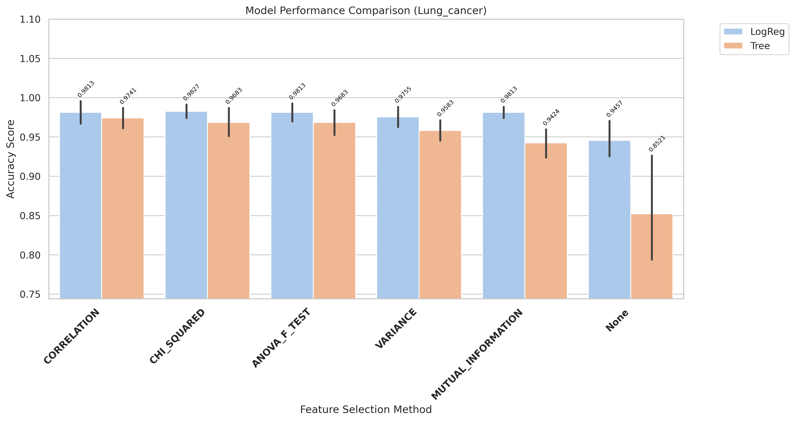
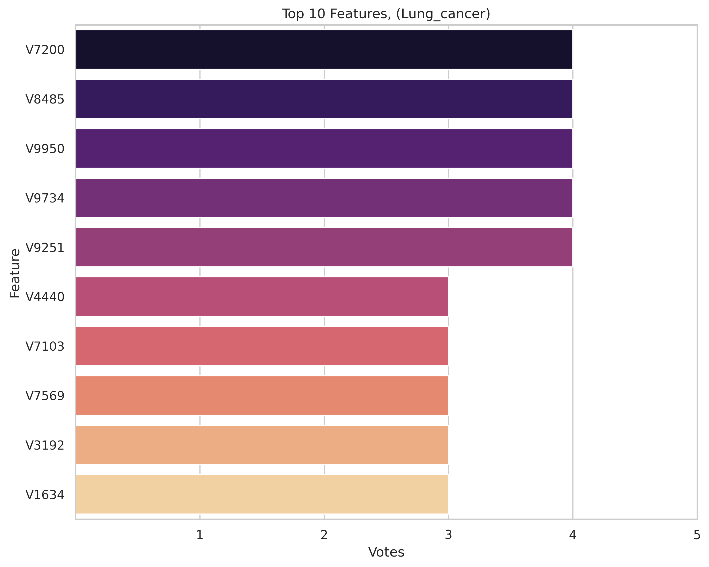

# Lung_cancer Results and Evaluation

[Back to index](./README.md)

## 1) EDA (Exploratory Data Analysis)

- Notebook entry point(s):
- `notebook/Lung_cancer/01_eda.ipynb`
- Shape: (203, 12601)

[Insert Chart: EDA Summary]

**Caption:**

- Purpose: Check whether the dataset is imbalanced.
- How to read: The x-axis (V1) shows class labels (0 and 1), and the y-axis (count) shows the number of samples in each class.

## 2) Data Preprocessing

- Notebook entry point(s):
- Not explicitly available in current notebook folder.
- Output location convention: `data/processed/Lung_cancer/01_clean/`

## 3) Filter Selection

- Notebook entry point(s):
- `notebook/Lung_cancer/02_Filter_selection.ipynb`

## 4) Modeling (Filter-stage comparison)

- Notebook entry point(s):
- `notebook/Lung_cancer/03_modeling.ipynb`
- Report artifact: `results/Lung_cancer/filter/reports/evaluation_Lung_cancer.txt`

[Insert Chart: Filter Selection Comparison]

**Caption:**

- Purpose: Compare filter-method performance to select the best feature set for the next stage.
- How to read: The x-axis lists filter methods, and the y-axis shows evaluation scores; higher bars/scores indicate better methods.

## 5) Ensemble Filter (Voting + union feature set)

- Notebook entry point(s):
- `notebook/Lung_cancer/04_Ensemble_filter_selection.ipynb`
- Seed pool file: `data/processed/Lung_cancer/03_ensemble/top17_features_voting.csv`
- Seed pool size used in ranking: 10
- Top voting features: `V9950(3)`, `V8444(3)`, `V6092(3)`, `V8485(3)`, `V5850(3)`

[Insert Chart: Ensemble Voting / Union Features]

**Caption:**

- Purpose: Show agreement among filter methods when voting for features.
- How to read: The x-axis lists feature names, and the y-axis shows vote counts; features with higher votes are prioritized.

## 6) Wrapper: Sklearn SFS (Raw vs Union execution)

- Script entry point(s):
- `notebook/Lung_cancer/06_sklearn_sfs-raw.py`
- `notebook/Lung_cancer/06_sklearn_sfs-union.py`

| Variant | Sklearn Selected | Sklearn Global Best | Sklearn Fit Time (s) |
| ------- | ---------------: | ------------------: | -------------------: |
| Raw     |                8 |            0.990122 |             1929.819 |
| Union   |                7 |            0.965488 |               28.044 |

## 7) Wrapper: Seeded SFS (Raw vs Union execution)

- Script entry point(s):
- `notebook/Lung_cancer/07_sfs-raw.py`
- `notebook/Lung_cancer/07_sfs-union.py`

| Variant | Seeded Selected | Seeded Global Best | Seeded Fit Time (s) |
| ------- | --------------: | -----------------: | ------------------: |
| Raw     |               7 |           0.985244 |             597.305 |
| Union   |               5 |           0.970366 |               9.143 |

## 8) Accuracy Evaluation (Comparing Raw vs Union)

- Notebook entry point(s):
- `notebook/Lung_cancer/7_accuracu_evaluate.ipynb`
- `notebook/Lung_cancer/7_accuracu_evaluate_union.ipynb`

[Insert Chart: Accuracy Comparison Raw vs Union]

**Caption:**

- Purpose: Compare accuracy across wrapper configurations (Sklearn SFS and Seeded SFS) for each data variant.
- How to read:
  - The x-axis shows configurations/methods, and the y-axis shows accuracy; higher values indicate better performance.
  - Vertical black lines (error bars) show Standard Deviation across cross-validation folds. Shorter bars indicate more stable model performance.
    

**Caption:**

- Purpose: Compare accuracy across wrapper configurations (Sklearn SFS and Seeded SFS) for each data variant.
- How to read:
  - The x-axis shows configurations/methods, and the y-axis shows accuracy; higher values indicate better performance.
  - Vertical black lines (error bars) show Standard Deviation across cross-validation folds. Shorter bars indicate more stable model performance.

- **Observation:** Raw sklearn LogReg achieves the highest accuracy (0.9901) among all wrapper configurations.
- **Explanation:** The raw feature space preserves more signal for sklearn SFS, though at significantly higher computation cost.
- **Takeaway:** Use sklearn raw for peak accuracy; use seeded union for best speed-to-performance ratio.

- Raw best configuration: `sklearn + LogReg`, mean accuracy **0.9901**, std 0.0135
- Union best configuration: `seeded + LogReg`, mean accuracy **0.9704**, std 0.0114

## 9) Time Evaluation (Comparing fit times for Raw vs Union)

- Notebook entry point(s):
- `notebook/Lung_cancer/8_time_evaluate.ipynb`
- `notebook/Lung_cancer/8_time_evaluate_union.ipynb`

[Insert Chart: Time Comparison Raw vs Union]

**Caption:**

- Purpose: Compare training-time cost across wrapper methods on the same dataset.
- How to read: The x-axis shows methods/configurations, and the y-axis shows total fit time (ms); lower bars mean faster runtime.
  

**Caption:**

- Purpose: Compare training-time cost across wrapper methods on the same dataset.
- How to read: The x-axis shows methods/configurations, and the y-axis shows total fit time (ms); lower bars mean faster runtime.

- **Observation:** Union runs are generally faster than raw runs across wrapper methods.
- **Explanation:** Union reduces candidate-space size, reducing total model-fit operations.
- **Takeaway:** Use union for rapid iteration; use raw when chasing peak wrapper score.

## 10) Final Evaluation (All Methods Comparison)

- Notebook entry point(s):
- `notebook/Lung_cancer/10_final_evaluate.ipynb`
- Report artifact: `results/Lung_cancer/evaluation/reports/final_evaluation_all_methods_lung_cancer_Lung_cancer.txt`

[Insert Chart: Final Evaluation - All Methods]

**Caption:**

- Purpose: Compare all feature selection methods (Filter, Ensemble, Sklearn SFS, Seeded SFS) with both LogReg and Tree models.
- How to read:
  - The x-axis lists all method/model combinations (e.g., "Sklearn_SFS_Raw + LogReg").
  - The y-axis shows cross-validation accuracy; higher bars indicate better performance.
  - Vertical error bars show Standard Deviation across folds; shorter bars indicate more stable models.

| Rank | Method + Model              | CV Folds | Mean Accuracy |    Std | Median |    Min |    Max |
| ---- | --------------------------- | -------: | ------------: | -----: | -----: | -----: | -----: |
| 1    | Sklearn_SFS_Raw + LogReg    |        5 |        0.9901 | 0.0135 | 1.0000 | 0.9750 | 1.0000 |
| 2    | Seeded_SFS_Raw + LogReg     |        5 |        0.9852 | 0.0135 | 0.9756 | 0.9750 | 1.0000 |
| 3    | CHI_SQUARED + LogReg        |        5 |        0.9827 | 0.0109 | 0.9856 | 0.9712 | 0.9928 |
| 4    | ANOVA_F_TEST + LogReg       |        5 |        0.9813 | 0.0149 | 0.9784 | 0.9640 | 1.0000 |
| 5    | CORRELATION + LogReg        |        5 |        0.9813 | 0.0188 | 0.9784 | 0.9568 | 1.0000 |
| 6    | Seeded_SFS_Union + LogReg   |        5 |        0.9704 | 0.0114 | 0.9756 | 0.9500 | 0.9756 |

**Key Observations:**

- Best configuration: Sklearn_SFS_Raw + LogReg with 0.9901 accuracy (σ=0.0135); close second is Seeded_SFS_Raw + LogReg at 0.9852
- Wrapper methods (sklearn and seeded SFS) outperform pure filter methods on this dataset
