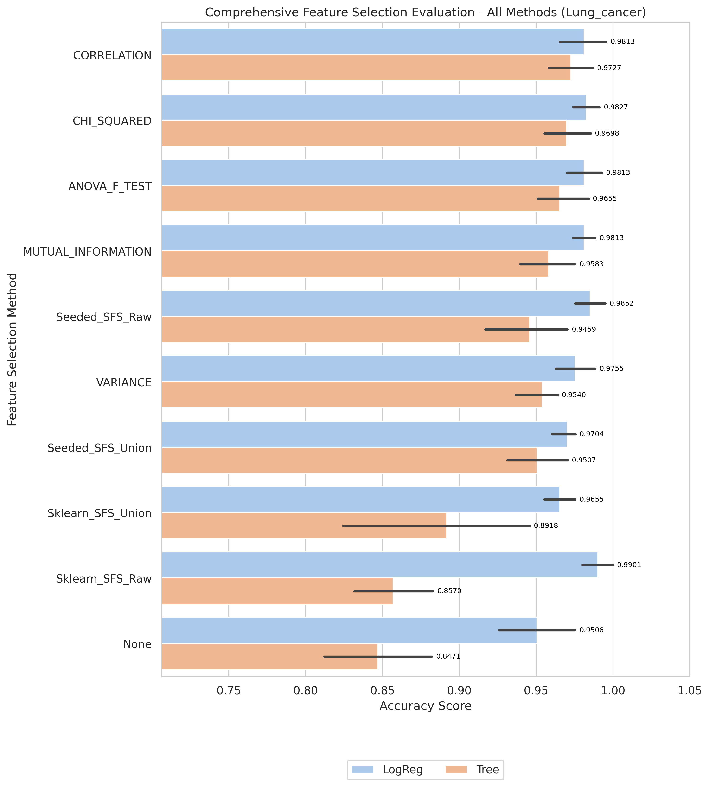

# Lung_cancer Kết quả và Đánh giá

_Đọc bản tiếng Anh tại [result-lung_cancer.md](result-lung_cancer.md)_

[Quay lại mục lục](./README.vi.md)

## 1) EDA (Phân tích khám phá dữ liệu)

- Điểm vào notebook:
- `notebook/Lung_cancer/01_eda.ipynb`

[Chèn biểu đồ: Tổng quan EDA]

**Chú thích:**
- Mục đích: Kiểm tra xem bộ dữ liệu có bị mất cân bằng (imbalanced) hay không.
- Cách đọc: Trục hoành (V1) thể hiện các nhãn lớp (0 và 1), trục tung (count) là số lượng mẫu của từng lớp.

## 2) Tiền xử lý dữ liệu

- Điểm vào notebook:
- Không có rõ ràng trong thư mục notebook hiện tại.
- Quy ước thư mục đầu ra: `data/processed/Lung_cancer/01_clean/`

## 3) Lọc đặc trưng (Filter Selection)

- Điểm vào notebook:
- `notebook/Lung_cancer/02_Filter_selection.ipynb`
- Tệp báo cáo: `results/Lung_cancer/filter/reports/evaluation_Lung_cancer.txt`

[Chèn biểu đồ: So sánh Filter Selection]

**Chú thích:**
- Mục đích: So sánh hiệu năng các phương pháp filter để chọn ra nhóm đặc trưng tốt nhất cho bước tiếp theo.
- Cách đọc: Trục hoành là các phương pháp filter, trục tung là điểm đánh giá; cột/điểm càng cao thì phương pháp càng tốt.

## 4) Mô hình hóa (so sánh ở giai đoạn filter)

- Điểm vào notebook:
- `notebook/Lung_cancer/03_modeling.ipynb`
- Kết quả modeling được lưu dưới `results/Lung_cancer/filter/` khi có sẵn.

## 5) Ensemble Filter (Bỏ phiếu + tập đặc trưng union)

- Điểm vào notebook:
- `notebook/Lung_cancer/04_Ensemble_filter_selection.ipynb`
- Tệp seed pool: `data/processed/Lung_cancer/03_ensemble/top17_features_voting.csv`
- Seed pool size used in ranking: 10
- Đặc trưng có số phiếu cao nhất: `V9950(3)`, `V8444(3)`, `V6092(3)`, `V8485(3)`, `V5850(3)`

[Chèn biểu đồ: Bỏ phiếu Ensemble / Đặc trưng Union]

**Chú thích:**
- Mục đích: Hiển thị mức độ đồng thuận của các phương pháp filter khi bỏ phiếu chọn đặc trưng.
- Cách đọc: Trục hoành là tên đặc trưng, trục tung là số phiếu (vote count); đặc trưng có phiếu cao hơn được ưu tiên hơn.

## 6) Wrapper: Sklearn SFS (chạy Raw vs Union)

- Điểm vào script:
- `notebook/Lung_cancer/06_sklearn_sfs-raw.py`
- `notebook/Lung_cancer/06_sklearn_sfs-union.py`

| Biến thể | Sklearn Số đặc trưng chọn | Sklearn Global Best | Sklearn Thời gian fit (ms) |
|---|---:|---:|---:|
| Raw | 6 | 0.9607 | 1,226,250 |
| Union | 4 | 0.9063 | 7,452 |

## 7) Wrapper: Seeded SFS (chạy Raw vs Union)

- Điểm vào script:
- `notebook/Lung_cancer/07_sfs-raw.py`
- `notebook/Lung_cancer/07_sfs-union.py`

| Biến thể | Seeded Số đặc trưng chọn | Seeded Global Best | Seeded Thời gian fit (ms) |
|---|---:|---:|---:|
| Raw | 10 | 0.9804 | 216,747 |
| Union | 7 | 0.9459 | 2,981 |

## 8) Đánh giá Accuracy (so sánh Raw vs Union)

- Điểm vào notebook:
- `notebook/Lung_cancer/7_accuracu_evaluate.ipynb`
- `notebook/Lung_cancer/7_accuracu_evaluate_union.ipynb`

[Chèn biểu đồ: So sánh Accuracy Raw vs Union]

**Chú thích:**
- Mục đích: So sánh độ chính xác giữa các cấu hình wrapper (Sklearn SFS và Seeded SFS) theo từng biến thể dữ liệu.
- Cách đọc:
  - Trục hoành là từng cấu hình/phương pháp, trục tung là accuracy; giá trị cao hơn thể hiện hiệu năng tốt hơn.
  - Vạch đen thẳng đứng (Error bar): Thể hiện độ lệch chuẩn (Standard Deviation) qua các fold cross-validation. Vạch này càng ngắn chứng tỏ mô hình dự đoán càng ổn định, ít biến động.

**Chú thích:**
- Mục đích: So sánh độ chính xác giữa các cấu hình wrapper (Sklearn SFS và Seeded SFS) theo từng biến thể dữ liệu.
- Cách đọc:
  - Trục hoành là từng cấu hình/phương pháp, trục tung là accuracy; giá trị cao hơn thể hiện hiệu năng tốt hơn.
  - Vạch đen thẳng đứng (Error bar): Thể hiện độ lệch chuẩn (Standard Deviation) qua các fold cross-validation. Vạch này càng ngắn chứng tỏ mô hình dự đoán càng ổn định, ít biến động.

- **Quan sát:** Thời gian chạy raw sklearn cao hơn nhiều so với các biến thể còn lại.
- **Giải thích:** Không gian đặc trưng raw lớn kết hợp với tìm kiếm lặp của sklearn làm tăng tổng chi phí fit.
- **Kết luận:** Dùng union để thử nghiệm nhanh; giữ các lần chạy raw cho bước xác nhận cuối.

- Cấu hình tốt nhất (raw): `sklearn + Tree`, accuracy trung bình **0.9607**, std 0.0326
- Cấu hình tốt nhất (union): `seeded + Tree`, accuracy trung bình 0.9262, std 0.0571
- Final selected features (winning setup, raw sklearn): 6 features

## 9) Đánh giá thời gian (so sánh thời gian fit Raw vs Union)

- Điểm vào notebook:
- `notebook/Lung_cancer/8_time_evaluate.ipynb`
- `notebook/Lung_cancer/8_time_evaluate_union.ipynb`

[Chèn biểu đồ: So sánh thời gian Raw vs Union]

**Chú thích:**
- Mục đích: So sánh chi phí thời gian huấn luyện giữa các phương pháp wrapper trên cùng bộ dữ liệu.
- Cách đọc: Trục hoành là phương pháp/cấu hình, trục tung là tổng thời gian fit (ms); cột thấp hơn nghĩa là chạy nhanh hơn.

**Chú thích:**
- Mục đích: So sánh chi phí thời gian huấn luyện giữa các phương pháp wrapper trên cùng bộ dữ liệu.
- Cách đọc: Trục hoành là phương pháp/cấu hình, trục tung là tổng thời gian fit (ms); cột thấp hơn nghĩa là chạy nhanh hơn.

- **Quan sát:** Các lần chạy union thường nhanh hơn raw trên hầu hết phương pháp wrapper.
- **Giải thích:** Union làm giảm không gian ứng viên, từ đó giảm tổng số lần fit mô hình.
- **Kết luận:** Dùng union để lặp thử nhanh; dùng raw khi cần tối đa hóa wrapper score.

## 10) Đánh Giá Cuối Cùng (So Sánh Tất Cả Phương Pháp)

- Điểm vào notebook:
- `notebook/Lung_cancer/10_final_evaluate.ipynb`
- Báo cáo: `results/Lung_cancer/evaluation/reports/final_evaluation_all_methods_lung_cancer_Lung_cancer.txt`

[Biểu Đồ: Đánh Giá Cuối Cùng - Tất Cả Phương Pháp]

**Chú Thích:**
- Mục đích: So sánh tất cả phương pháp lựa chọn đặc trưng (Filter, Ensemble, Sklearn SFS, Seeded SFS) với cả hai mô hình LogReg và Tree.
- Cách đọc:
  - Trục X liệt kê tất cả các kết hợp phương pháp/mô hình (ví dụ: "Sklearn_SFS_Raw + LogReg").
  - Trục Y hiển thị độ chính xác cross-validation; các cột cao hơn cho biết hiệu suất tốt hơn.
  - Các thanh lỗi dọc hiển thị độ lệch chuẩn (Std) trên các fold; các thanh ngắn hơn chỉ ra mô hình ổn định hơn.

| Xếp Hạng | Phương Pháp + Mô Hình | CV Fold | Accuracy Trung Bình | Std | Median | Min | Max |
|---|---|---:|---:|---:|---:|---:|---:|
| 1 | CHI_SQUARED + LogReg | 5 | 0.9784 | 0.0102 | 0.9712 | 0.9712 | 0.9928 |
| 2 | CORRELATION + LogReg | 5 | 0.9770 | 0.0200 | 0.9856 | 0.9496 | 1.0000 |
| 3 | ANOVA_F_TEST + LogReg | 5 | 0.9741 | 0.0173 | 0.9784 | 0.9496 | 0.9928 |

**Quan Sát Chính:**
- Cấu hình tốt nhất: CHI_SQUARED + LogReg với độ chính xác 0.9784 (σ=0.0102)
- Xếp thứ hai: CORRELATION + LogReg với độ chính xác 0.9770
- Khuyến nghị: Xem so sánh chi tiết trong biểu đồ và tệp báo cáo ở trên.