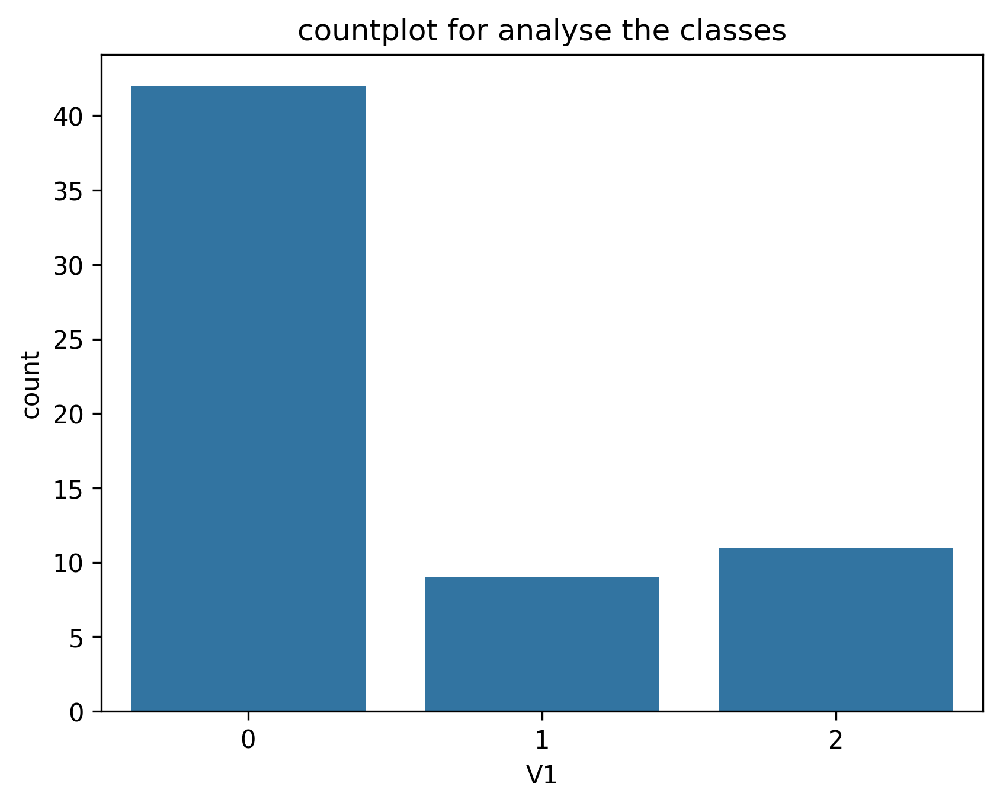
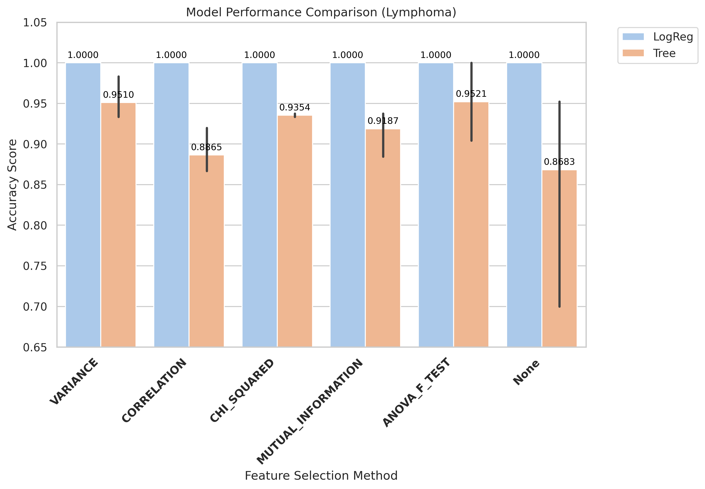
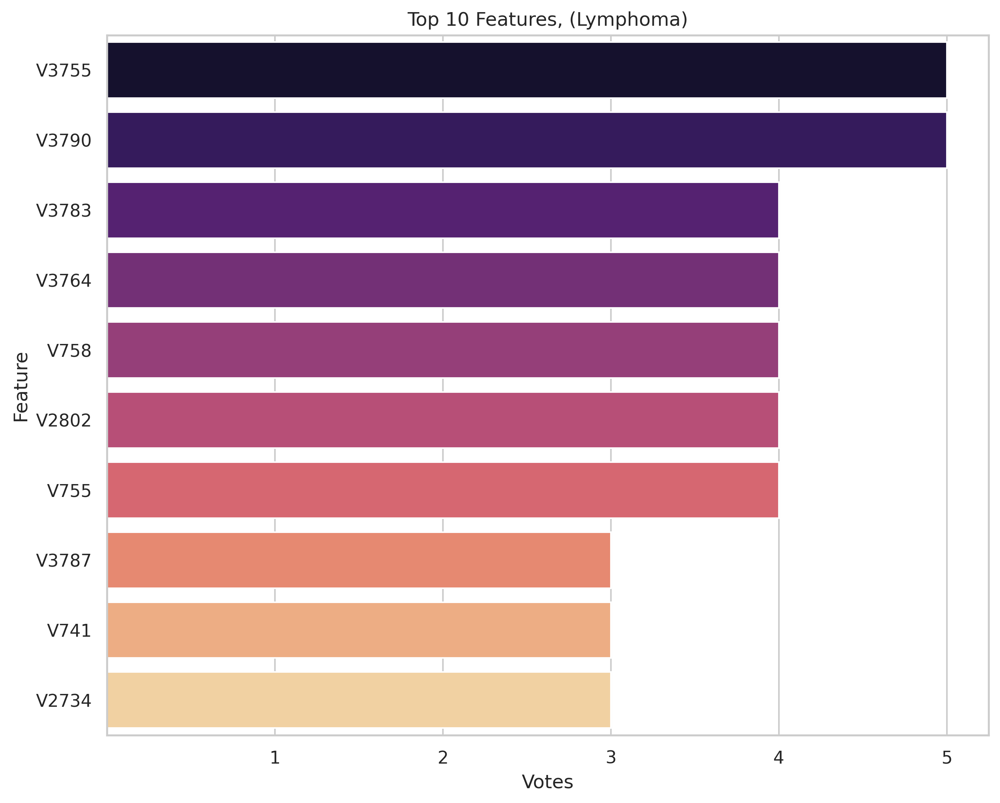
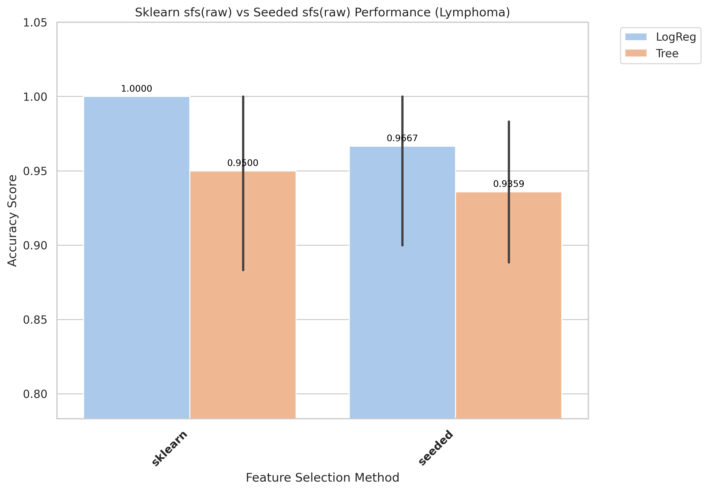
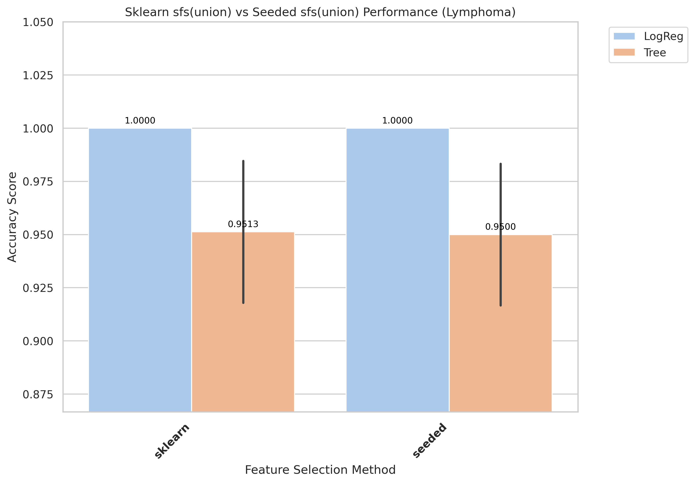
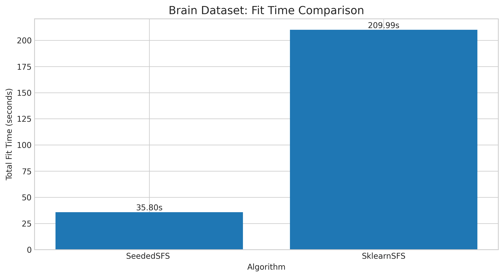
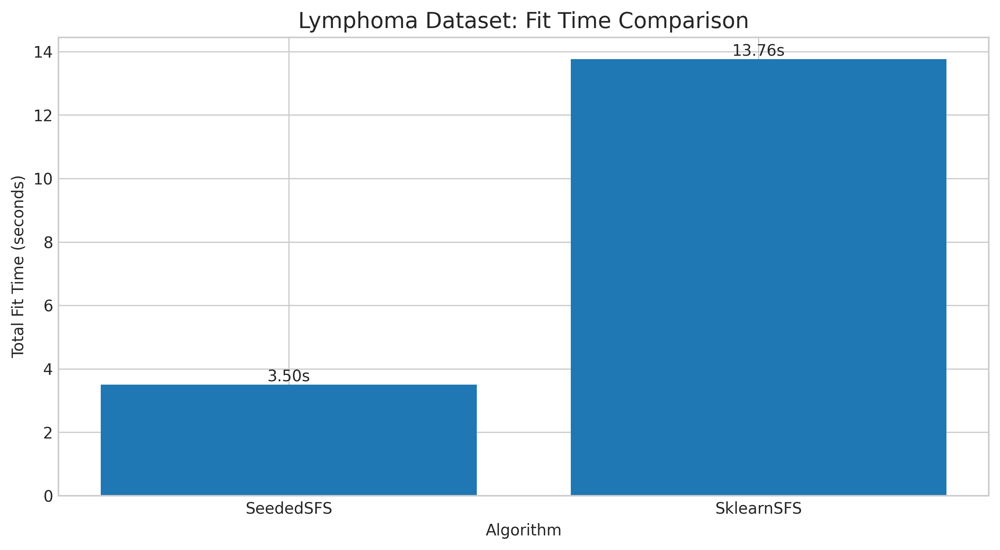

# Lymphoma Results and Evaluation

[Back to index](../results.md)

## 1) EDA (Exploratory Data Analysis)

- Notebook entry point(s):
- `notebook/Lymphoma/01_eda.ipynb`

[Insert Chart: EDA Summary]

## 2) Data Preprocessing

- Notebook entry point(s):
- `notebook/Lymphoma/02_Preprocessing.ipynb`
- Output location convention: `data/processed/Lymphoma/01_clean/`

## 3) Filter Selection

- Notebook entry point(s):
- `notebook/Lymphoma/03_filter_selection.ipynb`
- Report artifact: `results/Lymphoma/filter/reports/evaluation_Lymphoma.txt`

[Insert Chart: Filter Selection Comparison]

## 4) Modeling (Filter-stage comparison)

- Notebook entry point(s):
- `notebook/Lymphoma/04_modeling.ipynb`
- Modeling outputs are tracked under `results/Lymphoma/filter/` when available.

## 5) Ensemble Filter (Voting + union feature set)

- Notebook entry point(s):
- `notebook/Lymphoma/05_esemble_filter.ipynb`
- Seed pool file: `data/processed/Lymphoma/03_ensemble/top50_features_voting.csv`
- Seed pool size: 10
- Top voting features: `V3755(5)`, `V3790(5)`, `V3783(4)`, `V3764(4)`, `V758(4)`

[Insert Chart: Ensemble Voting / Union Features]

## 6) Wrapper: Sklearn SFS (Raw vs Union execution)

- Script entry point(s):
- `notebook/Lymphoma/06_sklearn_sfs-raw.py`
- `notebook/Lymphoma/06_sklearn_sfs-union.py`

| Variant | Sklearn Selected | Sklearn Global Best | Sklearn Fit Time (ms) |
|---|---:|---:|---:|
| Raw | 3 | 1 | 209,993 |
| Union | 3 | 1 | 13,759 |

## 7) Wrapper: Seeded SFS (Raw vs Union execution)

- Script entry point(s):
- `notebook/Lymphoma/07_sfs-raw.py`
- `notebook/Lymphoma/07_sfs-union.py`

| Variant | Seeded Selected | Seeded Global Best | Seeded Fit Time (ms) |
|---|---:|---:|---:|
| Raw | 2 | 1 | 35,799 |
| Union | 2 | 1 | 3,496 |

## 8) Accuracy Evaluation (Comparing Raw vs Union)

- Notebook entry point(s):
- `notebook/Lymphoma/8_accuracu_evaluate.ipynb`
- `notebook/Lymphoma/8_accuracu_evaluate_union.ipynb`

[Insert Chart: Accuracy Comparison Raw vs Union]

- **Observation:** Leading methods achieve ceiling-level performance in both variants.
- **Explanation:** Class separation remains strong after both raw and union feature pipelines.
- **Takeaway:** Prefer union seeded for equivalent accuracy at lower cost.

- Raw best configuration: `sklearn + LogReg`, mean accuracy **1.0000**, std 0.0000
- Union best configuration: `seeded + LogReg`, mean accuracy **1.0000**, std 0.0000

## 9) Time Evaluation (Comparing fit times for Raw vs Union)

- Notebook entry point(s):
- `notebook/Lymphoma/9_time_evaluate.ipynb`
- `notebook/Lymphoma/9_time_evaluate_union.ipynb`

[Insert Chart: Time Comparison Raw vs Union]

- **Observation:** Union runs are generally faster than raw runs across wrapper methods.
- **Explanation:** Union reduces candidate-space size, reducing total model-fit operations.
- **Takeaway:** Use union for rapid iteration; use raw when chasing peak wrapper score.
