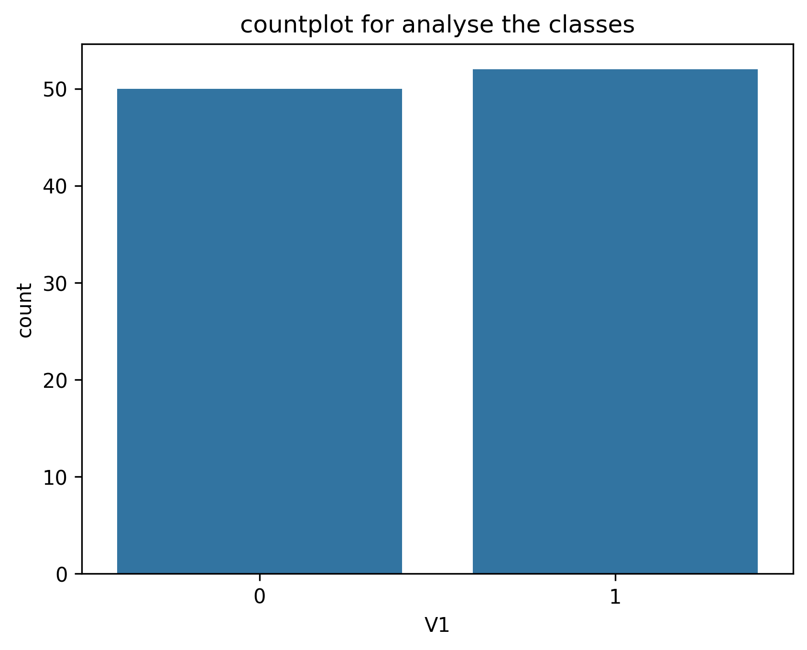
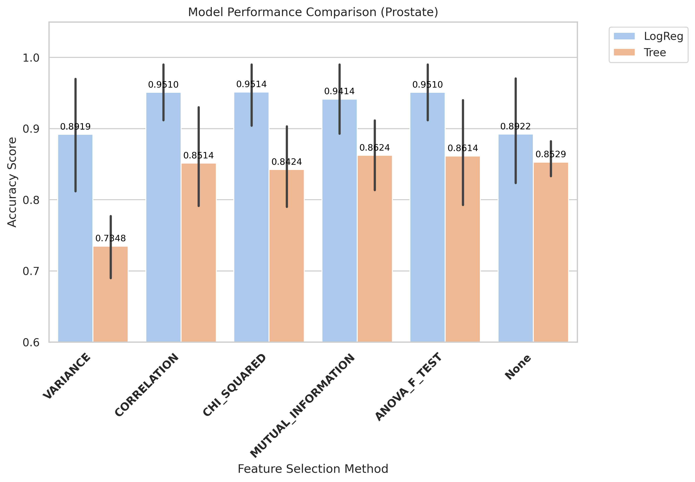
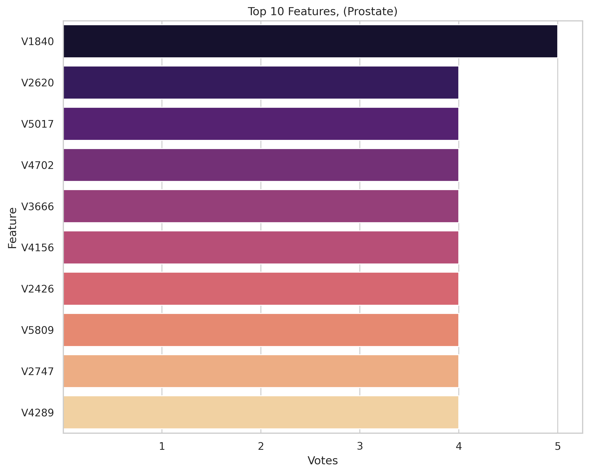
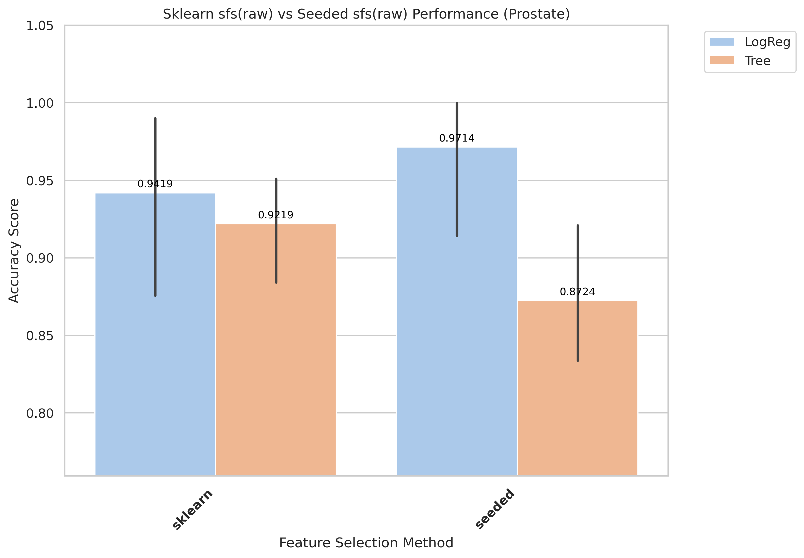
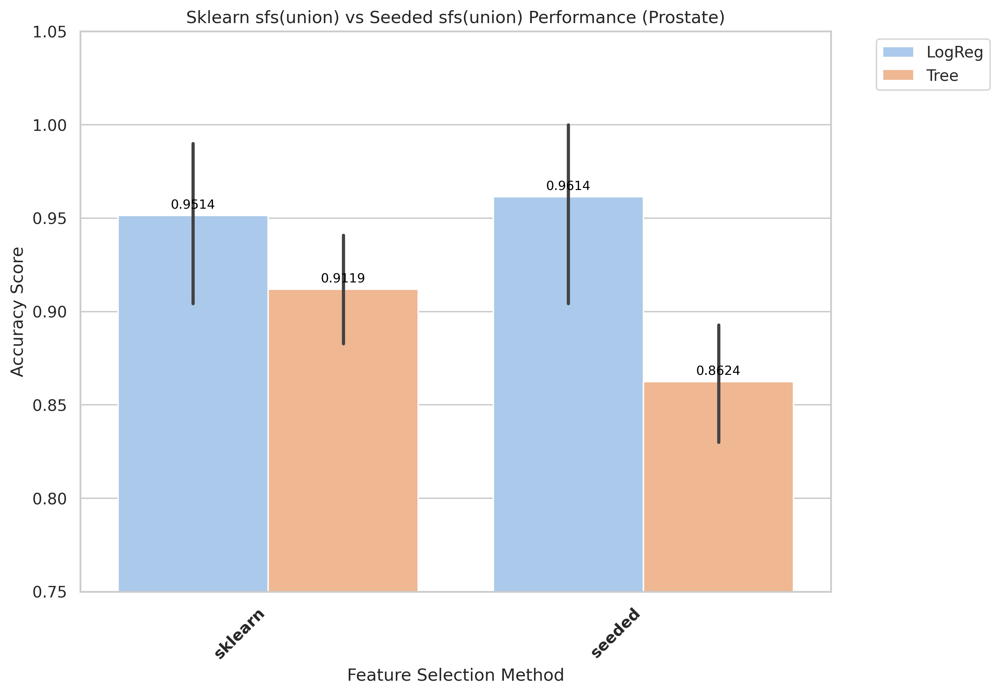
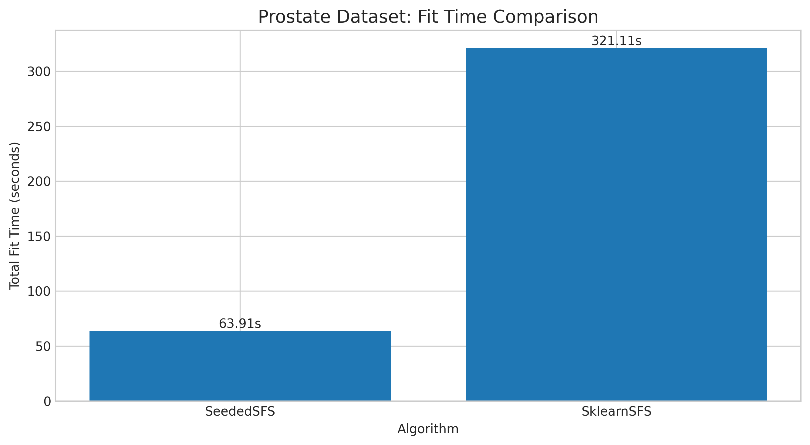
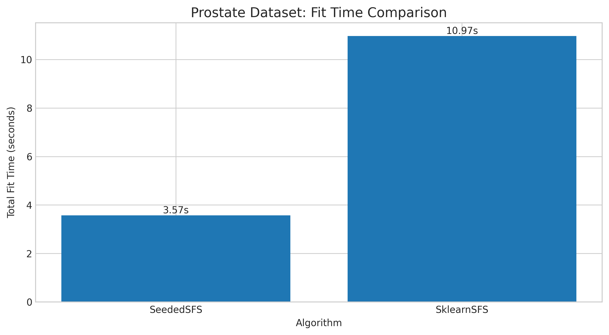

# Prostate Results and Evaluation

[Back to index](../results.md)

## 1) EDA (Exploratory Data Analysis)

- Notebook entry point(s):
- `notebook/Prostate/01_eda.ipynb`

[Insert Chart: EDA Summary]

## 2) Data Preprocessing

- Notebook entry point(s):
- `notebook/Prostate/02_preprocess.ipynb`
- Output location convention: `data/processed/Prostate/01_clean/`

## 3) Filter Selection

- Notebook entry point(s):
- `notebook/Prostate/03_filter_selection.ipynb`
- Report artifact: `results/Prostate/filter/reports/evaluation_Prostate.txt`

[Insert Chart: Filter Selection Comparison]

## 4) Modeling (Filter-stage comparison)

- Notebook entry point(s):
- `notebook/Prostate/04_modeling.ipynb`
- Modeling outputs are tracked under `results/Prostate/filter/` when available.

## 5) Ensemble Filter (Voting + union feature set)

- Notebook entry point(s):
- `notebook/Prostate/05_ensemble.ipynb`
- Seed pool file: `data/processed/Prostate/03_ensemble/top50_features_voting.csv`
- Seed pool size: 10
- Top voting features: `V1840(5)`, `V2620(4)`, `V5017(4)`, `V4702(4)`, `V3666(4)`

[Insert Chart: Ensemble Voting / Union Features]

## 6) Wrapper: Sklearn SFS (Raw vs Union execution)

- Script entry point(s):
- `notebook/Prostate/06_sklearn_sfs-raw.py`
- `notebook/Prostate/06_sklearn_sfs-union.py`

| Variant | Sklearn Selected | Sklearn Global Best | Sklearn Fit Time (ms) |
|---|---:|---:|---:|
| Raw | 3 | 0.9614 | 321,108 |
| Union | 3 | 0.9514 | 10,968 |

## 7) Wrapper: Seeded SFS (Raw vs Union execution)

- Script entry point(s):
- `notebook/Prostate/07_sfs-raw.py`
- `notebook/Prostate/07_sfs-union.py`

| Variant | Seeded Selected | Seeded Global Best | Seeded Fit Time (ms) |
|---|---:|---:|---:|
| Raw | 4 | 0.9714 | 63,907 |
| Union | 3 | 0.9614 | 3,566 |

## 8) Accuracy Evaluation (Comparing Raw vs Union)

- Notebook entry point(s):
- `notebook/Prostate/8_accuracu_evaluate.ipynb`
- `notebook/Prostate/8_accuracu_evaluate_union.ipynb`

[Insert Chart: Accuracy Comparison Raw vs Union]

- **Observation:** Raw variant gives slightly higher accuracy, while union is much faster.
- **Explanation:** Union constrains feature space and lowers compute, but may exclude useful raw-only signals.
- **Takeaway:** Use raw for peak accuracy and union for faster development cycles.

- Raw best configuration: `seeded + LogReg`, mean accuracy **0.9714**, std 0.0639
- Union best configuration: `seeded + LogReg`, mean accuracy 0.9614, std 0.0622
- Final selected features: 4 features (raw seeded run)

## 9) Time Evaluation (Comparing fit times for Raw vs Union)

- Notebook entry point(s):
- `notebook/Prostate/9_time_evaluate.ipynb`
- `notebook/Prostate/9_time_evaluate_union.ipynb`

[Insert Chart: Time Comparison Raw vs Union]

- **Observation:** Union runs are generally faster than raw runs across wrapper methods.
- **Explanation:** Union reduces candidate-space size, reducing total model-fit operations.
- **Takeaway:** Use union for rapid iteration; use raw when chasing peak wrapper score.
