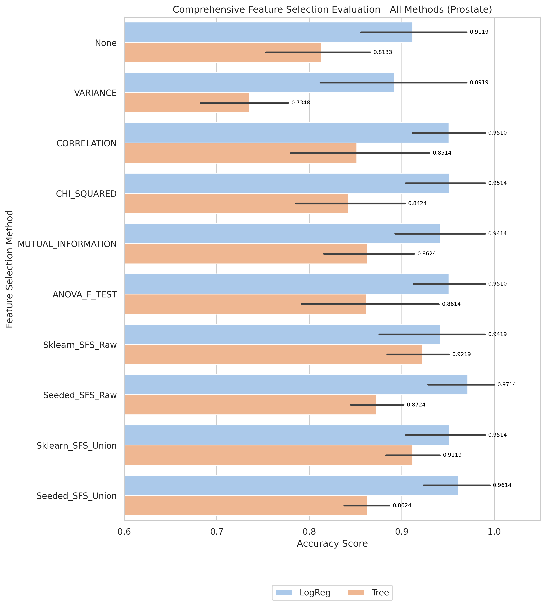

# Prostate Results and Evaluation

[Back to index](./README.md)

## 1) EDA (Exploratory Data Analysis)

- Notebook entry point(s):
- `notebook/Prostate/01_eda.ipynb`

[Insert Chart: EDA Summary]

**Caption:**
- Purpose: Check whether the dataset is imbalanced.
- How to read: The x-axis (V1) shows class labels (0 and 1), and the y-axis (count) shows the number of samples in each class.

## 2) Data Preprocessing

- Notebook entry point(s):
- `notebook/Prostate/02_preprocess.ipynb`
- Output location convention: `data/processed/Prostate/01_clean/`

## 3) Filter Selection

- Notebook entry point(s):
- `notebook/Prostate/03_filter_selection.ipynb`
- Report artifact: `results/Prostate/filter/reports/evaluation_Prostate.txt`

[Insert Chart: Filter Selection Comparison]

**Caption:**
- Purpose: Compare filter-method performance to select the best feature set for the next stage.
- How to read: The x-axis lists filter methods, and the y-axis shows evaluation scores; higher bars/scores indicate better methods.

## 4) Modeling (Filter-stage comparison)

- Notebook entry point(s):
- `notebook/Prostate/04_modeling.ipynb`
- Modeling outputs are tracked under `results/Prostate/filter/` when available.

## 5) Ensemble Filter (Voting + union feature set)

- Notebook entry point(s):
- `notebook/Prostate/05_ensemble.ipynb`
- Seed pool file: `data/processed/Prostate/03_ensemble/top50_features_voting.csv`
- Seed pool size: 10
- Top voting features: `V1840(5)`, `V2620(4)`, `V5017(4)`, `V4702(4)`, `V3666(4)`

[Insert Chart: Ensemble Voting / Union Features]

**Caption:**
- Purpose: Show agreement among filter methods when voting for features.
- How to read: The x-axis lists feature names, and the y-axis shows vote counts; features with higher votes are prioritized.

## 6) Wrapper: Sklearn SFS (Raw vs Union execution)

- Script entry point(s):
- `notebook/Prostate/06_sklearn_sfs-raw.py`
- `notebook/Prostate/06_sklearn_sfs-union.py`

| Variant | Sklearn Selected | Sklearn Global Best | Sklearn Fit Time (ms) |
|---|---:|---:|---:|
| Raw | 3 | 0.9614 | 321,108 |
| Union | 3 | 0.9514 | 10,968 |

## 7) Wrapper: Seeded SFS (Raw vs Union execution)

- Script entry point(s):
- `notebook/Prostate/07_sfs-raw.py`
- `notebook/Prostate/07_sfs-union.py`

| Variant | Seeded Selected | Seeded Global Best | Seeded Fit Time (ms) |
|---|---:|---:|---:|
| Raw | 4 | 0.9714 | 63,907 |
| Union | 3 | 0.9614 | 3,566 |

## 8) Accuracy Evaluation (Comparing Raw vs Union)

- Notebook entry point(s):
- `notebook/Prostate/8_accuracu_evaluate.ipynb`
- `notebook/Prostate/8_accuracu_evaluate_union.ipynb`

[Insert Chart: Accuracy Comparison Raw vs Union]

**Caption:**
- Purpose: Compare accuracy across wrapper configurations (Sklearn SFS and Seeded SFS) for each data variant.
- How to read:
  - The x-axis shows configurations/methods, and the y-axis shows accuracy; higher values indicate better performance.
  - Vertical black lines (error bars) show Standard Deviation across cross-validation folds. Shorter bars indicate more stable model performance.

**Caption:**
- Purpose: Compare accuracy across wrapper configurations (Sklearn SFS and Seeded SFS) for each data variant.
- How to read:
  - The x-axis shows configurations/methods, and the y-axis shows accuracy; higher values indicate better performance.
  - Vertical black lines (error bars) show Standard Deviation across cross-validation folds. Shorter bars indicate more stable model performance.

- **Observation:** Raw variant gives slightly higher accuracy, while union is much faster.
- **Explanation:** Union constrains feature space and lowers compute, but may exclude useful raw-only signals.
- **Takeaway:** Use raw for peak accuracy and union for faster development cycles.

- Raw best configuration: `seeded + LogReg`, mean accuracy **0.9714**, std 0.0639
- Union best configuration: `seeded + LogReg`, mean accuracy 0.9614, std 0.0622
- Final selected features: 4 features (raw seeded run)

## 9) Time Evaluation (Comparing fit times for Raw vs Union)

- Notebook entry point(s):
- `notebook/Prostate/9_time_evaluate.ipynb`
- `notebook/Prostate/9_time_evaluate_union.ipynb`

[Insert Chart: Time Comparison Raw vs Union]

**Caption:**
- Purpose: Compare training-time cost across wrapper methods on the same dataset.
- How to read: The x-axis shows methods/configurations, and the y-axis shows total fit time (ms); lower bars mean faster runtime.

**Caption:**
- Purpose: Compare training-time cost across wrapper methods on the same dataset.
- How to read: The x-axis shows methods/configurations, and the y-axis shows total fit time (ms); lower bars mean faster runtime.

- **Observation:** Union runs are generally faster than raw runs across wrapper methods.
- **Explanation:** Union reduces candidate-space size, reducing total model-fit operations.
- **Takeaway:** Use union for rapid iteration; use raw when chasing peak wrapper score.

## 10) Final Evaluation (All Methods Comparison)

- Notebook entry point(s):
- `notebook/Prostate/10_final_evaluate.ipynb`
- Report artifact: `results/Prostate/evaluation/reports/final_evaluation_all_methods_prostate_Prostate.txt`

[Insert Chart: Final Evaluation - All Methods]

**Caption:**
- Purpose: Compare all feature selection methods (Filter, Ensemble, Sklearn SFS, Seeded SFS) with both LogReg and Tree models.
- How to read:
  - The x-axis lists all method/model combinations (e.g., "Sklearn_SFS_Raw + LogReg").
  - The y-axis shows cross-validation accuracy; higher bars indicate better performance.
  - Vertical error bars show Standard Deviation across folds; shorter bars indicate more stable models.

| Rank | Method + Model | CV Folds | Mean Accuracy | Std | Median | Min | Max |
|---|---|---:|---:|---:|---:|---:|---:|
| 1 | Seeded_SFS_Raw + LogReg | 10 | 0.9714 | 0.0602 | 1.0000 | 0.8571 | 1.0000 |
| 2 | Seeded_SFS_Union + LogReg | 10 | 0.9614 | 0.0586 | 1.0000 | 0.8571 | 1.0000 |
| 3 | CHI_SQUARED + LogReg | 5 | 0.9514 | 0.0583 | 0.9500 | 0.8571 | 1.0000 |

**Key Observations:**
- Best configuration: Seeded_SFS_Raw + LogReg with 0.9714 accuracy (σ=0.0602)
- Second best: Seeded_SFS_Union + LogReg with 0.9614 accuracy
- Recommendation: See detailed comparison in the plot and report file above.