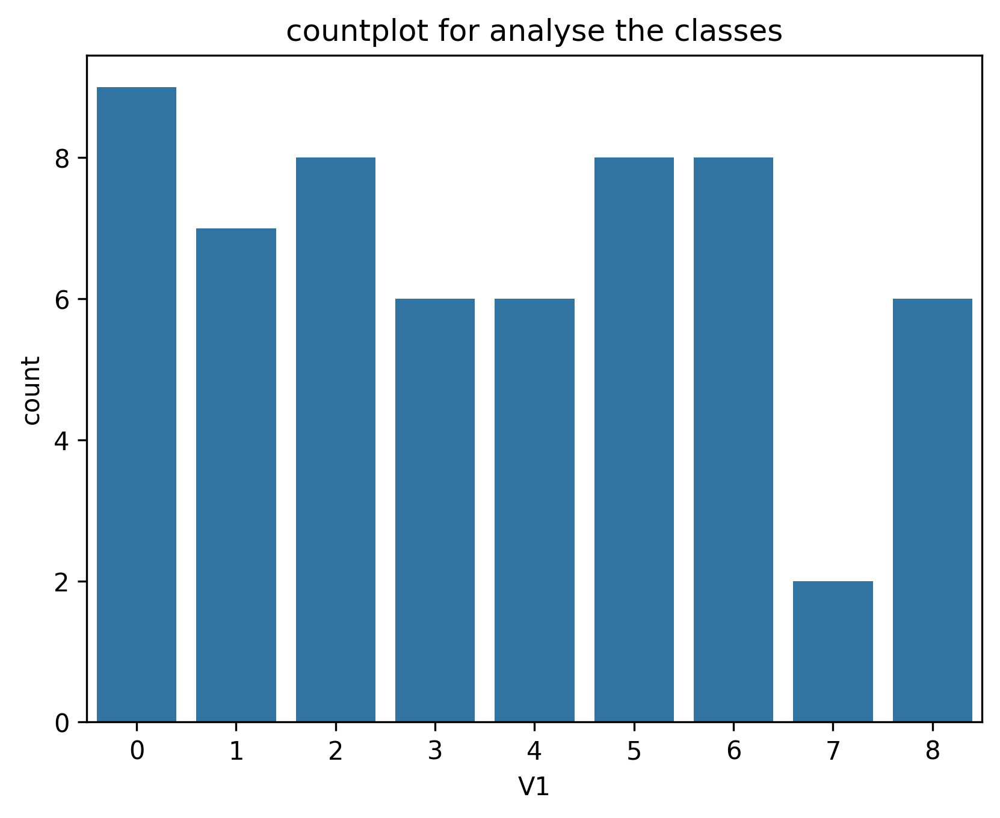
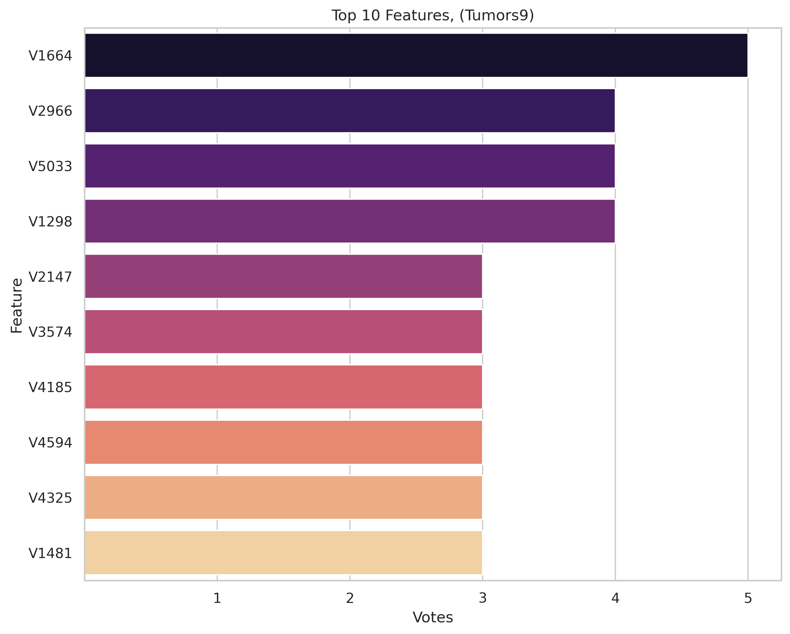
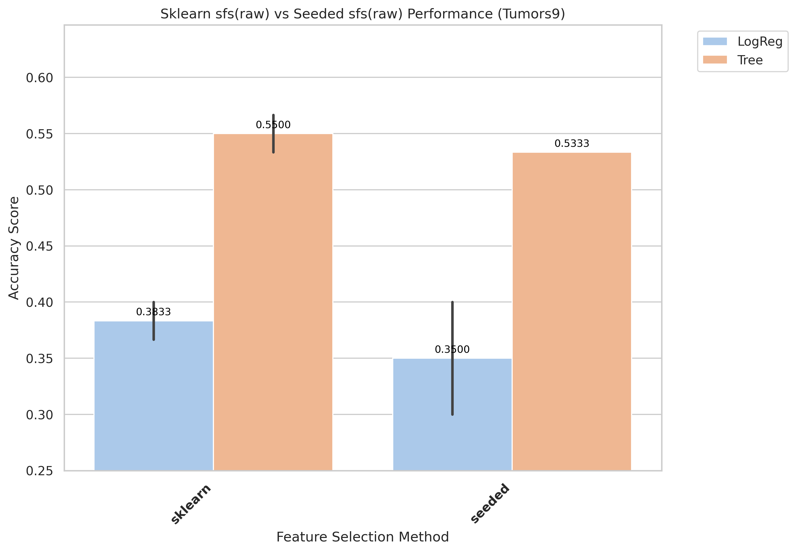
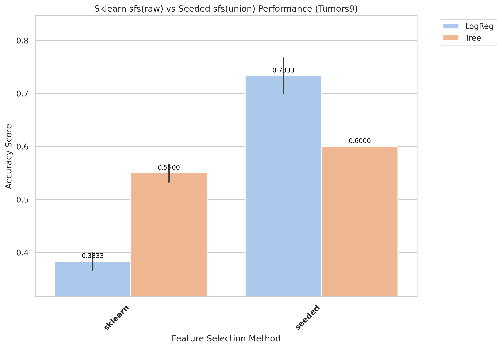
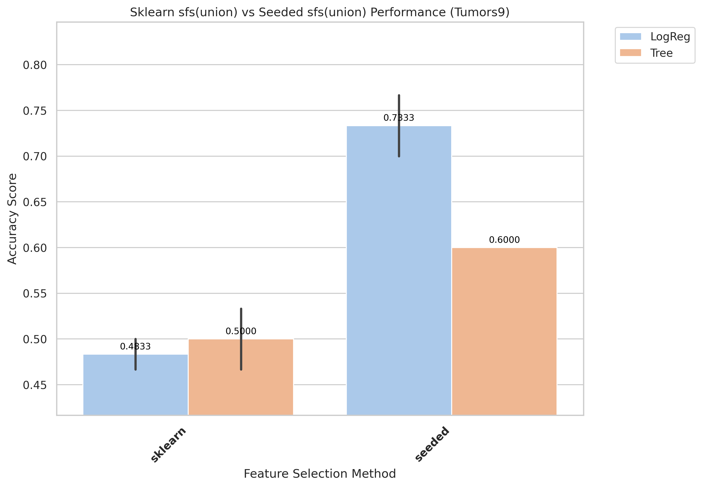
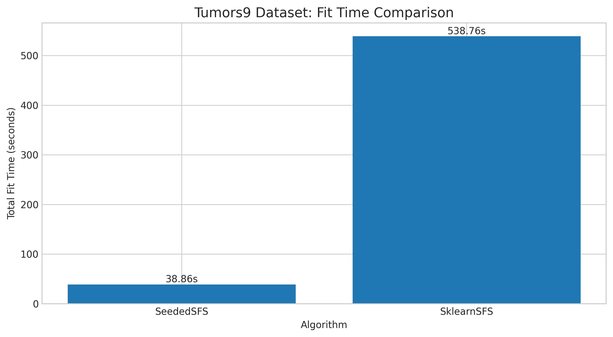
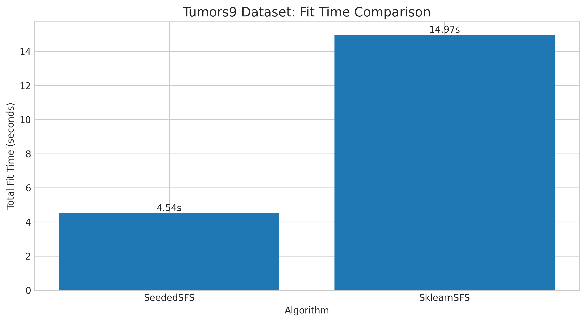

# Tumors9 Results and Evaluation

[Back to index](../results.md)

## 1) EDA (Exploratory Data Analysis)

- Notebook entry point(s):
- `notebook/Tumors9/01_eda.ipynb`

[Insert Chart: EDA Summary]

## 2) Data Preprocessing

- Notebook entry point(s):
- `notebook/Tumors9/02_preprocess.ipynb`
- Output location convention: `data/processed/Tumors9/01_clean/`

## 3) Filter Selection

- Notebook entry point(s):
- `notebook/Tumors9/03_filter_selection.ipynb`

## 4) Modeling (Filter-stage comparison)

- Notebook entry point(s):
- `notebook/Tumors9/04_modeling.ipynb`
- Modeling outputs are tracked under `results/Tumors9/filter/` when available.

## 5) Ensemble Filter (Voting + union feature set)

- Notebook entry point(s):
- `notebook/Tumors9/05_ensemble.ipynb`
- Seed pool file: `data/processed/Tumors9/03_ensemble/top50_features_voting.csv`
- Seed pool size: 10
- Top voting features: `V1664(5)`, `V2966(4)`, `V5033(4)`, `V1298(4)`, `V2147(3)`

[Insert Chart: Ensemble Voting / Union Features]

## 6) Wrapper: Sklearn SFS (Raw vs Union execution)

- Script entry point(s):
- `notebook/Tumors9/06_sklearn_sfs-raw.py`
- `notebook/Tumors9/06_sklearn_sfs-union.py`

| Variant | Sklearn Selected | Sklearn Global Best | Sklearn Fit Time (ms) |
|---|---:|---:|---:|
| Raw | 6 | 0.55 | 538,757 |
| Union | 3 | 0.5 | 14,975 |

## 7) Wrapper: Seeded SFS (Raw vs Union execution)

- Script entry point(s):
- `notebook/Tumors9/07_sfs-raw.py`
- `notebook/Tumors9/07_sfs-union.py`

| Variant | Seeded Selected | Seeded Global Best | Seeded Fit Time (ms) |
|---|---:|---:|---:|
| Raw | 6 | 0.6 | 38,858 |
| Union | 11 | 0.65 | 4,536 |

## 8) Accuracy Evaluation (Comparing Raw vs Union)

- Notebook entry point(s):
- `notebook/Tumors9/8_accuracu_evaluate.ipynb`
- `notebook/Tumors9/8_accuracu_evaluate_union.ipynb`

[Insert Chart: Accuracy Comparison Raw vs Union]

- **Observation:** Union seeded improves both wrapper score and final evaluation metrics over raw.
- **Explanation:** Union aggregation likely strengthens weak multiclass signal concentration.
- **Takeaway:** Set union seeded as the default for Tumors9.

- Raw best configuration: `sklearn + Tree`, mean accuracy 0.5500, std 0.0236 (2-fold)
- Union best configuration: `seeded + LogReg`, mean accuracy **0.7333**, std 0.0471 (2-fold)

## 9) Time Evaluation (Comparing fit times for Raw vs Union)

- Notebook entry point(s):
- `notebook/Tumors9/9_time_evaluate.ipynb`
- `notebook/Tumors9/9_time_evaluate_union.ipynb`

[Insert Chart: Time Comparison Raw vs Union]

- **Observation:** Union runs are generally faster than raw runs across wrapper methods.
- **Explanation:** Union reduces candidate-space size, reducing total model-fit operations.
- **Takeaway:** Use union for rapid iteration; use raw when chasing peak wrapper score.
